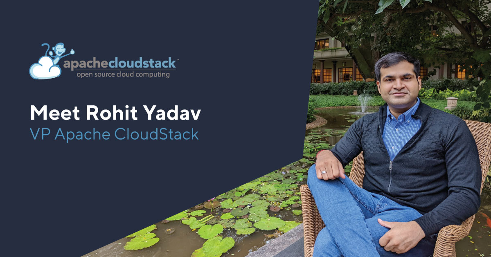

The CloudStack Community is happy to announce Rohit Yadav as the new VP of the
Apache CloudStack Project and PMC chair. After a year of success in which Simon
Weller chaired the project, we are now excited to welcome Rohit, who is a
long-term contributor to the project. He has a strong technology background and
has been engaged in the open-source world for more than a decade, during which
he contributed to multiple other open-source projects.

In this interview, you will be able to learn more about Rohit Yadav and see his
perspective on the VP's role and how he can contribute to the Apache CloudStack
project evolution.

<!-- truncate -->

**Why do you believe in open-source, where and how did it all start?**

During my university days, I got introduced to open-source as a way of
community-driven development. Compared to proprietary and closed-source
software, I found the idea of open-source remarkable that anybody can access
source code, learn it, modify it, distribute it, and even contribute it back.

In my spare time, I started learning and contributing to a few open-source
projects as a hobby and even created some open-source side-projects. I also got
an opportunity to work with the VideoLAN project as a Google Summer of Code
student and later worked as a volunteer summer student at CERN.

All of this early experience inculcated an interest in open-source and
virtualisation, and eventually, I was hired straight out of university by Citrix
to work on open-source Apache CloudStack project that was still in the ASF
incubator at the time. This is when I learned about the ASF and how to work in
the Apache CloudStack community from my colleagues and from the community, and I
learnt how to [contribute changes](https://infra.apache.org/contributors.html).
I started lurking and interacting on the project [mailing lists](/mailing-lists)
and IRC to understand how to work in this community.

I quickly found myself supporting users on the mailing lists and learning
real-world use of CloudStack, contributing patches such as maintaining our (new)
maven-based build system, working on some issues and making some improvements. I
also wrote the [cloudmonkey
CLI](https://github.com/apache/cloudstack-cloudmonkey) because there wasn’t one
available and I also ended-up working on a large APIs refactoring project that
helped me understand CloudStack deeper and work closely with the original
creators and architects of CloudStack.

During this, I was invited to become a committer to the project and got
sponsored to participate in the first CloudStack Collaboration Conference 2012
in Las Vegas. After another few years of working on flagship CloudStack
features, frameworks, releases, maintaining CloudStack and collaborating with
the community, I eventually got invited to become a PMC member.

I’ve transitioned into a more supporting, mentoring, empowering and leadership
role in the community and at work. This allows me to find time and bandwidth to
champion and promote Apache CloudStack in all forums and platforms.

**Why should enterprises use open-source solutions?**

Enterprises nowadays are adopting open-source software especially when it comes
to infrastructure software. This gives them business advantage in keeping low
costs and not having to depend on a single vendor (no vendor lock-in) while have
the longevity, trust, stability, reliability, durability, flexibility, better
agility and security, and access to an ecosystem of community and commercial
offerings and support around it. There is also community and inter-organisation
collaborations on standards, frameworks and feature development that help reduce
costs for the end-consumers, including the enterprises.

Enterprises also attract better talent as it’s generally much easy to hire or
train talent on open-source software with its documentation and other types of
training materials in the form of books, blogs and videos etc., accessible to
everybody.

It’s hard to imagine any enterprise and any consumer product or service that
won’t have any open-source project used in their stacks.

**Who are the existing enterprise users of Apache CloudStack and how are they benefiting?**

Anybody looking to implement (private or public) IaaS cloud should seriously
consider CloudStack. It is easy to-use, cost-effective, very stable, massively
scalable, highly reliable battle-tested IaaS cloud computing platform,
well-known and used in production at many of the world’s largest organisations.
The project is community-driven by diverse contributors who are deeply invested
in solving real-world
[use-cases](https://cwiki.apache.org/confluence/display/CLOUDSTACK/Case+Studies).

You don’t have to take my word for it - as an open-source top-level
[ASF](https://apache.org/) project anybody can test drive and see it for
themselves, there is no vendor lock-in or paywall to get started. It takes a
very short amount of time and effort to set it up, perhaps a few hours or less
for a seasoned administrator. We have the [quick install
guides](https://docs.cloudstack.apache.org/en/latest/quickinstallationguide/qig.html)
for anybody to get started and even a public simulator-based demo environment
for anybody with a few minutes to try it out, get the look-and-feel for it at
https://qa.cloudstack.cloud/simulator/ (using the demo-environment credentials
admin:password).

CloudStack is very easy to deploy, use and manage. Being a monolith application,
it’s easier to upgrade, can be managed by a small team. It is feature-rich, and
offers a great UI, APIs and rich tooling and libraries such as
[cloudmonkey](https://github.com/apache/cloudstack-cloudmonkey) (cmk, the
official CLI), the [CloudStack Terraform
provider](https://github.com/apache/cloudstack-terraform-provider), the
[CloudStack Kubernetes
provider](https://github.com/apache/cloudstack-kubernetes-provider), the
[CloudStack Cluster-API Provider](https://cluster-api-cloudstack.sigs.k8s.io/)
(CAPC), the [CloudStack Go-SDK](https://github.com/apache/cloudstack-go),
[support for
Ansible](https://docs.ansible.com/ansible/latest/scenario_guides/guide_cloudstack.html),
and countless other integration, libraries and related projects in its
ever-growing ecosystem.

As an open-source project, Apache CloudStack project does not track who uses it.
Still, we have a fair idea of our user base based on the community-maintained
and contributed [list of users](https://cloudstack.apache.org/users.html) on our
project website. Also, based on activities and representation by such users and
their organisations in the community by their participation on the mailing
lists, around releases, issue reporting and code contributions on Github,
attendance and participation in project meetups and conferences, and other
forums such as blogs, videos, websites, press releases, social media etc. These
enterprises, organisations and users include some of the world’s largest Fortune
500 companies.

I get super motivated and content when I read CloudStack
[case-studies](https://cwiki.apache.org/confluence/display/CLOUDSTACK/Case+Studies)
or when I learn where and how our work on CloudStack benefits the core mission
of companies. In the most recent CloudStack Collab conference, I was delighted
to learn how CloudStack [empowers the Digital India
mission](https://www.youtube.com/watch?v=xq2LVY18GU8) that helped [vaccinate
billions](https://www.cowin.gov.in/) as well as delivers digital product and
services to citizens.

**How is Apache CloudStack project evolving and where do you see its future?**

Over the years, we’ve seen a steady stream of [developer
contribution](https://github.com/apache/cloudstack/graphs/contributors) and
[releases](https://github.com/apache/cloudstack/releases). We’re seeing
CloudStack getting more and more polished with every release. We’ve grown into a
pedigree of PMC members, committers, contributors and power users who have been
around in the community for a long time, a decade or more now. This demonstrates
the reliability, durability and stability the project offers to the users
community and the trust of the users community who are continuing to use and
support CloudStack over the years. We’re seeing CloudStack adoption growing
steadily from users participation on mailing lists, Github, meetups and
conferences and release adoption. Per the hype curve, we’re in the plateau of
productivity so this isn’t surprising.

We have always been a community-driven project and that should continue. We may
also see interesting integrations, features and other changes to align with the
changing themes and trends of the industry and the users community, we may find
such use-cases in AI, data sovereignty, privacy and cloud-repatriation.

We need to ensure there’s a healthy community that feels welcome to use
CloudStack, report issues, participate on the mailing lists and in meetups and
conferences, and tell us about their use-cases and problems in all such forums.

The users community should be supported to contribute to CloudStack, and [help
train](https://github.com/shapeblue/hackerbook) on CloudStack development, help
contribute fixes, enhancements and feature that solves their problems, and
invite them to become committers and PMC members of the project. As long we
support a healthy feedback loop and maintain the cycle of the project it will
continue to grow, evolve, and thrive. We also need more efforts towards project
marketing and promotion, and some work on strategic features, frameworks and
integrations that leads to more growth and adoption of CloudStack.

**Start contributing!**

Want to become a committer and join a great community? [Read on!](/contribute)
