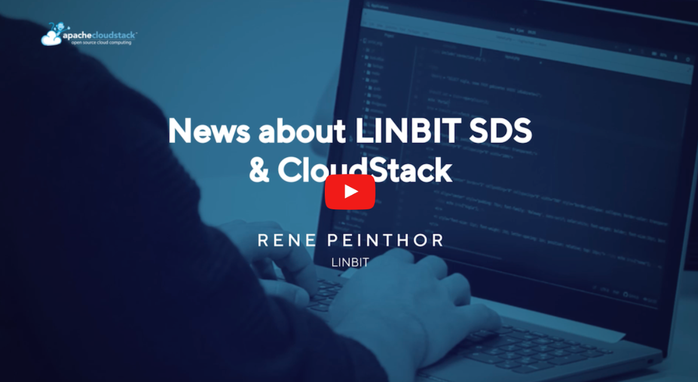

CloudStack European User Group 2023 took place on the 4th May. The event,
organised by Apache CloudStack community members was held in [Cifas,
London](https://www.google.com/maps/place/Cifas/@51.5252771,-0.1280909,15z/data=!4m2!3m1!1s0x0:0x67144bffc4ed0340?sa=X&gl=us&ved=2ahUKEwjw2q689-z-AhWJfMAKHfmoDZoQ_BJ6BAhfEAg).

For those who were not able to attend in-person, the event was [live-streamed on
Apache CloudStack’s YouTube channel](https://www.youtube.com/watch?v=pt8bBsZN5Xk).

The Apache CloudStack community is grateful to the events sponsors for
supporting the event and helping make it a reality –
[ShapeBlue](https://www.shapeblue.com/), [Your.Online](https://your.online/) and
[StorPool](https://storpool.com/).

This blog shares the session recordings and descriptions for those who were not
able to attend.

<!-- truncate -->

# Sessions

[**Welcome, Giles Sirett**
](https://www.youtube.com/watch?v=K6AZrM85q9I&list=PLnIKk7GjgFlZtSvP7zSXDKr-r5qLCKCFd&index=3)
**Session description:**
Giles Sirett, CEO of ShapeBlue and Chairman of CSEUG, gives an outline of what
everyone could expect for the day.

[**What’s new in CloudStack 4.18, Giles Sirett**
](https://www.youtube.com/watch?v=BthKUzK2KvE&list=PLnIKk7GjgFlZtSvP7zSXDKr-r5qLCKCFd&index=4)
**Session description:**
In this session, Giles Sirett gives an overview of some of the most exciting
features and integrations introduced in Apache CloudStack 4.18. Some of these
features include edge zones, SDN integration (Tungsten Fabric), autoscaling,
managed user data and more.

[**CloudStack Monitoring, Lucian Burlacu, ShapeBlue**
](https://www.youtube.com/watch?v=pukEbV70iTc&list=PLnIKk7GjgFlZtSvP7zSXDKr-r5qLCKCFd&index=5)
**Session description:**
In this session, Lucian Burlacu from ShapeBlue, gives an introduction to
monitoring CloudStack, from the hardware up to the stack.

[**News about LINBIT SDS & CloudStack, Rene Peinthor, LINBIT**
](https://www.youtube.com/watch?v=0yMs7Jkw4g4&list=PLnIKk7GjgFlZtSvP7zSXDKr-r5qLCKCFd&index=6)
**Session description:**
In this session, Rene Peinthor from LINBIT, shares the recent updates to the
LINSTOR driver. He also shows the results of combining CloudStack & XCP-ng with
LINBIT's storage stack.

[**Re-using old hardware, thus saving money and the environment, Wido den Hollander, Your.Online**
](https://www.youtube.com/watch?v=LLwmjV19_WU&list=PLnIKk7GjgFlZtSvP7zSXDKr-r5qLCKCFd&index=7)
**Session description:**
Watch the session to learn from Wido Den Hollander - tips and tricks to make use
of older hardware for a longer time in your CloudStack environment.

[**Tungsten Fabric SDN for Core and Edge Zones in ACS, Alexandre Mattioli, ShapeBlue**
](https://www.youtube.com/watch?v=9kZ0tJlh60Y&list=PLnIKk7GjgFlZtSvP7zSXDKr-r5qLCKCFd&index=8)
**Session description:**
In this session, Alexandre Mattioli from ShapeBlue shares how Tungsten Fabric
allows for richer network topologies in CloudStack without the need for
commercial solutions.

[**A proposal - make changes in Apache CloudStack faster and low risk with vendor CI systems, Boyan Krosnov, Niki Tenev, StorPool**
](https://www.youtube.com/watch?v=B_vFqHIDREs&list=PLnIKk7GjgFlZtSvP7zSXDKr-r5qLCKCFd&index=9)
**Session description:**
In this session, Boyan Krosnov and Niki Tenev from StorPool share other
community's approaches to vendor CI systems, thus sparking the conversation on
the future of the Apache CloudStack community's approach.

[**Dimsi and Backroll : What’s new/next release, Pierre Charton, Pierre de La Ville and Ousmane, Dimsi**
](https://www.youtube.com/watch?v=NvIhxSh8L0M&list=PLnIKk7GjgFlZtSvP7zSXDKr-r5qLCKCFd&index=10)
**Session description:**
In this session, team members from DIMSI, share DIMSI's backroll (KVM guest
agent backup) project news and CloudStack plugin release.
