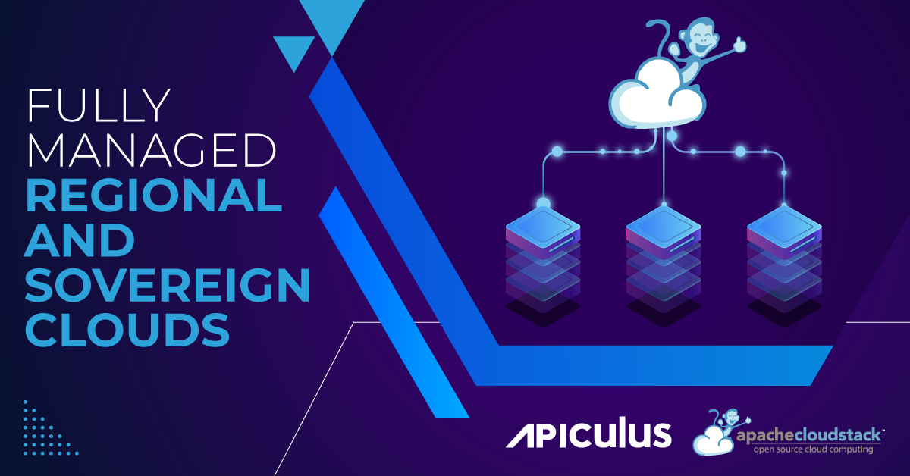
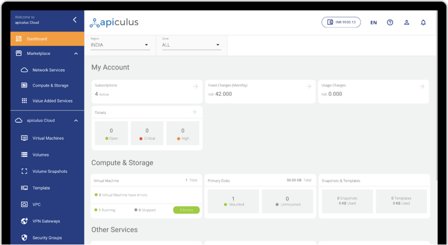

[Apiculus](https://www.apiculus.com/) is a fully integrated and re-brandable
public cloud management software for ISPs, data centres and telcos that combines
cloud monetisation, customer lifecycle and infrastructure management into a
single pane of glass. Apiculus is an all-in-one technology platform that
combines infrastructure management, cloud service management, customer lifecycle
management, and an integrated solution for the cloud providers in the Edge market.

Apiculus is developed by [IndiQus Technologies](https://www.apiculus.com/), an
India-based cloud solutions company that has set up and managed over 25 public,
private and hybrid clouds globally.

<!-- truncate -->

# Apiculus with Apache CloudStack

Apiculus adds a layer of powerful customer lifecycle management features to
Apache CloudStack, providing a self-service CMP (cloud management platform),
marketplace, monetization, monitoring, and support systems. By building on top
of the existing orchestration capabilities of Apache CloudStack, Apiculus
introduces a business layer that enhances the platform's capabilities.

<a class="button button--primary" href="/files/apiculus-case-study-2023.pdf" target="_blank">DOWNLOAD THE CASE STUDY</a>
 
 

>“Our aim is to position the combination of CloudStack and Apiculus as a robust
>cloud solution in 100+ countries and 300+ Enterprises in the next 3 years, and
>establish the combination as the go-to choice for operating private and public
>clouds.”
>
>-[Kshitish Purohit](https://www.linkedin.com/in/kshitishpurohit/), Chief Product Officer, Apiculus

# Apiculus Features

Apiculus empowers service providers to establish a marketplace featuring a range
of value-added services such as PaaS, IaaS, SaaS, and multi-cloud offerings.

With Apiculus, service providers can offer an extensive selection of
cloud-native and IaaS services through a PaaS, IaaS, SaaS, and multi-cloud ready
marketplace, enabling them to capture a larger share of their customers'
spending.

Apiculus also provides support for multiple regions and currencies, making it
easy to handle global and local billing requirements.

Service providers can define and create custom catalogues featuring integrated
or billing-only services with various targeting options for customer accounts.

Additionally, Apiculus makes it easy to streamline customer acquisition by
enabling service providers to create cash vouchers, site discounts, and various
structured trial benefits. This helps businesses attract and retain customers
while optimizing their marketing efforts.

<a class="button button--primary" href="/files/apiculus-case-study-2023.pdf" target="_blank">DOWNLOAD THE CASE STUDY</a>
