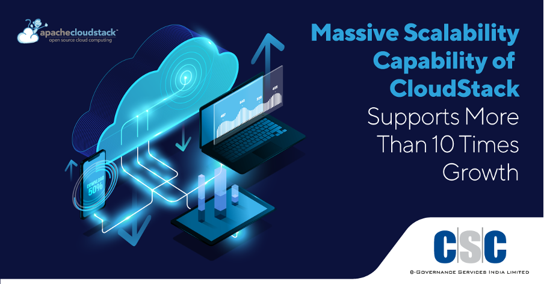
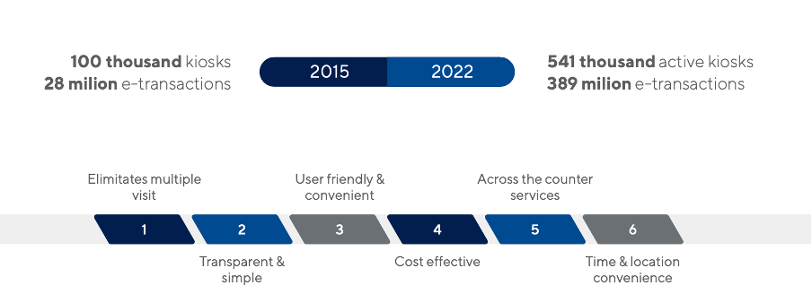

The [Common Services Centres (CSC)](https://csc.gov.in/) scheme is one of the
mission mode projects under the Digital India Programme. They are the access
points of essential public utility services, social welfare schemes, healthcare,
financial, education and agricultural services, apart from host of B2C services
to citizens in rural and remote areas of the country.

<!-- truncate -->

# CSC e-Governance India with CloudStack

In order to access these services, [CSC E-Governance India](https://csc.gov.in/)
chose CloudStack to underpin the delivery and build a government community cloud
for powering applications which aid in creating a digitally inclusive ecosystem.
In 2022, the system caters to an average of more than 200 million citizens every
month across the country. All this is looked after by a team of just 20 staff.

<a class="button button--primary" href="/files/cloudstack-case-study-csc-e-govermance-2023.pdf" target="_blank">DOWNLOAD THE CASE STUDY</a>
 
 

>“I was impressed from the outset with CloudStack due to its ease-of-use,
>particularly with regard to implementation. We were able to install and
>configure the solution in one go and since 2015 it has been running successfully
>for 7 years to date.”
>
>-[Abhishek Ranjan](https://www.linkedin.com/in/abhishekranjan/), former CTO of CSC e-Governance India

# CloudStack infrastructure supports 5X growth in 7 years

Since 2015, there were approximately 100,000 kiosks and 28 million
e-transactions. Fast-forward to 2022, there were 541,000 kiosks with 389
million e-transactions. Abhishek credits the possibility of this growth rate ‘to
the scalability and reliability of CloudStack’.

<a class="button button--primary" href="/files/cloudstack-case-study-csc-e-govermance-2023.pdf" target="_blank">DOWNLOAD THE CASE STUDY</a>
