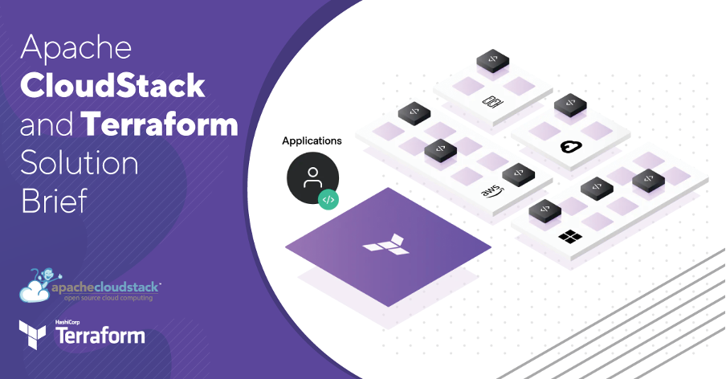

IT solution providers need to satisfy the demand for the delivery of diverse
services in the short-term. Time-to-market when offering IT solutions, IaaS or
just provisioning infrastructure is a key factor for the company’s
competitiveness. This requires companies to utilize tools capable of providing
the agility to deliver new features, scalability, and infrastructure anywhere
almost instantly.

<!-- truncate -->

[Terraform](https://www.terraform.io/) is an open-source infrastructure-as-code
tool created by Hashicorp and Licensed through the Apache 2 License. By using
Terraform, end users can easily create complex infrastructures anywhere, since
Terraform has a huge list of providers supported, including Apache CloudStack.

HashiCorp Terraform helps organizations improve productivity, reduce risk, and
increase business velocity as they integrate cloud into their IT environments.
According to them, it improves IT Ops productivity up to 75%.

# Apache CloudStack and Terraform Integration

Terraform relies on a set of plugins known as Providers in order to provision or
manage resources and cloud services. As part of the integration of Terraform and
Apache CloudStack, Terraform requires a specific CloudStack provider, which acts
as a transition layer between Terraform and Apache CloudStack. This provider was
written to provision and manage resources such as virtual machines, networks,
templates, volumes etc., using the CloudStack APIs.

There are two main working components here:

- Terraform Core
- CloudStack's Provider

<a class="button button--primary" href="/files/terraform-solution-brief 2023.pdf" target="_blank">DOWNLOAD THE SOLUTION BRIEF</a>
 
 

>“CloudStack and Terraform bring scalability and flexibility. The immediate
>benefit out of them is that you can have tested and proven blueprints and roll
>out environments quickly. Terraform is perfect for quickly creating Test/Dev
>environments.
>
>In distributed teams, collaboration is extremely important. Infrastructure as
>code is a huge boost, helping teams to collaborate on code.”
>
>-[Tamara Muryshkin](https://www.linkedin.com/in/muryshkin/), Enterprise Service Manager at Fraunhofer-Gesellschaft

# [About Terraform](https://www.terraform.io/)

Terraform is an **open-source infrastructure as code software tool** that provides a
consistent CLI workflow to **manage hundreds of cloud services**. Terraform codifies
cloud APIs into declarative configuration files.

Terraform allows infrastructure to be expressed as code in a simple,
human-readable language called HCL (HashiCorp Configuration Language). It reads
configuration files and provides an execution plan of changes, which can be
reviewed for safety and then applied and provisioned. **Extensible providers allow
Terraform to manage a broad range of resources, including IaaS, PaaS, SaaS, and
hardware services.**

<a class="button button--primary" href="/files/terraform-solution-brief 2023.pdf" target="_blank">DOWNLOAD THE SOLUTION BRIEF</a>
 
