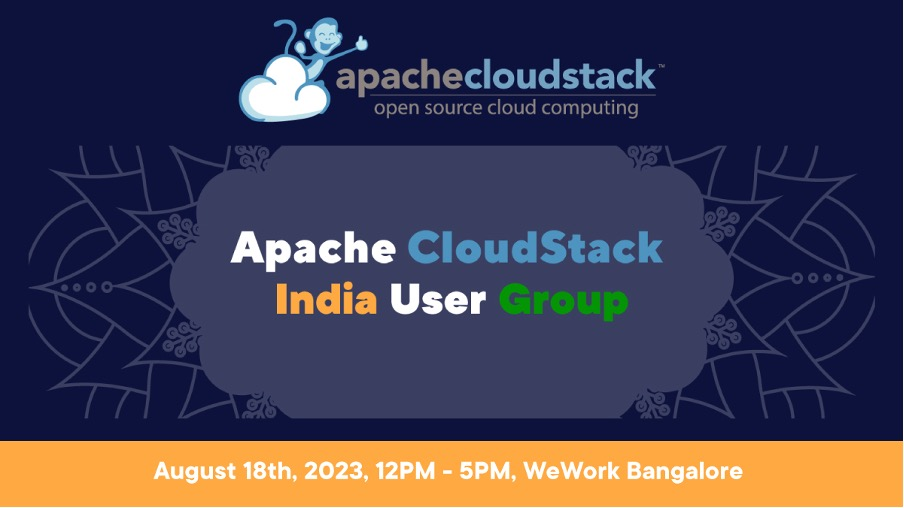

This year, the Indian CloudStack community will be hosting a User Group at
**WeWork, Bangalore**, taking place on **August 18th 2023**. The WeWork location
will be announced shortly, so keep an eye out on this blog page if you would
like to attend!

If you are an existing Apache CloudStack User or want to know more about the
technology, join us for the user group, which will host exciting tech talks,
demos and user stories. As for all events organised by the Apache CloudStack
community, [registration is free of
charge](https://www.meetup.com/india-cloudstack-user-group/events/294738405).

<a class="button button--primary button--lg" href="https://www.meetup.com/india-cloudstack-user-group/events/294738405" target="_blank">REGISTER</a>
 
 

<!-- truncate -->

The **[Call for
Presentations](https://docs.google.com/forms/d/1eRWD8pWosgOavD2hhn0mSUSyRpqjtbEWHmPY-NqXYIQ/viewform?edit_requested=true)
is currently open!** When submitting a talk, you have
the option to share any technical talks, user stories, new features,
integrations presentations and more! Submitting a session proposal to the User
Group offers an opportunity to share your expertise, contribute to the
community, and gain recognition in the cloud computing industry.

**Please note, the deadline for session proposals is August 11th, 2023.**

<a class="button button--primary button--lg" href="https://docs.google.com/forms/d/1eRWD8pWosgOavD2hhn0mSUSyRpqjtbEWHmPY-NqXYIQ/viewform?edit_requested=true" target="_blank">Submit a Talk</a>
 
 

# A Note from Our VP

>“CloudStack meetups allow our community of users, contributors, vendors and
>integrators to get together, collaborate and network to share their problems,
>discuss ideas and solutions around CloudStack.
>
>Meetups give the opportunity for attendees to hear from speakers on real-world
>use of CloudStack, learn about their solutions, integrations and about upcoming
>features and releases of CloudStack. It's just a great place to be for anybody
>considering CloudStack or starting to build private cloud.”
>
>-&nbsp;[Rohit Yadav](https://www.linkedin.com/in/rohityadavcloud/), PMC Chair and VP Apache CloudStack

# Agenda

The agenda is yet to be confirmed, due to the session proposal still being
accepted. Return to this blog on the week of the User Group to see the speakers
and sessions being held!
