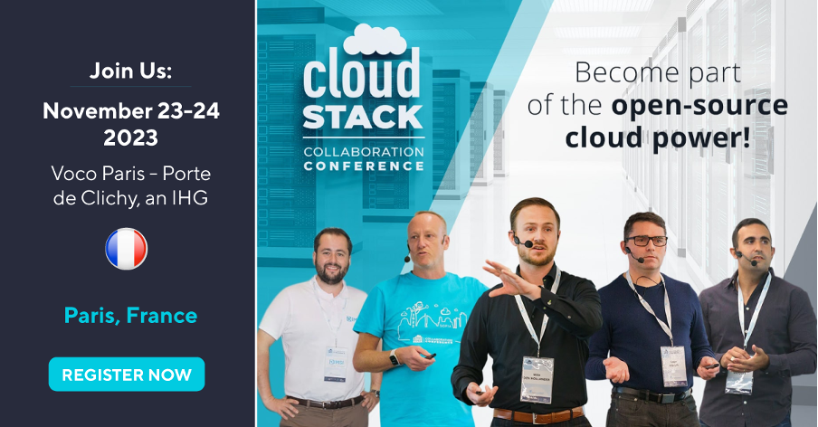

On November 23-24th 2023, the annual [CloudStack Collaboration
Conference](https://www.cloudstackcollab.org/) will be taking place in the
[VOCO Paris, Porte de
Clichy](https://www.ihg.com/voco/hotels/gb/en/clichy/parpc/hoteldetail). Once
again, this year’s CCC will be a hybrid event, seeing the global CloudStack
community joining on site and virtually from around the world. [Registration is
currently
open](https://events.hubilo.com/cloudstack-collaboration-conference-2023/register),
with free entry to anybody adopting or interested in the open-source technology.

<a class="button button--primary button--lg" href="https://events.hubilo.com/cloudstack-collaboration-conference-2023/register" target="_blank">REGISTER</a>
 
 

<!-- truncate -->

# What to Expect

For those new to the new community, CCC is a hybrid event aimed at developers,
operators and users to discuss and evolve the open-source software project, its
functionality and real-world operability. This event will introduce you to the
CloudStack family, community leaders, project members and contributors. To get
an idea of previous sessions held, feel free to read last’s year event [roundup
blog](https://cloudstack.apache.org/blog/cloudstack-collaboration-conference-2022-roundup).

# Call for Speakers

The event team is currently accepting session proposals, providing you the
opportunity to host your own session on the global stage. If you have a story
about CloudStack, building cloud infrastructure, developing CloudStack features
or integration, security, scalability, multi-cloud, [submit your talk now!](https://docs.google.com/forms/d/e/1FAIpQLSdaFH8I_fubiImp6mOXpAPL82UfjpCgisu3WAQBMtY-geqWyA/viewform)

<a class="button button--primary button--lg" href="https://docs.google.com/forms/d/e/1FAIpQLSdaFH8I_fubiImp6mOXpAPL82UfjpCgisu3WAQBMtY-geqWyA/viewform" target="_blank">SUBMIT A TALK</a>
 
 

# Sponsorship Opportunity

The CloudStack Collaboration Conference stands as the premier global event for
CloudStack and open-source cloud enthusiasts. This powerful platform is adopted
by major telecoms, enterprises, and Fortune 100 companies worldwide. Embrace the
opportunity to sponsor the conference, granting you access to connect and
network with top-tier senior staff and C-level executives from these esteemed
organizations. By becoming a sponsor, you gain the advantage of engaging with
numerous developers, cloud architects, and technical leaders. Moreover,
partnering with the CloudStack Collaboration Conference offers your brand
enhanced visibility within one of the most dynamic and vibrant open-source
communities across the globe.

<a class="button button--primary button--lg" href="https://www.cloudstackcollab.org/wp-content/uploads/2023/02/Sponsorship-Prospectus-CCC-2023.pdf" target="_blank">Download the SponsorshipProspectus</a>
 
 

If you have any questions, or would like to sponsor the conference, email the
event team:  info@cloudstackcollab.org

Event sponsors to date:

