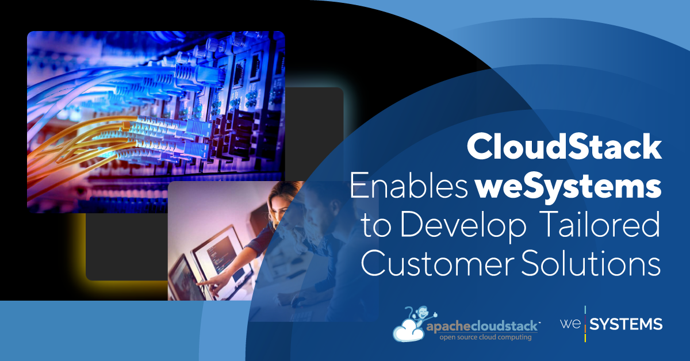

In the ever-evolving landscape of IT infrastructure, innovation and adaptability
are paramount. Companies like [weSystems](https://wesystems.de/en/) understand
this truth all too well. Specializing in IT infrastructure, data center
services, connectivity, and networks, weSystems is dedicated to developing
tailor-made computing and storage solutions that empower their customers with
cutting-edge technology.

They develop computing and storage solutions that give their customers the
highest computing power and the most secure storage capacities.

This case study reveals how weSystems leveraged Apache CloudStack to create a
multi-tenant IaaS cloud offering that aligns seamlessly with their mission.

<a class="button button--primary" href="/files/ACS-WeSystems-Case-Study.pdf" target="_blank">DOWNLOAD THE CASE STUDY</a>
 
 

<!-- truncate -->

# Tailoring Solutions in the Digital Age

The digital transformation has reshaped the way businesses operate and interact.
It brings along new challenges that necessitate bespoke solutions. Stephan
Bienek, Head of Hosting at weSystems AG, highlights the importance of developing
custom solutions with open-source technology:

>“Our job at weSystems is to develop customised solutions that support the
>process of digitalization and return customer focus to their business.
>
>We try to build on open-source where possible, even if it means we take a few
>more efforts in the beginning, we are convinced of the benefits of building on
>open-source in the long run.”
>
>-[Stephan Bienek](https://www.linkedin.com/in/stephan-bienek-66aa69206/), Head of Hosting, weSystems

# A Quest for the Perfect Fit

weSystems embarked on a journey to find the ideal platform for building a
multi-tenant IaaS cloud offering that could handle diverse workloads and support
managed hosting and application services. The chosen platform needed to
encompass several key features, including support for multiple zones,
multi-tenancy, integration with the Kubernetes ecosystem, Ceph Storage, and the
flexibility to create custom service offerings. After evaluating multiple
options, CloudStack emerged as the frontrunner, surpassing alternatives like
OpenStack, Proxmox, and VMware.

>“The rich feature set in computing, networking and UI/API’s flexibility, to
>combine features fulfilling a new requirement whilst still keeping the ease of
>operation and use is the perfect match for us.”
>
>-[Brian Nørgaard](https://www.linkedin.com/in/brian-n%C3%B8rgaard-granh%C3%B8j-2b0a001/?originalSubdomain=dk), Director Nordic, weSystems ApS

<a class="button button--primary" href="/files/ACS-WeSystems-Case-Study.pdf" target="_blank">DOWNLOAD THE CASE STUDY</a>
 
 

# Empowering Complex Solutions

The implementation journey began with a Proof of Concept (PoC) to evaluate
CloudStack's capabilities. It quickly became evident that CloudStack offered the
clarity of documentation, ease of setup, and daily operation that weSystems was
seeking. Once the PoC was established, they moved on to set up a productive zone
and simultaneously focused on developing automation processes, tooling, usage
tracking, and billing.

Through rigorous testing and adaptation, the team found that CloudStack's
versatility allowed them to address unexpected challenges effectively. The
platform seamlessly integrated into their technology stack components, promoting
operational efficiency and team trust. The ability to deploy standard and
customized virtual machines, along with a clean and intuitive Web UI and API,
facilitated easy adoption among the team and customers.

# Contributing to the Open-Source Community

As advocates of open-source software, weSystems finds value in contributing to
CloudStack's ecosystem. They actively participate by proposing new
functionalities, contributing code to the open and transparent codebase, and
offering support to the community. The extensive and passionate community
surrounding CloudStack provides a safety net for operational concerns and
troubleshooting.
