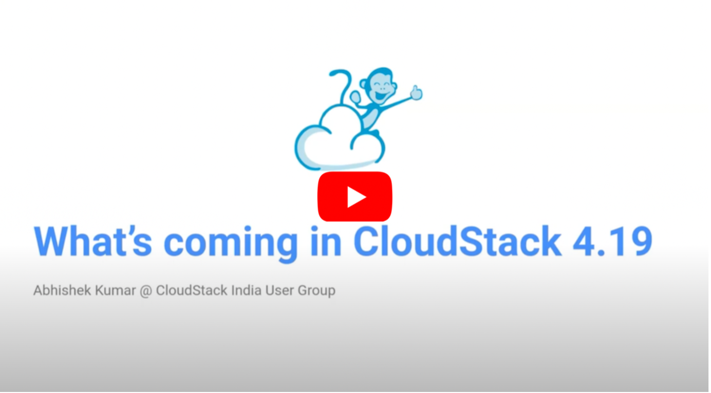

On Friday 18th August, the Apache CloudStack India User Group 2023 took place in
Bangalore, seeing CloudStack enthusiasts, experts, and industry leaders from
across the country, discuss the open-source project. The meetup served as a
vibrant platform to delve into the depths of Apache CloudStack, share insights,
and forge new connections.

This roundup blog shares session recordings and slides from the user group.
Click the following link to see the photos taken from the user group:
https://photos.google.com/share/AF1QipMf5oiut3pZr8vB3kk_LiCzLgjglxJxkUYmaHoMPHrIb6m8Hu9X7QrUMI90S9odYQ?key=SlRuZjRfdGFSR1pKWGVGMV83eUt1R1ZwallrSG9n

<!-- truncate -->

<h2>Sessions</h2>

### Welcome and State of Apache CloudStack Community, Rohit Yadav

(The session recording is not available)

<iframe src="https://www.slideshare.net/slideshow/embed_code/key/e5gbS0sSfzB5wj" width="100%" height="400" frameborder="0" marginwidth="0" marginheight="0" scrolling="no" allowfullscreen> </iframe> 
<strong> <a href="https://www.slideshare.net/ShapeBlue/welcome-and-state-of-apache-cloudstack-community-rohit-yadav" title="Welcome and State of Apache CloudStack Community" target="_blank">Open in SlideShare</a> </strong>

**Session Description:**
VP of Apache CloudStack welcomes the CloudStack India User Group meetup attendees in Bangalore and walks through the current state of the Apache CloudStack community, composition of committers and PMC members, release activities, contributor trends on mailing lists and GitHub, and update on community initiatives and upcoming events.

**Speaker Bio:**
[Rohit](https://www.linkedin.com/in/rohityadavcloud/) is the current VP of the
Apache CloudStack project, as well as a PMC member. At work, Rohit is the
VP of engineering at ShapeBlue, where he provides leadership and mentorship to
the ever-growing Engineering Team.

### What's Coming in CloudStack 4.19, Abhishek Kumar

<iframe src="https://www.slideshare.net/slideshow/embed_code/key/q10q4hkRSULcD" width="100%" height="400" frameborder="0" marginwidth="0" marginheight="0" scrolling="no" allowfullscreen> </iframe> 
<strong> <a href="https://www.slideshare.net/ShapeBlue/whats-coming-in-cloudstack-419" title="What's Coming in CloudStack 4.19" target="_blank">Open in SlideShare</a></strong>

**Session Description:**
An early overview of the upcoming new and exciting features and improvements in
the next major LTS release of CloudStack, 4.19. Abhishek Kumar, who will be
acting as the release manager for the CloudStack 4.19, gives a quick recap of
the major additions in the previous LTS release - 4.18.0, discusses the timeline
for the 4.19.0 release and talks about the planned and expected new features in
the upcoming release.

**Speaker Bio:**
[Abhishek](https://www.linkedin.com/in/shwstppr/) is a committer of the Apache
CloudStack project and has worked on the notable features such as VM ingestion,
CloudStack Kubernetes Service, IPv6 support, etc. He works as a Software
Engineer at ShapeBlue.

### Deploying Kubernetes Clusters on Apache CloudStack, Kiran Chavala and Vishesh Jindal

<iframe src="https://www.slideshare.net/slideshow/embed_code/key/wkQ5R4NGml0wVC" width="100%" height="400" frameborder="0" marginwidth="0" marginheight="0" scrolling="no" allowfullscreen> </iframe> 
<strong> <a href="https://www.slideshare.net/ShapeBlue/deploying-kubernetes-clusters-on-apache-cloudstack" title="Deploying Kubernetes Clusters on Apache CloudStack" target="_blank">Open in SlideShare</a> </strong>

**Session Description:**

Currently Apache CloudStack supports two methods to deploy Kubernetes Clusters
(CKS, CAPC). This session gives a demo on how to easily deploy CKS and CAPC on
Apache CloudStack and will also give an overview of various use cases which will
help you to choose the best deployment based on your requirement.

http://docs.cloudstack.apache.org/en/latest/plugins/cloudstack-kubernetes-service.html

https://cluster-api-cloudstack.sigs.k8s.io/getting-started.html

**Speakers Bios:**

For work, [Kiran](https://www.linkedin.com/in/kiran-chavala-1bb6a97/) is a QA engineer at
ShapeBlue. Kiran has experience in providing technical support on various issues
related to CloudStack.

[Vishesh](https://www.linkedin.com/in/vishesh92/) is a software engineer at
ShapeBlue. He has experience in developing and
managing cloud infrastructure. He has a particular interest in databases and has
worked extensively on them.

### CloudStack Object Storage Framework and Demo, Kishan Kavala

<iframe src="https://www.slideshare.net/slideshow/embed_code/key/46zMXIcvGFdH8X" width="100%" height="400" frameborder="0" marginwidth="0" marginheight="0" scrolling="no" allowfullscreen> </iframe> 
<strong> <a href="https://www.slideshare.net/ShapeBlue/cloudstack-object-storage-framework-demo" title="CloudStack Object Storage Framework & Demo" target="_blank">Open in SlideShare</a> </strong>

**Session Description:**
In this session, Kishan introduces Object Storage and its use cases. He also
demos CloudStack Object Framework using MinIO provider. The demo includes the
creation of an Object Store, Bucket and using an S3 compatible client to access
objects.

**Speaker Bio:**
[Kishan](https://www.linkedin.com/in/kishankavala/) is a committer to the
CloudStack project and works as a software architect at ShapeBlue.

### CloudStack Managed User-data and Demo, Harikrishna Patnala

(The session recording is not available)

<iframe src="https://www.slideshare.net/slideshow/embed_code/key/Ln76YBl687IEq6" width="100%" height="400" frameborder="0" marginwidth="0" marginheight="0" scrolling="no" allowfullscreen> </iframe> 
<strong> <a href="https://www.slideshare.net/ShapeBlue/cloudstack-managed-userdata-demo" title="CloudStack Managed User-data & Demo" target="_blank">Open in SlideShare</a></strong>

**Session Description:**
When launching a new Instance on Apache CloudStack, users can set a UserData
script to be executed by cloud-init during the boot process. The ‘CloudStack
Managed UserData’ feature extends this functionality allowing one to automate
the installation of packages, update the instance’s OS, and configure
applications during instance deployment. Managed UserData enables users to
register and manage their own UserData script(s) as a CloudStack resource. It
can be associated with a CloudStack Template/ISO, or when a new Instance is
being deployed.

**Speaker Bio:**
[Harikrishna](https://www.linkedin.com/in/harikrishnapatnala/) works at
ShapeBlue as a software engineer and is also engaged in active development of
new features and capabilities for the Apache CloudStack project. He has been
working on CloudStack since 2012 and is a committer to the project.

### Deploying CloudStack with Ceph, Ravichandran

<iframe src="https://www.slideshare.net/slideshow/embed_code/key/tawlrOJg0jCSCL" width="100%" height="400" frameborder="0" marginwidth="0" marginheight="0" scrolling="no" allowfullscreen> </iframe> 
<strong> <a href="https://www.slideshare.net/ShapeBlue/deploying-cloudstack-with-ceph" title="Deploying CloudStack with Ceph" target="_blank">Open in SlideShare</a> </strong>

**Session Description:**
In this session, Ravi Described some use cases about harmonizing Ceph storage
with Apache CloudStack for a CloudStack infrastructure setup. This includes
using primary and secondary storage for CloudStack, synchronizing and rendering
VM snapshots accessible across remote zones, fortifying storage for disaster
recovery, and upholding client VM data backup.

**Speaker Bio:**
[Ravichandran](https://www.linkedin.com/in/ravichandran-p-99948054/) has 15+
years of technical expertise in Linux and Cloud solutions in Assistanz Networks
Private Limited. Ravi is currently leading Business Development at Apache
CloudStack consulting, Storage solutions and Stackbill CMP product.

### Mitigating Common CloudStack Instance Deployment Failures, Jithin Raju

<iframe src="https://www.slideshare.net/slideshow/embed_code/key/9LvAIhGjhIe2xX" width="100%" height="400" frameborder="0" marginwidth="0" marginheight="0" scrolling="no" allowfullscreen> </iframe> 
<strong> <a href="https://www.slideshare.net/ShapeBlue/mitigating-common-cloudstack-instance-deployment-failures" title="Mitigating Common CloudStack Instance Deployment Failures" target="_blank">Open in SlideShare</a> </strong>

**Session Description:**
A discussion on the common failures when using CloudStack taking instance
deployment as an example. The session includes 15 specific failure scenarios,
their causes, and possible mitigation steps.

**Speaker Bio:**
For work, [Jithin](https://www.linkedin.com/in/rajujith/) is a cloud architect
at ShapeBlue. Jithin has helped organisations around the globe use commercial
distributions of Apache CloudStack in the past 10 years.
