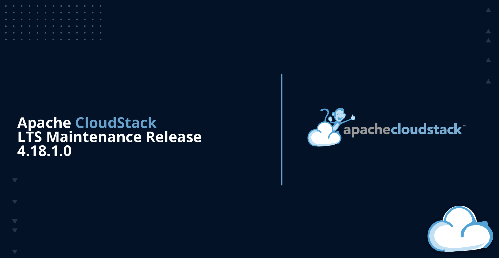

The Apache CloudStack project is pleased to announce the release of
CloudStack 4.18.1.0.

The CloudStack 4.18.1.0 release is a maintenance release as part of
its 4.18.x LTS branch and contains around 200 fixes and
improvements since the CloudStack 4.18.0.0 release.

<!-- truncate -->

Some of the highlights include:

- Support Managed User Data in AutoScale VM groups
- Support CKS (CloudStack Kubernetes Cluster) in VPC tiers
- Support for VMware 8.0.0.x
- Several Hypervisor (VMware, KVM, XenServer) fixes and improvements
- Several UI fixes and improvements
- Several Network (L2, VXLAN, etc) fixes and improvements
- Several System VM (CPVM, SSVM) fixes and improvements
- Improve Solidfire storage plugin integration on VMware
- Support volume migration in ScaleIO/PowerFlex within and across ScaleIO/PowerFlex storage clusters
- Volume encryption support for StorPool
- Fix CloudStack upgrade with some MySQL versions
- Fix guest OSes and guest OS mappings in CloudStack database

CloudStack LTS branches are supported for 18 months and will receive
updates for the first 12 months and only security updates in the last
6 months.

Apache CloudStack is an integrated Infrastructure-as-a-Service (IaaS)
software platform that allows users to build feature-rich public and
private cloud environments. CloudStack includes an intuitive user
interface and rich API for managing the compute, networking, software,
and storage resources. The project became an Apache top-level project
in March 2013.

More information about Apache CloudStack can be found at:
https://cloudstack.apache.org/

# Documentation

What's new in CloudStack 4.18.1.0:
https://docs.cloudstack.apache.org/en/4.18.1.0/releasenotes/about.html

The 4.18.1.0 release notes include a full list of issues fixed, as
well as upgrade instructions from previous versions of Apache
CloudStack, and can be found at:
https://docs.cloudstack.apache.org/en/4.18.1.0/releasenotes/

The official installation, administration, and API documentation for
each of the releases are available on our documentation page:
https://docs.cloudstack.apache.org/

# Downloads

The official source code for the 4.18.1.0 release can be downloaded
from our downloads page:
https://cloudstack.apache.org/downloads.html

In addition to the official source code release, individual
contributors have also made convenience binaries available on the
Apache CloudStack download page, and can be found at:

- https://download.cloudstack.org/el/7/
- https://download.cloudstack.org/el/8/
- https://download.cloudstack.org/ubuntu/dists/
- https://www.shapeblue.com/packages/
