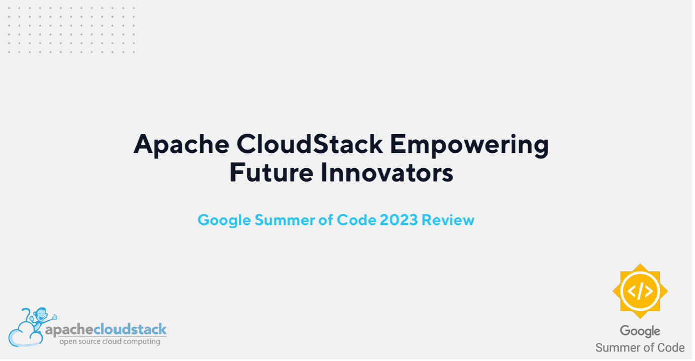
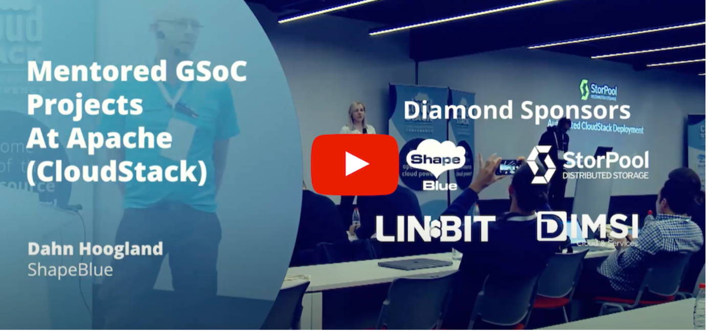

In the ever-evolving landscape of open-source software development, fostering
the growth of young talents and innovators is essential. One remarkable program
that stands at the forefront of this mission is the [Google Summer of Code
(GSoC)](https://summerofcode.withgoogle.com/). For years, GSoC has been an
invaluable platform for students to collaborate with prominent open-source
organizations, and Apache CloudStack is proud to be a part of this
transformative journey.

<!-- truncate -->

As an open-source Infrastructure-as-a-Service (IaaS) platform, Apache CloudStack
has consistently provided a robust, scalable, and reliable solution for building
and managing cloud environments. With a global community of developers and
contributors, CloudStack has had an ongoing commitment to the GSoC programme and
its students in the last years. We believe that young talents should be led in
their open-source journey and projects shall be willing to help them learn and
develop new skills and knowledge.

# A Word From this Year’s Participant and Mentor

>“Working on the Apache CloudStack project gave me the opportunity to understand
>how cloud computing infrastructure as a service works, the usage of nested
>virtualization and all other technical aspects involved.
>
>The community has been really welcoming and supportive, and I’m excited to be a
>part of this community.”
>
>-&nbsp;[Ayush Pandey](https://www.linkedin.com/in/itsayushpandey/), GSoC 2023 Student

>“I am very excited to be coordinating the CloudStack projects for the Google
>Summer of Code 2023 and mentoring Ayush on his project. I think GSOC is a great
>experience as an introduction to open-source projects and meeting its community,
>and from the mentor side it’s a great opportunity to meet and support talented
>people.”
>
>-&nbsp;[Nicolas Vazquez](https://www.linkedin.com/in/nvazquezuy/), GSoC 2023 Mentor

# The Impact of GSoC on Open-source Technologies

In 2023, the Google Summer of Code (GSoC) program made a resounding impact on
the world of open-source software development. With an impressive participation
of 966 new contributors from across the globe, GSoC facilitated their engagement
in 12+ week projects, collaborating with 168 open-source organizations. This
global initiative united mentors and contributors hailing from over 75
countries, creating a dynamic ecosystem of innovation and learning.

For nearly two decades, GSoC has thrived on the collective enthusiasm of
open-source communities and the dedication of 19,000+ volunteer mentors, each
spending between 50 to 150 hours guiding over 20,000 contributors since 2005. In
2023, this tradition continued with 168 mentoring organizations and a staggering
1,950 mentors supporting the program.

# A Preview of the Work Completed by GSoC Students

This year, Ayush worked on adding implementation of import/export instances to
the KVM hypervisor. The unmanaging instance feature is only available for the
VMWare hypervisor in the latest version of CloudStack. This summer, Ayush worked
on extending it to the KVM hypervisor. Click here to learn more about his
project -  https://summerofcode.withgoogle.com/programs/2023/projects/f0gpheQM

You can also see the CloudStack community submission to GitHub here -
https://github.com/apache/cloudstack/pull/7712

In last year’s CloudStack Collaboration Conference, a previous GSoC mentor, Daan
Hoogland, held a talk, where he reviewed the involvement of CloudStack in GSoC,
and looked at some of the work done by the GSoC students.

