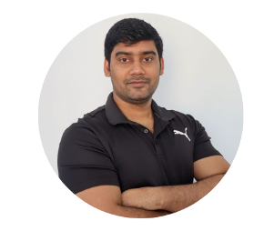
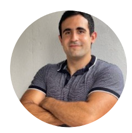

Are you ready for the most anticipated Apache CloudStack event of the year? The
CloudStack Collaboration Conference is back, and this time it's happening in
Paris on November 23-24.

The wait is finally over, as the conference agenda has just been released,
giving attendees the chance to plan their schedules and make the most of this
extraordinary gathering of cloud enthusiasts, developers, and industry leaders.

<!-- truncate -->

# A Glimpse into the Agenda

The [recently released agenda](https://www.cloudstackcollab.org/#schedule)
offers a tantalizing glimpse into what attendees can expect over the two days of
the conference. With a diverse range of sessions and workshops, there's a wealth
of knowledge to be gained and connections to be made. Here are some highlights
from the agenda:

**State of the Union, [Rohit Yadav](https://www.linkedin.com/in/rohityadavcloud/)**

In this session, Rohit will reflect on the last year of project collaboration,
developments in CloudStack and community activity. He will set out how he sees
the project developing over the next few years.

**Keynote Talk: Open Source is Not Dead, [Charles Schulz](https://www.linkedin.com/in/charlesschulz/)**

Successful open source companies change their business models and then the open
source license they were distributing their software on. More and more it feels
like Open Source is just a marketing buzzword designed to lure customers to a
particular solution. On the regulatory front, the EU is implementing the CRA and
handling software as it were trucks manufacturing. Is there any hope left for
Open Source? Has it failed in delivering its premise?

Fear not. Open Source's not dead. It has already won and it will prevail again.

**What’s New in CloudStack and What Will Come in 4.19, [Abhishek Kumar](https://www.linkedin.com/in/shwstppr/)**

Abhishek will give a brief introduction to the new and exciting features in the
upcoming Apache CloudStack 4.19 release.

**How to Re-use Old Hardware with CloudStack. Saving Money and the Environment, [Wido den Hollander](https://www.linkedin.com/in/widodh/)**

Wido will share how using older hardware for a longer time can save money and
the environment by not producing new hardware.

**Migrating VMware Infra to KVM Using CloudStack, [Nicolas Vazquez](https://www.linkedin.com/in/nvazquezuy/)**

In this session, Nicolas will present a new feature, targeted for CloudStack
4.19, which allows administrators to migrate Instances from a VMware environment
(external or connected to CloudStack) and import them into a KVM
CloudStack-managed environment.

The CloudStack Collaboration Conference is a wholly community-driven event
orchestrated by volunteers and dedicated enthusiasts from within the community.
We extend our gratitude to the sponsors of the CloudStack Collaboration
Conference – [ShapeBlue](https://www.shapeblue.com/),
[StorPool](https://storpool.com/), [LINBIT](https://linbit.com/),
[DIMSI](https://cloud.dimsi.io/#/), [Vates](https://www.vates.fr/),
[mitteldeutsche IT](https://mitteldeutsche-it.de/),
[Leaseweb](https://www.leaseweb.com/), [proIO](https://www.proio.com/),
[Your.Online](https://your.online/) and [Stack
Console](https://www.stackconsole.io/) – for their help in bringing this event
to the worldwide community.
