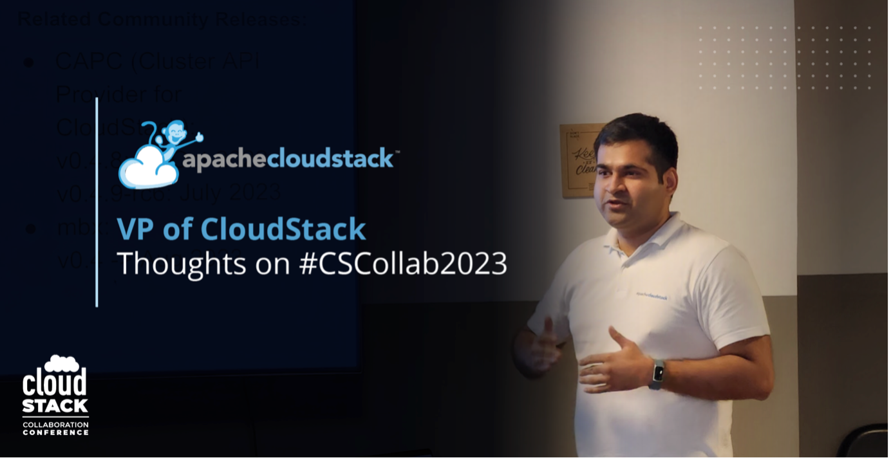

The [CloudStack Collaboration Conference
2023](https://www.cloudstackcollab.org/) is only a few weeks away. This year’s
event will be taking place in Paris and online, on 23-24th November.
[Registration is still
open](https://events.hubilo.com/cloudstack-collaboration-conference-2023/register),
with free tickets to anybody interested in the open-source project or cloud
technology. The event’s agenda has also been released, which you can see when
registering for the event.

I decided to interview the project’s current VP, [Rohit
Yadav](https://www.linkedin.com/in/rohityadavcloud/), to get his thoughts on the
annual event.

<!-- truncate -->

**Why should individuals and organisations in the cloud industry be excited to
attend CloudStack Collab 2023?**

*“I think the conference gives a great opportunity to everyone in the community,
be it an individual, a small and midsize business, or an enterprise, to
participate, collaborate, learn about what is coming in CloudStack and to meet
and network with people.*

*CloudStack Conferences and events provide a neutral space for the community to
come together, interact and learn about ongoing and future development of the
project, influence the direction of the project and form potential partnership
with one-another to support their objectives. This can also ensure long-term
stability of the contributor base, participation and health of the project.*

*The benefit of a hybrid event is those who aren't able to attend the conference
in person can still participate online, and watch the video streams or the
recordings later on.*

*It can also benefit people looking to learn about reducing cloud costs. It is
not a new thing that companies around the world are under financial pressure. We
have seen through various scenarios in the past, that moving from VMware to
CloudStack, or moving away from Hyperscalers to CloudStack can significantly
reduce the cost of ownership. So, the conference and its videos can help a lot
of people who are considering CloudStack, as well as those already implementing
it.”*

**Are there any specific talks that stand out to you and that you are most looking forward to?**

*“There are certainly several talks that I am really excited about – these are new
features in Apache CloudStack, use-cases of CloudStack, as well as sessions from
thought leaders who are going to talk about their perspective on CloudStack and
open-source. So, I am particularly excited about these talks.”*

**Can you give a sneak peek into your ‘State of the Union’ talk?**

*“One of the things I did was look at what previous VPs spoke about in their
State of the Union talks. So, there will be content about the community, changes
since last years, updates about releases and reflecting on what happened in the
community, in the last year.*

*I will also look into trends in the community, whether that is from the mailing
lists or from GitHub, as well as discuss new initiatives in the community. I'm
still figuring out a theme to stitch the content that I already have and
I am reaching out to people and organisations for quotes in support of
CloudStack.”*

**How do you feel the CloudStack community has evolved in recent years?**

*“Just like the project itself, the community has matured a lot alongside it. We
have over a decade of CloudStack releases, making it a stable and mature
product. A lot of people have been with the project since the early days and
they have a stable and mature outlook on using CloudStack*

*A term that can be applied here is [mechanical
sympathy](https://wa.aws.amazon.com/wellarchitected/2020-07-02T19-33-23/wat.concept.mechanical-sympathy.en.html#:~:text=Mechanical%20sympathy%20is%20when%20you,Jackie%20Stewart%2C%20racing%20driver),
which can explain how and why some people can become more intuitive than others
when it comes to the open-source software. As a result, CloudStack becomes an
extension of somebody who understands it better, as they will know its
limitations, thus meaning they know where to push it and where not to push it.”*

**How does the CloudStack Collaboration Conference contribute to fostering
collaboration among the CloudStack community members?**

*“There are a lot of users/vendors who have their idea of where CloudStack could
be extended and used. One of the great perks of CCC is that it gives networking
opportunities, where people can discuss their ideas, roadmaps and align with
others on where they want to see CloudStack go.*

*We have seen in the past where multiple parties have come together to push
CloudStack in a direction with respect to a feature or their roadmap or business
strategy.”*

**Do you believe that open-source technologies will become more prevalent
among MSP’s and enterprises? If so, why? **

*“Yes, I believe so. Any open-source project would have a community around it
and that it is easy to get access its the source code, modify and
redistribute it. What that unlocks is that for the same software, there might be
multiple vendors, which means there is not a vendor lock-in and therefore the
total cost of ownership is lower.*

*Open-source also fosters innovation, as every MSP or enterprise will have their
own roadmap and things they want to do with the software. Achieving these
objectives will require changes in the software, which is possible because
they’re not dependent on a vendor, meaning they can do it themselves or they can
partner with other parties in the relevant open-source ecosystem to achieve their
goals.”*
