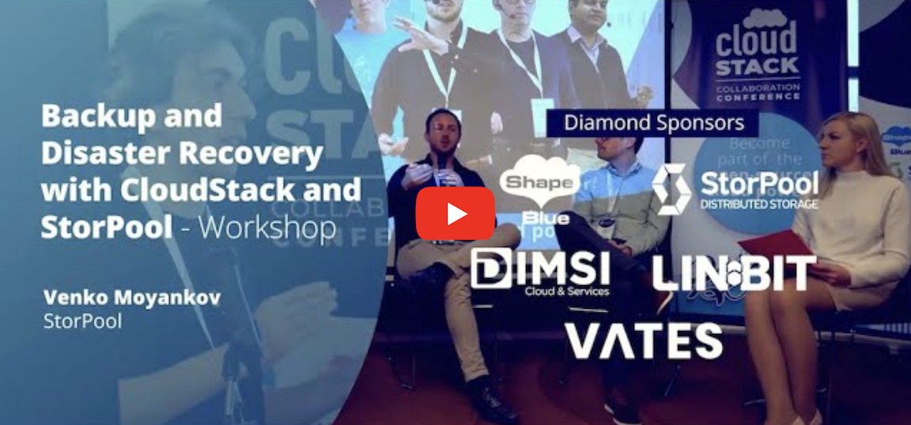
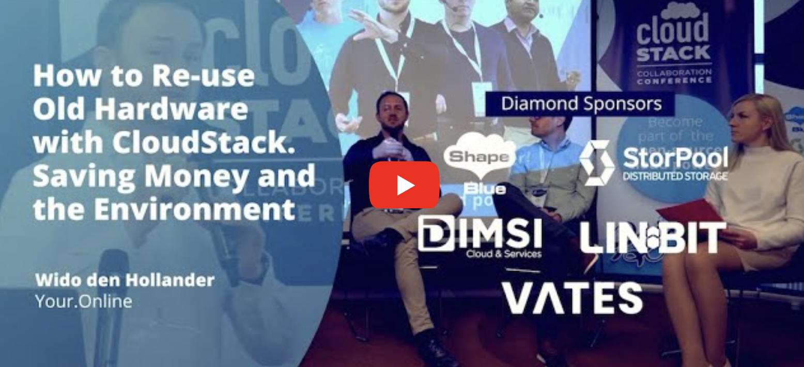
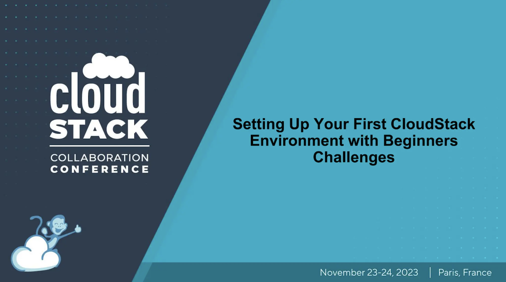
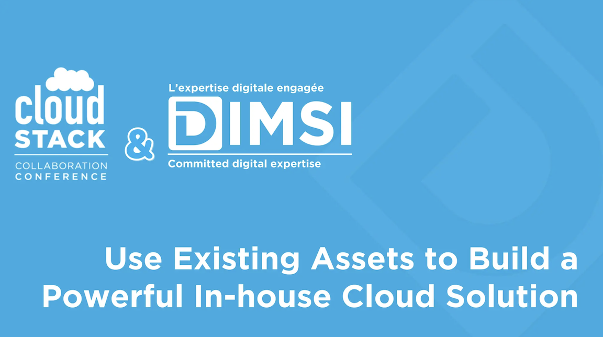
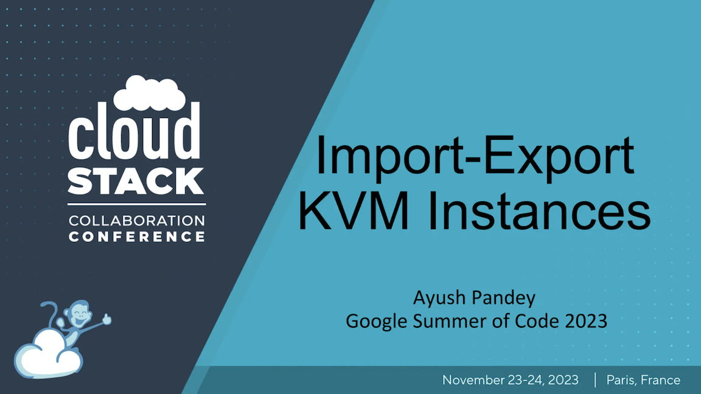

The [CloudStack Collaboration Conference
2023](https://www.cloudstackcollab.org/) took place on 23-24th November. The
annual event is the largest get-together for the global Apache CloudStack
community. The hybrid event is aimed at developers, operators and users to
discuss and evolve the open-source software, its functionality and real-world
operability. It introduces attendees to the CloudStack family, community
leaders, project members and contributors.

The conference, arranged by a group of volunteers from the Apache CloudStack
Community, took place in the voco hotel, in Porte de Clichy, Paris. It hosted
over 350 attendees from 30+ countries, with 47 speakers holding sessions and
workshops.

The Apache CloudStack community would like to express their gratitude to the
sponsors of the conference, whose support made the event a reality – [ShapeBlue](https://www.shapeblue.com/),
[StorPool](https://storpool.com/), [LINBIT](https://linbit.com/), [DIMSI](https://cloud.dimsi.io/#/), [Vates](https://vates.tech/), [mitteldeutsche IT](https://mitteldeutsche-it.de/), [Leaseweb](https://www.leaseweb.com/), [proIO](https://www.proio.com/) and
[Your.Online](https://your.online/).

This blog provides a summary of the event, featuring the session slides and recordings.

<a class="button button--primary button--lg" href="https://photos.app.goo.gl/9Ke53cngVzTCS2wE7" target="_blank">View Photo Gallery</a> 

<!-- truncate -->

## Day 1 Sessions

### State of the Union, [Rohit Yadav](https://www.linkedin.com/in/rohityadavcloud/)

The Apache CloudStack project has had another exciting year – with growth in
adoption, functionality and community size. In the project’s annual State of The
Union talk, the current VP of the project, Rohit Yadav, reflects on the last
year of the project’s collaboration, developments in CloudStack and community
activity. He sets out how he sees the project developing over the next few
years.

### What’s New in CloudStack 4.19, [Abhishek Kumar](https://www.linkedin.com/in/shwstppr/)

This session gives a brief introduction of the new and exciting feature in the
latest (upcoming) CloudStack LTS release, ie, 4.19.0. The discussion includes
the details on the timeline of the CloudStack 4.19.0 release, overview of some
of the marquee, new feature of the release – Object storage framework, KVM
ingestion, Hypervisor agnostic simple DRS, CAPC aware CKS, OAuth2, DRaaS with
Multi zone disaster recovery, etc and a summary of improvements added since the
previous major LTS release of the CloudStack, ie, 4.18.0.

### Keynote Talk: Open Source is Not Dead, [Charles Schulz](https://www.linkedin.com/in/charlesschulz/)

Successful Open Source companies change their business models and then the open
source license they were distributing their software on. More and more it feels
like Open Source is just a marketing buzzword designed to lure customers to a
particular solution. On the regulatory front, the EU is implementing the CRA and
handling software as it were trucks manufacturing. Is there any hope left for
Open Source? Has it failed in delivering its premise? Fear not. Open Source’s
not dead. It has already won and it will prevail again.

### Why and How CloudStack at weSystems, [Stephan Bienek](https://www.linkedin.com/in/stephan-bienek-66aa69206/)

Why? What? How? During the session, Stephan shares what made weSystems choose
CloudStack as their main platform, which they base most of their managed
services on. In addition, he talks about which services they provide based on
CloudStack and how they integrated and use CloudStack today.

### How We Use CloudStack to Provide Managed Hosting, [Swen Brüseke](https://www.linkedin.com/in/swen-br%C3%BCseke-391912193/)

Swen shows how proIO utilize CloudStack to provide customers with managed
hosting solutions and versatile public and private cloud solutions, mainly based
on open-source software.

### Panel Discussion: Apache CloudStack Question Time, Giles Sirett, Wido den Hollander, Stephan Bienek, Swen Brüseke

Panel group – taking a range of submitted questions from the audience (across
any subject).

### KVM Security Groups Under the Hood, [Wido den Hollander](https://www.linkedin.com/in/widodh/)

They are just a few clicks in the UI or a single API call, but how do security groups work at KVM hypervisor level? How do they filter traffic and what else do they do in addition to firewalling? What Anti-Spoofing policies are implemented by the security groups?

In this talk, Wido dives into the specifics of the security groups on the KVM hypervisor for both IPv4 and IPv6.

### Elevating Privacy and Security in CloudStack, [Boris Stoyanov](https://www.linkedin.com/in/bstoyanov/)

In an increasingly interconnected digital landscape, safeguarding data privacy
and ensuring robust security measures are paramount. CloudStack offers a dynamic
ecosystem for deploying and managing cloud resources. However, to fully harness
its potential, it is crucial to address privacy and security concerns
effectively.

This presentation explores the realm of possibilities and demonstrates how
CloudStack can enhance the privacy and security of your cloud deployments. Boris
examines practical approaches to protect sensitive data, fortify communications,
and secure your infra against emerging threats. Join us on a journey to discover
how CloudStack can be your trusted ally in the quest for a more secure and
private cloud environment.

### Migrating VMware Infra to KVM Using CloudStack, [Nicolas Vazquez](https://www.linkedin.com/in/nvazquezuy/)

In this session, Nicolas presents a new feature, targeted for CloudStack 4.19,
which allows administrators to migrate Instances from a VMware environment
(external or connected to CloudStack) and import them into a KVM
CloudStack-managed environment.

### Updates on the LINSTOR Driver for CloudStack, [Rene Peinthor](https://github.com/rp-)

About two Years ago, the LINSTOR driver for CloudStack was merged into the
CloudStack code base, and it has received updates since then. Rene gives a quick
overview of LINSTOR/DRBD and the driver, followed by more details on recently
added features.

One is the ability to optionally store data snapshots on secondary storage,
about making deep copies of templates vs using snapshots, about using
LINSTOR/DRBD on XCP-ng hypervisors under Apache CloudStack, and (if finished by
November) about VM-snapshots on LINSTOR/DRBD.

### Zero to Cloud Hero: Crafting a Private Cloud from Scratch with XCP-ng, Xen Orchestra and CloudStack, [Olivier Lambert](https://www.linkedin.com/in/olivier-lambert-22316b26/)

Dive into the seamless integration of the Vates stack as the foundation for your
CloudStack deployment. In this workshop, you’ll witness the power and simplicity
of XCP-ng and Xen Orchestra. From a blank slate to a fully operational private
cloud, Olivier guides you through each pivotal step. Learn how to streamline
your cloud setup process and unlock the potential of a private cloud
infrastructure that’s both efficient and easy to manage. Watch to discover how
to transform bare metal into a cloud powerhouse in mere minutes.

### VNF Integration and Support in CloudStack, [Wei Zhou](https://www.linkedin.com/in/wei-zhou-3635b633/)

In this session, Wei presents how CloudStack 4.19 adds the capability to easily
and quickly perform a light-touch integration of networking appliances with ACS,
allowing for operators to offer a broader range of networking services while
empowering end-users to effortlessly deploy their own virtualized network
functions.

### Developments to CloudStack’s SDN ecosystem: Integration with VMWare NSX 4, [Pearl Dsilva](https://www.linkedin.com/in/pearldsilva/), [Alexandre Mattioli](https://www.linkedin.com/in/alexandremattiolibastos/)

In recent releases, Apache CloudStack has been evolving towards richer support
for Software Defined Networking (SDN) solutions. In ACS 4.18, we introduced
integration with Tungsten Fabric SDN, which opened ACS to several long-awaited
features such as overlay networks, BGP, MPLS and other sophisticated networking
capabilities. We now are working towards integrating VMWare NSX 4 with
CloudStack, which will enable agile software-defined infrastructure for building
cloud-native micro-segmented application environments on VMWare using
CloudStack.

In this talk, Pearl and Alex delve into the expansion of ACS’s SDN ecosystem
with the integration of VMWare NSX 4, thus enabling operators to make informed
decisions regarding the right SDN platform for their CloudStack deployment. They
also look into what it takes to create a new network provider in CloudStack.

### Backroll, News and Demo, [Pierre Charton](https://www.linkedin.com/in/pierre-charton-068b6748/), [Matthias Dhellin](https://www.linkedin.com/in/matthias-dhellin-217068298/), [Ousmane Diarra](https://www.linkedin.com/in/odiarra1/)

Pierre, Matthias, and Ousmane demonstrate the new Backroll version, with a new
and easy installation process. They also give a demo of the new features of the
project and its integration with CloudStack, providing an all-in-one solution.

### Backup and Disaster Recovery with CloudStack and StorPool – Workshop, [Venko Moyankov](https://www.linkedin.com/in/venkomoyankov/)

One of the main shortcomings of CloudStack compared to VMware is the lack of built-in support for disaster recovery. In this workshop, Venko shows how you can build a cloud using Apache CloudStack and StorPool storage that features disaster recovery capabilities and off-site backups. He shows a reference architecture of the solution, followed by a live demo on how to set backup policies, backup virtual machines and recover the VMs in a site-down event.

The workshop allows an open discussion about the practical aspects of implementing a DR service, the difficulties of building such solutions and how to address them.

### Mitigating Common CloudStack Instance Deployment Failures, [Jithin Raju](https://www.linkedin.com/in/rajujith/)

A discussion on the common failures when using CloudStack taking instance
deployment as an example. The session includes 15 specific failure scenarios,
their causes, and possible mitigation steps.

## Day 2 Sessions

### How to Re-use Old Hardware with CloudStack. Saving Money and the Environment, [Wido den Hollander](https://www.linkedin.com/in/widodh/)

CloudStack allows you to use older hardware for a longer time in your cloud
environment. By using older hardware for a longer time you can save money and
the environment by not producing new hardware.

### Hypervisor Agnostic DRS in CloudStack - Brief overview & demo, [Vishesh Jindal](https://www.linkedin.com/in/vishesh92)

Vishesh has been working on the feature hypervisor-agnostic DRS in CloudStack. He briefly overviews the implementation and discusses the algorithms currently available and how they can improve resource allocation and workload balancing in virtualized environments. Additionally, Vishesh showcases a live demo of hypervisor agnostic DRS in action, highlighting its capabilities and effectiveness.

### Building a Software Makerspace with CloudStack to Drive Innovation by Improving Learning and Research Abilities at Universities, [Jonas Willén](https://www.linkedin.com/in/jonas-will%C3%A9n-6a745a56), [Pierre Le Fèvre](https://www.linkedin.com/in/pierrelefevre), [Emil Karlsson](https://www.linkedin.com/in/e-karlsson)

A makerspace today is focused on turning ideas into physical prototypes by
providing resources in terms of tools and infrastructure. In a university, a
makerspace provides students with an opportunity to build a portfolio. Students
experiment through an entire development life cycle by creating prototypes for
each stage of a cycle. It has been shown to be a productive method for learning.

To the best of our knowledge, software development is yet to be included in the
makerspace concept. In the case of our software makerspace, it is following the
same principles as a traditional makerspace for device and mechanical
prototyping, but instead provides software development tools. One such
indispensable tool is cloud-based infrastructure. A cloud facilitates rapid
prototyping of machine learning tools, microservices, IoT data mining, etc.

This talk presents their approach to extend the concept of a makerspace to
software development using a student developed private cloud. They present the
method they used to gather requirements from various researchers and students.
They also present the final design and the current implementation of the cloud
using Apache CloudStack. Finally, they discuss how other universities could
implement their own software makerspace and its benefits.

### DRBD Deep Dive, [Philipp Reisner](https://www.linkedin.com/in/philipp-reisner)

LINSTOR/DRBD became a primary storage option for Apache CloudStack nearly two years ago. In this session, Philipp shares insights about the internals of DRBD, the data-path part of the data-storage solution.

Knowing about DRBD’s meta-data, the activity log, and the bitmap will enable you to make more educated decisions when it comes to selecting the right hardware for your next ApacheCloudStack+LINSTOR+DRBD deployment. When your servers have different storage tiers, what are the advantages and trade-offs regarding putting data and meta-data on different tiers?

Recently, DRBD got a new transport, load-balancing TCP, that joins the existing TCP transport, and the RDMA transport received important updates. Looking beyond DRBD, what is important to know when selecting the RAID level and data alignment? Philipp concludes the session with comments regarding LVM compared to ZFS.

### Setting Up Your First CloudStack Environment with Beginners Challenges, [MD Rasel](https://www.linkedin.com/in/mdrasel0)

Are you eager to embark on your journey into the world of cloud computing with Apache CloudStack but don’t know where to start? This informative session is designed especially for beginners. MD Rasel guides you through the essential steps of setting up your very first CloudStack environment, from initial installation to basic configuration.

This session aims to equip newcomers to Apache CloudStack with the fundamental knowledge and practical skills required to establish their own cloud infrastructure. MR Rasel addresses common challenges that beginners often encounter during the setup process and provide valuable insights on how to overcome them.

The session consists of a combination of presentations and live demonstrations. Attendees had the opportunity to follow along with the setup process in real time and ask questions.

### Transitioning from VMware vCloud to Apache CloudStack: A Path to Profitability and Competitiveness, [Marco Sinhoreli](https://www.linkedin.com/in/msinhore)

In this session, Marco explores the potential of migrating from VMware vCloud to
Apache CloudStack with KVM. VMware vCloud Suite is a robust cloud infrastructure
and management solution that combines vSphere and vRealize Suite, providing
automation and operations capabilities for traditional and modern infrastructure
and apps. However, the transition to Apache CloudStack can offer enhanced
profitability and competitiveness.

Marco delves into the benefits of Apache CloudStack, including its
cost-effectiveness and open-source nature, and discusses how a gradual migration
from VMware vCloud can reduce ownership costs, increase profitability, and
enhance competitiveness. He also covers the practical steps and considerations
in planning and executing this transition effectively.

### CloudStack and GitOps at Enterprise Scale, [Alex Dometrius](https://www.linkedin.com/in/alexdometrius), [Rene Glover](https://www.linkedin.com/in/rene-glover)

The AT&T team recently embarked on a journey with CloudStack and has since
deployed a solution which encompasses multiple data-centers. This talk focuses
on how they are using open source tools like CloudStack, FreeIPA, and Metal as a
Service (MaaS) to support KVM-based VM provisioning at an enterprise scale
within a GitOps model.

### 2FA and OAuth2 in CloudStack, [Andrija Panić](https://www.linkedin.com/in/andrijapanic)

This talk is about authentication and authorization – Two-Factor Authentication
(2FA) and OAuth2 explaining their critical roles in enhancing security and user
experience within the realm of Apache CloudStack.

With Two-Factor Authentication (2FA), we strengthen the authentication process,
mitigate password-related or usual login vulnerabilities, and ensure compliance
with security standards. On the other side of the authentication spectrum,
OAuth2, the industry-standard authorization framework, simplifies the process of
granting access to resources. Andrija discusses how this can be used and how it
fits in CloudStack.

### Centralized Logging Feature in CloudStack using ELK and Grafana, [Kiran Chavala](https://www.linkedin.com/in/kiran-chavala-1bb6a97)

In this session, Kiran demonstrates how to centralize all the CloudStack-related
logs in one place using Elastic Search and generate beautiful dashboards in
Grafana. This session simplifies the troubleshooting process involved with
CloudStack and quickly helps to resolve the issue.

### DRaaS using Snapshot copy and destination selection (DRaaS), [Alexandre Mattioli](https://www.linkedin.com/in/alexandremattiolibastos)

Apache CloudStack 4.19 introduces the capability for end-users to copy their
root disk or volume snapshots to one (or more) ACS Zones without operator
intervention. In this talk, Alex shows how this simple yet powerful new feature
enables for end-users to control where their data resides and for operators to
provide low-cost and robust DRaaS to their customers.

### Use Existing Assets to Build a Powerful In-house Cloud Solution, [Magali Pervan](https://www.linkedin.com/in/magali-pervan), [Joffrey Luangsaysana](https://www.linkedin.com/in/jluang), [Grégoire Lamodière](https://www.linkedin.com/in/gr%C3%A9goire-lamodi%C3%A8re-04171210)

How to minimize the impact when it’s time to implement a cloud solution for
automating internal workloads and delivering efficient solutions? Magali,
Joffrey, and Grégoire present a case study of a successful hardware reuse
project, including key metrics: Business objectives, Performance objectives and
Financial objectives.

### CloudStack Managed User Data and Demo, [Harikrishna Patnala](https://www.linkedin.com/in/harikrishnapatnala)

We know existing Userdata support in CloudStack enables users to inject custom
scripts or data into virtual machines during provisioning, facilitating
automation and customization of VM setup and configuration. This talk is about
delivering the extended support of userdata with “Managed UserData” which
enables users to register and manage their own UserData script(s) as a
CloudStack resource - followed by a demo.

### Project Sustainability and Vendor Contributions in an Apache Governance Model – Panel, [Ivet Petrova](https://www.linkedin.com/in/ivpetrova), [Daan Hoogland](https://www.linkedin.com/in/dhoogland) and [Alex Ivanov](https://www.linkedin.com/in/alex-p-ivanov)

This Panel discusses the Apache CloudStack project sustainability and vendor
contributions in an Apache Governance Model. The participants present the
different points of view from the development perspective, vendor contributions
and PMCs. Panellists share their perspectives on how to help the project grow,
increase its visibility and ensure its longevity and healthy development.

### Enabling DPU Hardware Accelerators in XCP-ng Cloud Platform Environment, Andrei Semenov

In cloud computing environments, VMs require fast access to resources like
storage and networking. The hardware that the VMs access is implemented in
software and/or by passing through a dedicated hardware device. Software-based
solutions consume extra CPU cycles, thus resulting in poor performance. Also,
these require to expose a device-model to the guest, thus increasing the attack
surface. Conversely, hardware passthrough provides better performance and
security but can be expensive in terms of the number of physical resources,
since each device is dedicated to a single VM. This talk focuses on how Vates is
working on sharing hardware resources among VMs by relying on dedicated
processors named Data Processing Units (DPU). More precisely, Vates work on
offloading Xen hypervisor of storage emulation by relying on Kalray K200 DPU
PCIe controllers, a hardware accelerator based on MPPA architecture.

### CloudStack Object Storage - An Introduction, [Vladimir Petrov](https://www.linkedin.com/in/vladimir)

CloudStack 4.19 introduces a new framework for object storage. In this talk,
Vladi explains what has driven this development, the architecture chosen and
current integration points with Object store providers.

### Confidence in CloudStack, [Aron Wagner](https://www.linkedin.com/in/aronwagne), [Nathan Gleason](https://www.linkedin.com/in/nathangleason)

In an ever-growing landscape of thousands of virtualization and cloud native
projects it can be hard to understand what projects reliably just work.
Fortunately for the growing community at CloudStack that is precisely what we
(American Cloud) found.

### Declarative Kubernetes Cluster Deployment with CloudStack and Cluster API, [Ozhan Karaman](https://www.linkedin.com/in/ozhan-karaman)

Are you currently managing Kubernetes clusters in the cloud and considering a
transition to on-premises infrastructure using CloudStack? This session is an
exciting demonstration of how you can deploy Kubernetes clusters in a
declarative manner, leveraging the capabilities of CloudStack and Cluster API.
In this demo, Ozhan showcases a comprehensive solution that combines Packer,
Gitlab CI, ArgoCD, Cluster API, and Cluster Autoscaler to create a seamless
on-premises deployment strategy adaptable to diverse requirements over
CloudStack Infrastructure.

### Extending KVM Host HA for Non-NFS Storage, [Alex Ivanov](https://www.linkedin.com/in/alex-p-ivanov)

The current KVM Host HA feature depends on the existence of an NFS primary storage to detect which nodes are online, even if other types of primary storage are used. StorPool extends the HA feature to allow other methods to be used for this. The new implementation adds support for using StorPool Storage for HA heartbeats, removing the need for NFS primary storage. The solution developed by StorPool allows new storage vendors and protocols to be added easily.

### Live Demo Showcase: Unveiling Dell PowerFlex’s IaaS Capabilities with Apache CloudStack, [Florian Coulombel](https://www.linkedin.com/in/fcoulombel)

Dell PowerFlex is the latest storage platform to offer advanced integration with
Apache CloudStack. Powerflex, a software-defined platform, has built a
reputation for performance, agility, and scalability and is already being used
in a number of large-scale CloudStack IaaS environments.

Watch the session to see the live demo of the integration and automation
capabilities.

Some of the key features showcased are: Infrastructure Provisioning and
Configuration, VM operations & lifecycle management and Infrastructure
Management & Monitoring.

### Import Export Virtual Machine for KVM Hypervisor, [Ayush Pandey](https://www.linkedin.com/in/itsayushpandey)

Ayush talks about his contribution as a GSoC Contributor, for implementing the
Import-Export Instances feature for the KVM Hypervisor.

