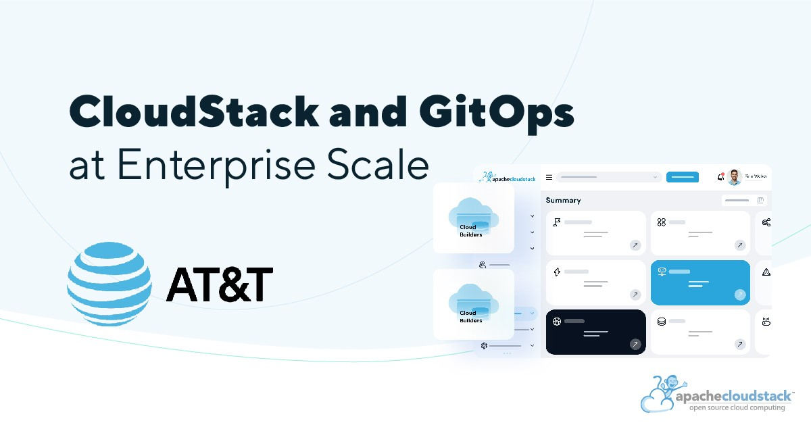

# CloudStack and GitOps at Enterprise Scale – The Success of AT&T

AT&T is a provider of telecommunications, media, and technology
services. The company offers wireless communications, data/broadband
and internet services, local and long-distance telephone services,
telecommunications equipment, managed networking, and wholesale
services. AT&T is a 125+ year old telecommunications company based in
Dallas, Texas. Their main purpose is to create connection – a
connection to friends, family, work, commerce, education, health,
entertainment and more by using advanced technology and delivering
services globally.

During the annual CloudStack Collaboration Conference 2023, Alex
Dometrius, Associate Director - Technology at AT&T, presented the talk
CloudStack and GitOps at Enterprise Scale, where he outlined their
journey with Apache CloudStack and the architecture they used to
managed their CloudStack-based platform using GitOps.

<!-- truncate -->

In the spirit of continuous improvement, Alex’s team looked for an
opportunity to improve on how they do infrastructure provisioning
within the enterprise ultimately leading to deployment of CloudStack.

After reviewing a few different cloud management platforms, AT&T
decided to deploy CloudStack as a centrally-managed and
centrally-supported IaaS platform, because if its multi-tenancy,
allowing the application teams within the business to maintain their
own-dedicated environments. Other reasons to choose CloudStack were
the CloudStack Terraform Provider and Native APIs, over-provisioning
capabilities and ability to manage the CloudStack-based platform using
GitOps.

In their talk during the CloudStack Collaboration Conference, Alex
Dometrius shares more about the issued solved and the success with
CloudStack. As a follow up of their talk at the event, we asked a few
questions to the AT&T team, to understand more about their choice of
technology and learn for their experience of managing infrastructure
at a large-scale and enterprise level.

<iframe width="100%" height="480p" src="https://www.youtube.com/embed/Bc1a8YHdEq4?si=V7QZM660_YS9pjKp"
title="YouTube video player" frameborder="0" allow="accelerometer;
autoplay; clipboard-write; encrypted-media; gyroscope;
picture-in-picture; web-share" allowfullscreen>
</iframe>

  Alex Dometrius, Associate Director - Technology at AT&T, presents at
  CloudStack Collaboration Conference 2023.

<strong>Why AT&T chose open-source technologies?</strong>

Our team has a long history of consuming and contributing to
open-source projects and we strive to use open-source technology
wherever possible. At risk of stating the cliché benefits of using
open-source software, there are several reasons why we lean towards
open-source solutions. Cost of entry is generally lower when deploying
open-source which allows us to deliver solutions to the business much
faster. These costs can also remain lower if there is an active
user/contributor community like what we found with CloudStack.

<strong>During your talk, you mentioned running PoCs of CloudStack and
  other technologies. What do you recommended to be tested during a
  PoC?</strong>

Why you chose CloudStack? Each use case is different obviously. The
scale of the implementation, how users will interact with the
platform, how migration from present state to future state can be
carried out when deploying a new cloud platform are all items we took
into consideration. As mentioned, CloudStack checked several of the
requirements we had: multi-tenancy capabilities, support for
infrastructure as code, project quota controls, an active open-source
community, etc.

<strong>How does CloudStack fit with the other technologies AT&T uses
internally?</strong>

CloudStack’s ability to support VMWare was another reason we chose to
deploy it. We have an existing VMWare footprint and we chose
CloudStack as a mechanism to help continue to support VMWare workloads
while also moving to a KVM-focused VM platform. For our team, it was
less about how CloudStack fit into our existing technology stack, as
this stack has a lot of legacy, home-grown tools, and more about the
capabilities CloudStack will provide as an enabler for us to move to a
more modern private cloud platform.

<strong>Do you run your datacenter ipv4 or ipv4/ipv6 or ipv6 only?</strong>

Both ipv4 and ipv6.

<strong>Why don’t you push back your container image cloudstack mgmt
to the community? Do you have plans to contribute to the
community?</strong>

We have already begun contributing back to the community as mentioned
with our [PR for fiber channel multi-path for
KVM](https://github.com/apache/cloudstack/pull/7889). We will look at
what makes sense to contribute regarding the cloudstack management
container.

<strong>What workloads are managed by CloudStack?</strong>

Our expectation is essentially all workloads in the enterprise
can/could be managed with CloudStack. Web applications, Kubernetes
clusters, databases, etc.

<h4>More about AT&T: <a href="https://www.att.com">https://www.att.com</a></h4>
