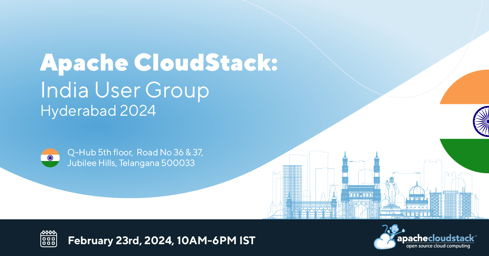

On <strong>23rd February</strong>, the 2024 edition of the CloudStack India User Group will be taking place in Hyderabad. The event will be taking place at: <strong>Q-Hub 5th floor, Road No 36 & 37, Jubilee Hills, Telangana, 500033</strong>.

Whether you're already using Apache CloudStack or interested in learning more about this technology, we invite you to participate in the user group. The event will feature engaging tech talks, demonstrations, and user stories. Like all gatherings organised by the Apache CloudStack community, registration is free of charge.

<a class="button button--primary button--lg" href="https://www.meetup.com/india-cloudstack-user-group/events/298324389/?isFirstPublish=true" target="_blank">REGISTER</a>
 

## Submit a Session Proposal

The Call for Presentations is open! When proposing a talk, you can choose to present technical discussions, user stories, details on new features, integration presentations, and more! Submitting a session proposal to the user group provides a chance to showcase your expertise, actively contribute to the community, and receive recognition in the field of cloud computing.

<strong>Please note, the deadline for session proposals is January 30th.</strong>

 
 
<a class="button button--primary button--lg" href="https://docs.google.com/forms/d/1jqEGPG6Xf2MwR5_u0RKySkNOti-pzxvDYQBYkCAV6o0" target="_blank">Submit a Talk</a>
 

<!-- truncate -->

## Agenda

|from|to|subject|speaker|
|-----|-----|-------------------|---------|
|9:30|10.00|Registration + Meetup Welcome|Abhishek Kumar, Release Manager Apache CloudStack 4.19|
|10:00|10:30|CloudStack 101: The Best Way to Build Your Private Cloud|Rohit Yadav, VP Apache CloudStack|
|10:40|11:10|What’s New in CloudStack 4.19|Abhishek Kumar, Release Manager Apache CloudStack 4.19|
|11:20|11:50|How We Grew Up with CloudStack and Our Journey|Dilip Singh, DataHub|
|12:00|12:30|VM Migration from VMware to CloudStack and KVM|Suresh Anaparti, ShapeBlue|
|12:30|13:30|Q&A and Lunch Break||
|13:30|14:00|Adoption of Apache CloudStack Among Public Cloud Service Providers|Amal Ranjith, StackBill|
|14:10|14:55|Elevating Cloud Infrastructure with Object Storage, DRS, VM Scheduling, and DRaaS|Jithin Raju & Vishesh Jindal, ShapeBlue|
|15:05|15:50|CloudStack Tooling Ecosystem|Kiran Chavala, ShapeBlue|
|16:00|16:30|CloudStack Authentication Methods|Harikrishna Patnala, ShapeBlue|
|16:30|17:00|Q&A | Coffee | Closing|

## A Note from CloudStack VP

"CloudStack meetups are fantastic events where our community of users, contributors, vendors and integrators can come together, collaborate, network and showcase what they are doing with CloudStack, talk about their use-cases, offerings, problems and solutions.

Our meetups attendees benefit from catching up with the latest developments in the CloudStack ecosystem as well as learn about real-world use of CloudStack from actual users, learn about their interesting solutions, integrations and meet them face to face. It's just a great place to be at for anybody using CloudStack or considering to build a private cloud."

-<a href="https://www.linkedin.com/in/rohityadavcloud/">Rohit Yadav</a>, PMC Chair and VP Apache CloudStack

## Share the Word!

Spread the word on social media and let your fellow cloud enthusiasts know about this user group! Share the news by using the registration and CFP links, as well as the event's official hashtag - <strong>#CSIndiaUG2024</strong>. Together, let's build a buzz that resonates across our community.
