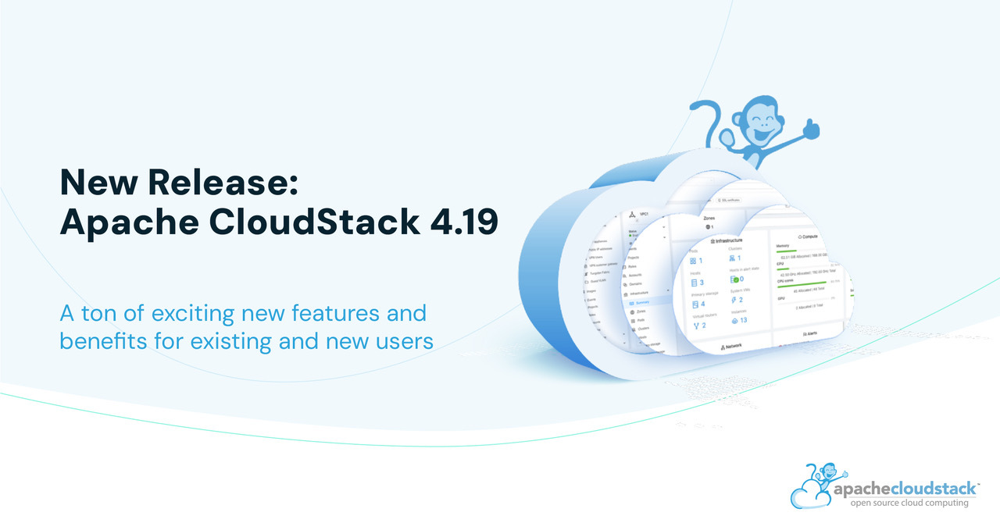

The Apache Software Foundation and the Apache CloudStack Project
Announces Apache® CloudStack® v4.19.

Apache CloudStack 4.19 is the most recent release of the cloud management platform.
It comes as a product of extensive contributions from the development community and
is a LTS release, guaranteeing ongoing maintenance and support for a period of 18 months. 

<!-- truncate -->

The 4.19 release contains 314 new features, improvements and bug fixes since 4.18, 26 of
these being major features. Some of the highlighted features include:

- VMware to KVM Migration
- KVM Import
- CloudStack Object Storage
- CloudStack DRS
- VNF Appliances Support
- Scheduled Instance Lifecycle Operations
- OAuth 2 Authentication
- CloudStack Snapshot Copy 

The full list of new features can be found in the project release notes at:
https://docs.cloudstack.apache.org/en/4.19.0.0/releasenotes

The CloudStack documentation includes upgrade instructions from previous versions of
Apache CloudStack, and can be found at:
https://docs.cloudstack.apache.org/en/4.19.0.0/upgrading

The official installation, administration and API documentation for each of the releases
are available on our documentation page:
https://docs.cloudstack.apache.org/en/4.19.0.0/installguide

# Downloads

The official source code for the 4.19.0.0 release can be downloaded from our downloads page:
https://cloudstack.apache.org/downloads.html

In addition to the official source code release, individual
contributors have also made convenience binaries available on the
Apache CloudStack download page, and can be found at:

- https://download.cloudstack.org/el/7/
- https://download.cloudstack.org/el/8/
- https://download.cloudstack.org/ubuntu/dists/
- https://www.shapeblue.com/packages/

#  A Word from the Community

<em>"4.19 is a fantastic release that is culmination of all our efforts from much of
last year coming together with a ton of exciting new features and benefits for
existing and new users such as VMware to KVM instance migration, a new pluggable
object storage framework with support for Min.io, hypervisor-agnostic DRS,
support for VNF appliances, DR as a service with multi-zone snapshot copy,
OAuth2, KVM ingestion, VM action scheduler, a redesigned dashboard, and much
more!"</em>

\- [Rohit Yadav](https://www.linkedin.com/in/rohityadavcloud/), CloudStack VP

 
 

<em>“The 4.19 release marks a significant milestone for CloudStack, combining a
diverse array of new features and crucial fixes. The primary focus has been on
enhancing the ease of adopting CloudStack, evident in capabilities like VMware
to KVM migration and KVM ingestion. The introduction of the Object Store
framework introduces a new dimension to storage capabilities within CloudStack.
Features such as hypervisor-agnostic DRS and Snapshot Copy DRaaS further bolster
the orchestration capabilities of CloudStack. 

The release process has been a year-long collaborative effort involving over 40
contributors from both organizations and individuals. Kudos to the community
members who not only contributed fantastic features but also played a crucial
role in testing and refining each other's work. This collaborative endeavour
has culminated in a feature-rich and stable 4.19 release.”</em>

\- [Abhishek Kumar](https://www.linkedin.com/in/shwstppr/), 4.19 Release Manager

