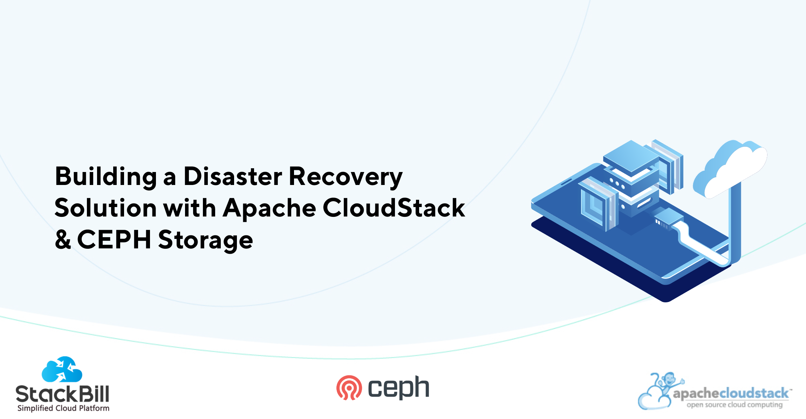

[StackBill](https://www.stackbill.com/) is a provider of self-service intuitive Cloud Management Portals (CMP) designed to meet the diverse needs of data centers, enterprises, telecom companies, and cloud service providers. The company has leveraged the capabilities of Apache CloudStack to deliver a robust and scalable cloud infrastructure management solution to their customers. They also  developed is a Disaster Recovery solution, based on Apache CloudStack and Ceph. 

<!-- truncate -->

## StackBill’s Cloud Management Portal for Apache CloudStack

StackBill's implementation of Apache CloudStack focuses on providing a user-friendly and efficient interface for managing cloud resources. They have developed a custom user portal that enables customers to easily provision, monitor, and manage their virtual machines and resources. The portal provides a centralized view of the entire cloud infrastructure, allowing users to efficiently allocate and optimize resources based on their requirements.

### Resource Management
One of the key strengths of StackBill's implementation is its robust resource management capabilities. They have integrated advanced resource scheduling algorithms into Apache CloudStack, allowing for efficient utilization of computing resources. This ensures that customers can maximize their resource allocation, minimize wastage, and ultimately reduce costs. StackBill's implementation also includes features such as automatic scaling, load balancing, and high availability to ensure optimal performance and reliability of the cloud infrastructure.

### Security 
Security is a top priority for StackBill, and their implementation of Apache CloudStack reflects this focus. They have incorporated robust security measures into their solution to protect customer data and ensure the integrity of the cloud environment. This includes features such as network segmentation, firewall management, and encryption to safeguard sensitive information and mitigate potential security risks.

### Integration and Automation 
In addition to resource management and security, StackBill's implementation also emphasizes integration and automation. They have developed APIs and plugins that enable seamless integration with third-party tools and services, allowing customers to leverage their existing infrastructure investments. StackBill's implementation also supports automation through scripting and orchestration tools, enabling customers to automate routine tasks and streamline their cloud management workflows.

 
<a class="button button--primary button--lg" href="/files/acs-case-study-stackbill.pdf" target="_blank">Download the Case Study</a>
 

## Cost-effective & Efficient Disaster Recovery Solution with Apache CloudStack & CEPH Storage

StackBill identified a market need for a Disaster Recovery solution that was both cost-effective and based on open-source technologies. Proprietary DR solutions often proved to
be prohibitively expensive for many organizations. A telecom company in Asia
approached StackBill with the specific requirement of a DR solution based on open-
source technology. The objective was clear: to reduce costs, increase profitability,
and ensure business continuity by quickly recovering from catastrophic events.

### Apache CloudStack: A Foundation for Success
Apache CloudStack was chosen as the cornerstone of the DR solution. This open-source cloud computing platform is highly scalable and offers Infrastructure as a Service (IaaS) capabilities. It provides the flexibility to deploy and manage large networks of virtual machines, making it ideal for delivering public cloud services and on-premises or hybrid cloud solutions.

### CEPH Storage: Ensuring Data Resilience
Ceph, an open-source storage platform, was selected for its ability to offer object, block, and file storage from a single system. Its self-healing and self- managed features reduce administrative overhead, allowing it to handle outages autonomously.
The decision to opt for open-source solutions was driven by the prohibitive costs and limitations of proprietary alternatives.

#### Implementation
The DR solution was implemented between active zones for selective VMs. Leveraging Ceph's RBD Mirror Snapshot feature, the system could schedule and move data to the DR location and vice versa. StackBill's DR Control tool played a crucial role in managing the failover process. Importantly, this DR solution was achieved without any modifications to CloudStack. A Complete DR Solution involves compatible network and storage solutions. They have collaborated with client’s network team and offered solutions with storage and StackBill.

In the realm of cloud computing, Disaster Recovery (DR) has historically posed significant challenges. However, StackBill's pioneering journey showcases the attainability of cost-effective and efficient solutions. By harnessing open-source technologies, notably Apache CloudStack and Ceph Storage, StackBill not only achieved substantial cost reductions but also fortified business continuity for its clients.

 
<a class="button button--primary button--lg" href="/files/acs-case-study-stackbill.pdf" target="_blank">Download the Case Study</a>
 
