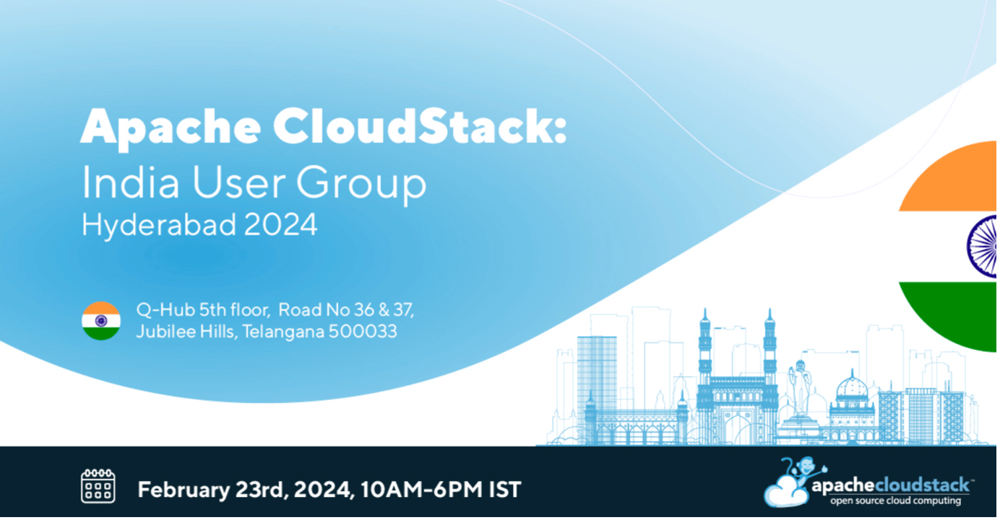

On February 23rd, the CloudStack India User Group 2024 took place in Hyderabad,
seeing the gathering of CloudStack enthusiasts, experts, and industry leaders
across India, as they engaged in sessions about the open-source project. The
meetup provided a platform to explore Apache CloudStack in detail, with a
particular focus on the new features released in Apache CloudStack 4.19. The
user group also saw its participants exchange insights and establish new
connections.

Below you can find the session slides from the user group. In the coming weeks,
the session recordings will also be made available here and on the Apache
[CloudStack YouTube channel](https://www.youtube.com/@ApacheCloudStack).

<!-- truncate -->

**Access each session's slides by clicking onto the presentation graphic.**

<a class="button button--primary button--lg" href="https://photos.google.com/u/1/share/AF1QipM0NzSg04eMoTW1jhXHwfEBUNrvCigWWSTrjB1aWfnmsBhRx6QaCOeIfep17u5cvQ?key=OGYyLXMydjd4YWtWSXRRcmQ1dG5jVzh1VmVpRTl3" target="_blank">View Photo Gallery</a>

   

# Sessions

## CloudStack 101: The Best Way to Build Your Private Cloud, [Rohit Yadav](https://www.linkedin.com/in/rohityadavcloud/)

Apache CloudStack is an open-source software designed to deploy and manage large
networks of virtual machines, as a highly available, highly scalable
Infrastructure as a Service (IaaS) cloud computing platform. This talk
introduces the technology, its architecture, its history and community.

## What’s New in CloudStack 4.19, [Abhishek Kumar](https://www.linkedin.com/in/shwstppr/)

This session gives a brief introduction to the new and exciting feature in the
latest CloudStack LTS release, ie, 4.19.0. The discussion includes the details
on the timeline of the CloudStack 4.19.0 release, overview of some of the
marquee, new feature of the release – Object storage framework, KVM ingestion,
Hypervisor agnostic simple DRS, CAPC aware CKS, OAuth2, DRaaS with Multi zone
disaster recovery, etc and a summary of improvements added since the previous
major LTS release of the CloudStack, ie, 4.18.0.

## How We Grew Up with CloudStack and its Journey, [Dilip Singh](https://www.linkedin.com/in/dilip-singh-10956256/)

In this session, Senior IT Manager at DataHub Nepal, Dilip Singh, shares how
DataHub grew up with CloudStack and details the journey the company had with the
cloud orchestration platform.

## VM Migration from VMware to CloudStack and KVM, [Suresh Anaparti](https://www.linkedin.com/in/sureshanaparti/)

The support for migrating VMware instances, and importing KVM instances to a
CloudStack-managed KVM environment has been added to CloudStack 4.19.

In this talk, Suresh provides the details about the import/migration process in
CloudStack along with a demo, and discusses the future improvements.

## Elevating Cloud Infrastructure with Object Storage, DRS, VM Scheduling, and DRaaS, [Jithin Raju](https://www.linkedin.com/in/rajujith/) & [Vishesh Jindal](https://www.linkedin.com/in/vishesh92/)

In this session, Vishesh Jindal and Jithin Raju give a demonstration on Apache
CloudStack's 4.19 marquee features - Object Storage, DRS, VM schedule & DRaaS.

## CloudStack Tooling Ecosystem, [Kiran Chavala](https://www.linkedin.com/in/kiran-chavala-1bb6a97/)

In this session, Kiran gives a talk about the rich ecosystem of tools (cmk,
CAPC, Terraform, Ansible, Packer, csbench, mbx), that support Cloudstack.

Find out how the various tools work and how easy it is to integrate with Apache
CloudStack.

This session provides a great way to speed up CloudStack adoption and improve
performance by saving valuable time.

## CloudStack Authentication Methods, [Harikrishna Patnala](https://www.linkedin.com/in/harikrishnapatnala/)

CloudStack provides versatile authentication methods to ensure secure access and
identity management. This talk explores key authentication mechanisms within
CloudStack, including LDAP, SAML, OAuth2, API keys, etc. LDAP integration
enables centralized user authentication, while SAML facilitates single sign-on
(SSO) across various services. OAuth2 ensures secure authorization for
third-party applications, and API keys offer programmatic access to resources.
Additionally, CloudStack supports Two-Factor Authentication for an extra layer
of security, enhancing user verification through multiple verification steps.

