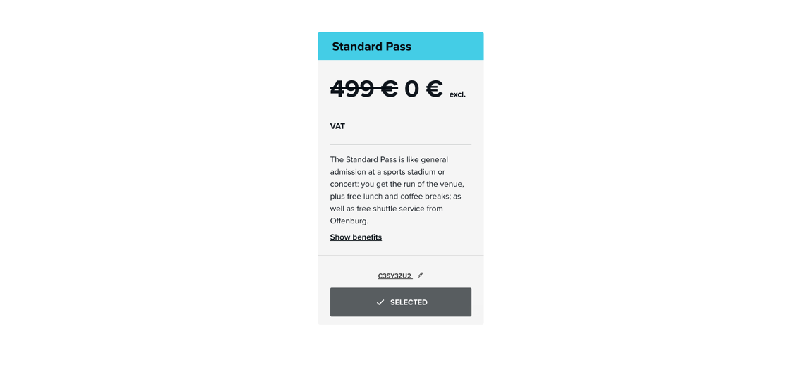

<h2>Meet Apache CloudStack at CloudFest 2024</h2>

On March 18-21st, the #1 internet infrastructure event in the world –
[CloudFest](https://www.cloudfest.com/) – will be taking place in
Rust, Germany! We are excited to share that Apache CloudStack will be
exhibiting at this year's CloudFest. This will provide the opportunity
to share Apache CloudStack’s capabilities to the wider cloud computing
industry.

<!-- truncate -->

## Get a Free Ticket!

Use the following code to attend the highly anticipated conference for
free, saving you 499 EUR - c3SY3Zu2

<a class="button button--primary"
href="https://registration.cloudfest.com/registration" target="_blank">Register for Free</a>

**Make sure to use the code:**

 
## The CloudStack Booth Number is R30!

If you do choose to attend the conference, make sure to swing by the
CloudStack booth! Our booth members are looking forward to having
interesting discussions with the wider cloud computing industry, on
topics such as:

- VMware to KVM Migration
- VMware to CloudStack migration
- KVM Import
- VNF Appliances Support
- CloudStack Object Storage
- Schedule Instance Lifecycle Operations
- CloudStack DRS
- And more!

## Apache CloudStack at CloudFest

Being part of CloudFest is another step for our community to connect
with existing users in the cloud industry and highlight the
improvements in our project. For example, by using the latest features
released in CloudStack 4.19, users can migrate to CloudStack from
VMware environments.

Additionally, we look forward to meeting individuals interested in
contributing to open-source projects and involving them in Apache
CloudStack.

We are looking forward to the opportunity to discuss Apache CloudStack
with potential new users and explore collaborations with technologies
seeking integration opportunities.

## How Apache CloudStack Benefits Cloud Builders

For companies venturing into the public cloud market, the challenge
lies in finding the right software and partners that facilitate swift
deployment for their customers. This hurdle can consume a considerable
amount of time and potentially lead to a diminished return on
investment if incorrect choices are made in delivering both public and
private cloud solutions.

CloudStack is a turnkey solution for cloud builders and managed
service providers. Being entirely open-source, it is user-friendly,
easy to implement, manage, and scale. CloudStack is also backed by a
large open-source community and adheres to rapid release
cycles. Apache CloudStack assists cloud builders in overcoming key
challenges such as costs, avoiding vendor lock-in, and efficiently
managing a multitude of physical servers spread across geographically
distributed data centers.
