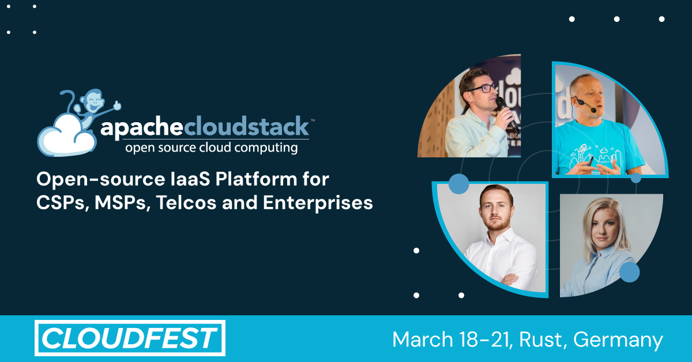
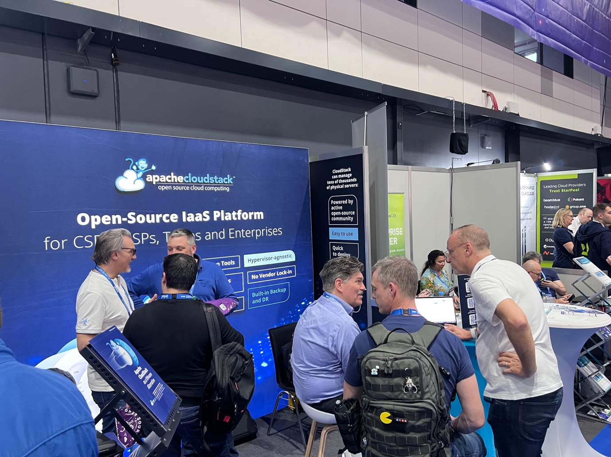
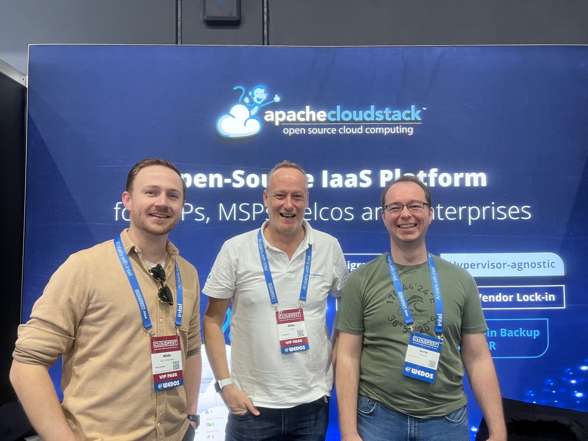
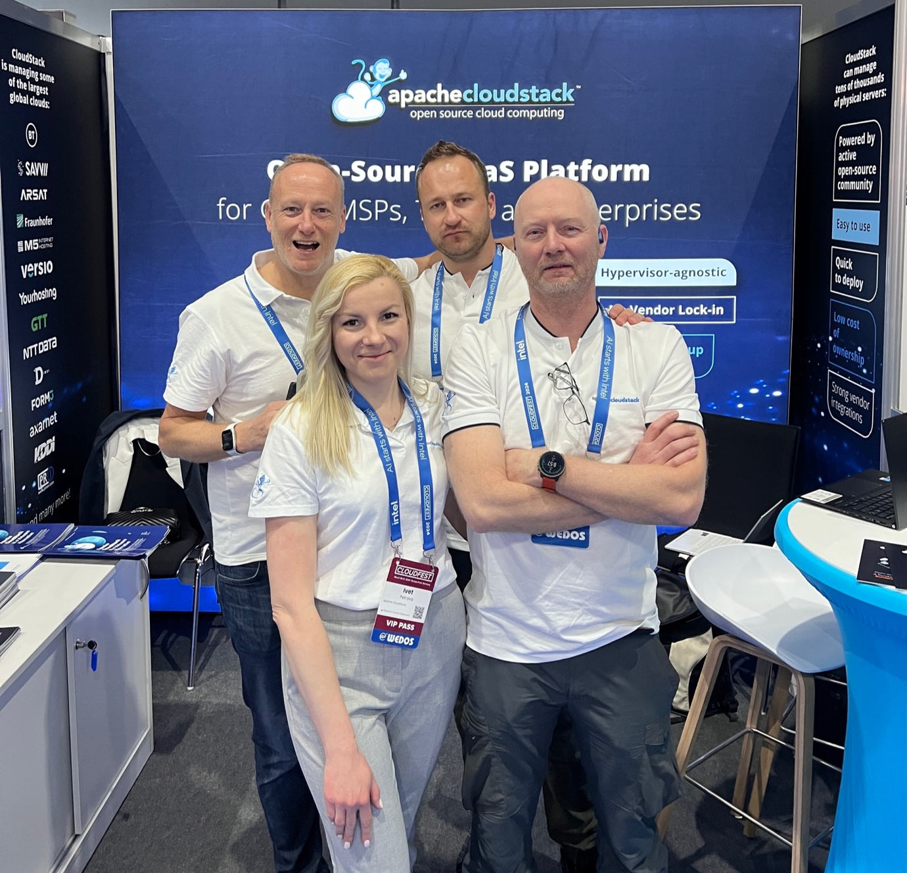
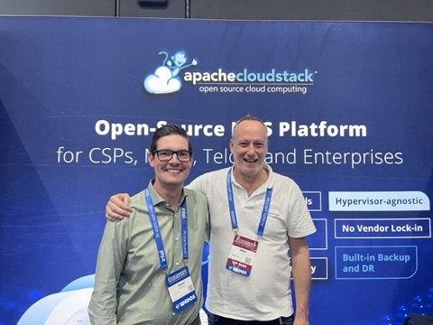

CloudFest happened last week and the CloudStack community was pleased to attend the premier event for internet infrastructure globally. Apache CloudStack has proudly showcased at the conference, with several community members representing both the technology and community. 

<!-- truncate -->

## Why We Participate?

Apache CloudStack's presence at CloudFest serves multiple strategic
purposes. Firstly, by exhibiting at this major event in the cloud
computing industry, Apache CloudStack enhances its visibility and
connects with a diverse audience of developers, IT professionals,
business leaders and potential new users. This exposure facilitates
networking opportunities and enables Apache CloudStack to showcase its
features and recent developments, fostering engagement with potential
users, contributors, and partners.

Moreover, CloudFest offers a platform for Apache CloudStack to engage
directly with its existing community, facilitating face-to-face
interactions and discussions. The participation in CloudFest allows
Apache CloudStack to stay competitive by highlighting its unique
advantages and strengths amidst the broader landscape of cloud
computing solutions.

Lastly, the event provides a valuable opportunity for Apache
CloudStack to gather market intelligence, enabling the project to
adapt and evolve in alignment with emerging trends, customer needs,
and industry challenges.

We are grateful to all community members, who came to help at the
booth, did numerous demos of Apache CloudStack and showcased its
strengths to service providers and cloud builders from all around the
globe.

## A Special Thanks to the CloudFest Team

Apache CloudStack extends gratitude to the CloudFest team, their CEO
Christian Jaeger and Johannes Gottschlich, for their unwavering
support and dedication to fostering innovation and collaboration
within the technology community.

We deeply appreciate their efforts in providing a platform for
projects like Apache CloudStack to thrive, connect with a diverse
audience, and showcase the transformative potential of open-source
solutions. It is through their support and understanding of the
significance of open-source technologies that projects like Apache
CloudStack can continue to evolve, empower users, and shape the future
of cloud computing.

## Exploring the CloudStack 4.19 Release

Our community members have shared with CloudFest attendees the latest
advancements and capabilities of Apache CloudStack, made available in
the 4.19 release! Due to VMware’s acquisition by Broadcom, there have
been many topical discussions on the latest CloudStack features
suitable for cloud service providers looking for a VMware alternative.
