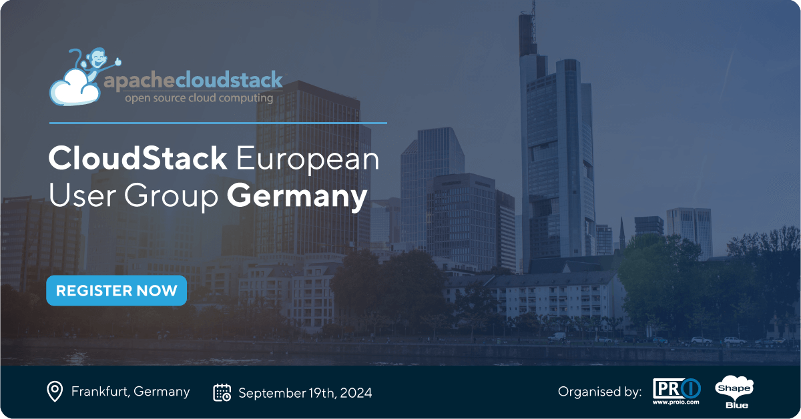

# Apache CloudStack is thrilled to share that the autumn edition of
  CloudStack European User Group 2024 is scheduled for September 19th
  and will happen in Frankfurt, Germany!

The event will be hosted by proIO – а German Private Cloud and Managed
Hosting Provider and a long-time CloudStack community supporter. The
venue to accommodate the CloudStack European User Group 2024 is Nio
House Frankfurt.

<!-- truncate -->

<a class="button button--primary"
href="https://www.eventbrite.co.uk/e/cloudstack-european-user-group-germany-tickets-879369205967" target="_blank">Register Now</a>

## Why Join the CSEUG

CloudStack European User Group is a get-together for the European
CloudStack Community. CSEUG is a 1-day technical event, where you will
be able to meet the leading CloudStack experts, users and skilful
engineers from the open-source world. You can expect technical talks,
user stories, new features and integrations presentations and more.

## Call for Presentations

The Call for Presentations is also open. We encourage you to submit
your session early, to maximise the chance of it being accepted. Also,
please keep in mind sessions are expected to be held in-person. Click
here to submit your session proposal -
https://forms.gle/7gREjJWAusZndGnL7

## Who is the Conference for?

The event is aimed at developers, operators and users to discuss and
evolve the open-source software project, its functionality and
real-world operability. This event will introduce you to the
CloudStack family, community leaders, project members and
contributors.

CSEUG welcomes attendees from all over the globe. Our core audience is
enterprises, cloud service providers, telcos and MSPs. Every region
sends its best and brightest to share insights and knowledge on
open-source technology, orchestrating public and private clouds,
building IaaS.

<a class="button button--primary"
href="https://www.eventbrite.co.uk/e/cloudstack-european-user-group-germany-tickets-879369205967" target="_blank">Register Now</a>

## Meet proIO – Our host

proIO is a Private Cloud Provider dedicated to empowering German SMBs
across various industries through its Infrastructure-as-a-Service and
Managed Hosting solutions, based out of Frankfurt, Germany. Deeply
rooted in its belief in open-source technology, proIO is recognized
for its expertise through its longstanding use of Apache
CloudStack. This commitment to open-source principles is further
highlighted by CEO Swen Brüseke, who is frequently featured at
community events, sharing insights and fostering dialogue with the
community.

"CloudStack empowers proIO to offer solutions that are precisely
tailored to meet our customers' unique business needs," states
Swen. "With its minimal footprint, flexibility, ease of use, and
compatibility with standard hardware, we're positioned to enhance and
streamline our customers' IT infrastructure. This approach reflects
our dedication to delivering highly effective, customer-centric
solutions."
