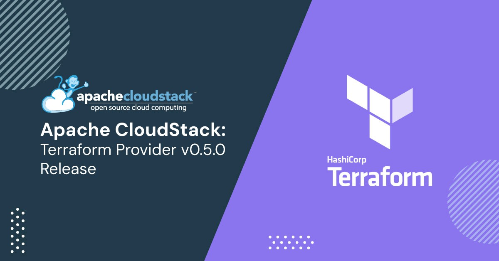

We are pleased to announce the release of Apache CloudStack Terraform
provider v0.5.0. Terraform is an open-source infrastructure as code software
tool that provides a consistent CLI workflow to manage resources in many
public/private clouds.

<!-- truncate -->

Terraform v0.5.0 comes packed with several new features, enhancements,
and bug fixes to make it even more robust and reliable.

Some of the key highlights of this release include:

- Added support for Kubernetes Cluster creation
- Added support for Kubernetes iso registration
- Added support for new data sources in Cloudstack
- Added UEFI Support to the Cloudstack instance resource
- Added vApp properties support to the Cloudstack Instance resource
- Added parameters (host_id , cluster_id support to the Cloudstack instance resource
- Added source_nat_ip_address support to the Cloudstack network
- Added  new resource attach_volume
- Improved service offering creation by adding more parameters
- Added documentation for new resources
- Various Bug fixes
- Validated and fixed all existing resource creations to work as expected

Apache CloudStack Terraform provider v0.5.0 is available for
download now from the [Apache CloudStack
website](https://cloudstack.apache.org/downloads/#cloudstack-terraform-provider-release).

<h3>Downloads and Documentation</h3>

The official source code for Apache CloudStack Terraform provider can
be downloaded from:

https://cloudstack.apache.org/downloads

The installation and usage documentation for Apache CloudStack Terraform provider is available at:

- https://github.com/apache/cloudstack-terraform-provider/wiki
- https://github.com/apache/cloudstack-terraform-provider/wiki#installing-from-github-release

The documentation for the usage of resources to create and interact
with CloudStack is available at
https://registry.terraform.io/providers/cloudstack/cloudstack/0.5.0/docs

Users can also get the provider from the Terraform registry published at:
https://registry.terraform.io/providers/cloudstack/cloudstack/0.5.0
