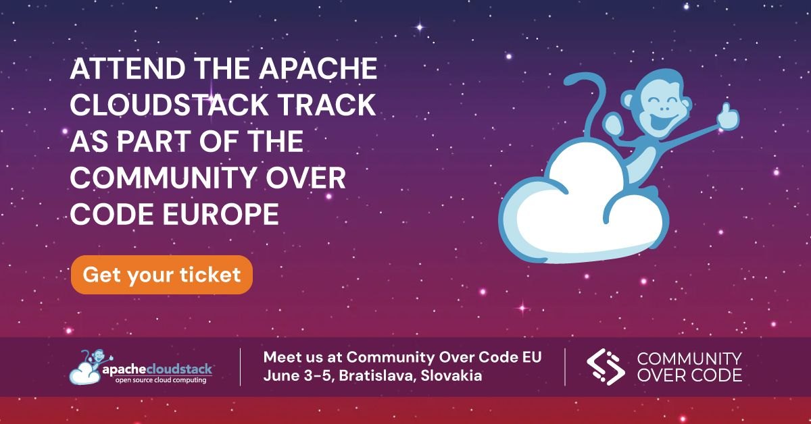

On 3-5th June, the [Apache Software
Foundation](https://www.apache.org) will be holding the annual
[Community Over Code EU](https://eu.communityovercode.org/)
conference. This year, attendees can anticipate engaging sessions led
by Apache CloudStack community members at the event. It serves as a
prime platform to stay aware of the newest developments within Apache
Software Foundation (ASF) projects and their associated
communities. Taking place in the charming city of Bratislava,
Slovakia, this event fosters an environment conducive to
collaborative, vendor-neutral discussions. Open-source communities
from across the globe will converge to freely exchange ideas and
strategize on various projects.

<!-- truncate -->

<a class="button button--primary"
href="https://eu.communityovercode.org/tickets/" target="_blank">Register Now</a>

 

<a class="button button--primary"
href="https://eu.communityovercode.org/schedule/" target="_blank">Event Schedule</a>

## Apache CloudStack Sessions

Below you can find a list of all the sessions about Apache CloudStack
– all of which will be held by Apache CloudStack community members.

###### What’s New in CloudStack, [Boris Stoyanov](https://www.linkedin.com/in/bstoyanov/) – Monday 3rd at 13:20 – 13:50 (Harmony 3)

In this session, CloudStack PMC Member Boris will be covering the
latest major features in Apache CloudStack over the past few releases.

###### Transitioning from VMware to Apache CloudStack: A Path to Profitability and Competitiveness, [Marco Sinhoreli](https://www.linkedin.com/in/msinhore/) – Tuesday 4th at 12:30 – 13:00 (Harmony 1) 

In this session, Marco will explore the potential of migrating from
VMware to Apache CloudStack with KVM. VMware vSphere is a robust cloud
infrastructure and management solution that combines vSphere and
vRealize Suite, providing automation and operations capabilities for
traditional and modern infrastructure and apps. However, the
transition to Apache CloudStack can offer enhanced profitability and
competitiveness.

Marco will delve into the benefits of Apache CloudStack, including its
cost-effectiveness and open-source nature, and discuss how a gradual
migration from VMware vCloud can reduce ownership costs, increase
profitability, and enhance competitiveness. He will also cover the
practical steps and considerations in planning and executing this
transition effectively.

###### Making Apache CloudStack market ready with a native rating solution,[Daniel Salvador](https://www.linkedin.com/in/gutoveronezi/),[Bryan Lima](https://www.linkedin.com/in/bryan-lima/), [João Paraquetti](https://www.linkedin.com/in/jo%C3%A3o-jandre-136a32159/),[Rafael Weingärtner](http://cloudstack.apache.org) – Tuesday 4th at 14:00 – 14:30 (Harmony 1)

This presentation will address the design and efforts of the ACS
community to implement a native rating feature that will allow more
flexibility and reduce the need for external systems.

### Importing KVM instances from external KVM hosts or QCOW2, [Andrija Panić](https://www.linkedin.com/in/andrijapanic/) – Tuesday 4th at 14:40 – 15:10 (Harmony 1)

CloudStack recently introduced a few hypervisor migration features, to
help cloud operators migrate existing VM workloads into CloudStack. In
this session, Andrija will show how you can migrate instances from
external KVM hosts to KVM hosts managed by CloudStack. Andrija will
also show how you can quickly deploy an instance from a previously
prepared qcow2 image.

###### Incremental snapshots/backups in KVM plugin of Apache CloudStack, [Daniel Salvador](https://www.linkedin.com/in/gutoveronezi/), [Bryan Lima](https://www.linkedin.com/in/bryan-lima/), [João Paraquetti](https://www.linkedin.com/in/jo%C3%A3o-jandre-136a32159/),[Rafael Weingärtner](http://cloudstack.apache.org) – Tuesday 4th at 15:20 – 15:50 (Harmony 1)

Apache CloudStack (ACS) and KVM are a combination that many
organizations decided to adopt. KVM is a widely used hypervisor with a
vibrant community and support in different operating system
distributions. While developing the KVM plugin functionalities, one
normally tries to make use of the full potential of the
hypervisor. However, while Libvirt, the toolkit used by ACS to manage
KVM VMs, already supports native incremental snapshots, every volume
snapshot/backup taken with ACS is a full snapshot/backup. In many
situations, always taking full snapshots of volumes is costly for both
the storage network and storage systems. This presentation will
address the design and efforts of the ACS community to support
incremental snapshots/backups for the KVM plugin. Thus, creating a
native backup solution in ACS that supports differential copies.

###### VNF Integration and Support in Apache CloudStack, [Wei Zhou](https://www.linkedin.com/in/wei-zhou-3635b633/) – Tuesday 4th at 16:10 – 16:40 (Harmony 1)

In this session, Wei will present how CloudStack 4.19 adds the
capability to easily and quickly perform a light-touch integration of
networking appliances with Apache CloudStack, allowing for operators
and end users to offer a broader range of networking services while
empowering end-users to effortlessly deploy their own virtualized
network functions (VNFs).

###### SDN Options in Apache CloudStack, [Alexandre Mattioli](https://www.linkedin.com/in/alexandremattiolibastos/) – Tuesday 4th at 16:50 – 17:20 (Harmony 1)

Apache CloudStack integrates with two major SDN solutions, Tungsten
Fabric (OpenSDN) for KVM environments and NSX for VMWare ESX
environments. In this talk, Alex will explore how these integrations
were implemented, how to setup ACS Zones with these SDNs and he will
also explore their capabilities in regards to Apache CloudStack.