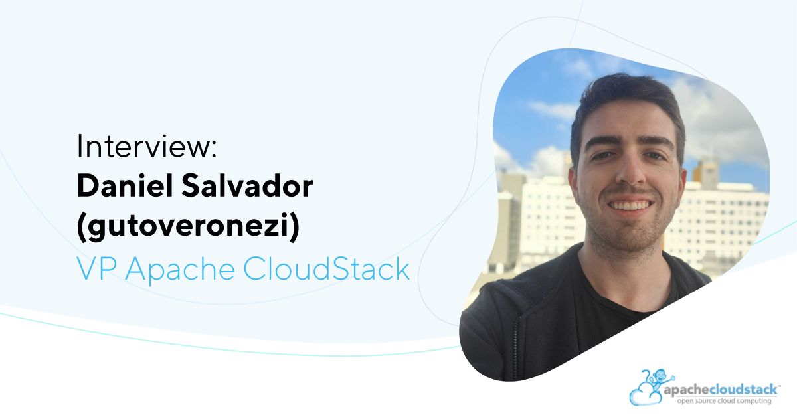

## Interview: Daniel Salvador - VP of Apache CloudStack

The Apache CloudStack community is announcing that Daniel Augusto
Veronezi has taken on the role of Vice President (VP) of Apache
CloudStack recently, a position that bridges the gap between the
vibrant community of developers and users and the Apache Software
Foundation (ASF) board. In this new role, Daniel is entrusted with
ensuring the health and growth of both the project and its community,
guiding its further development while fostering a collaborative
environment.

<!-- truncate -->

In our exclusive interview with Daniel, we explore the
responsibilities and vision he brings to this role. As he explains,
the VP’s primary duty is to serve as a liaison, ensuring effective
communication and alignment between the CloudStack community and the
ASF board. Despite holding this significant title, Daniel emphasizes
that the VP role carries no extra privilege or weight in
decision-making compared to other Project Management Committee (PMC)
members. His focus will be on maintaining a healthy community and
steering the project towards its future goals.

CloudStack has been a game-changer for many companies, particularly
those seeking an easy-to-deploy, robust cloud management
solution. With its latest enhancements, including advanced billing and
white-label capabilities, CloudStack is ideal for digital service
providers and companies managing large-scale virtual machine (VM)
environments. Telecom companies and cloud providers, in particular,
stand to benefit from CloudStack's ability to streamline VM
management, enhance security, and provide detailed cost and resource
tracking. Read the full interview bellow.

#### What exactly is the role of VP of Apache CloudStack?

The main role of a VP is to interface between the community/project
and the ASF board. The VP is not different from the other PMC members;
therefore, there is no privilege or greater weight in decisions for
the person acting as VP. However, the VP is entrusted with
guaranteeing the health of the community and also guiding the further
development of the project and its community.

#### CloudStack has played a critical role for many solutions providers and companies seeking ease of use and deployment. Which companies can benefit the most from CloudStack?

The latest billing and white-label capabilities make Apache CloudStack
an ideal choice for cloud and digital service providers. However, for
any company that needs to manage virtual machines (VMs) to run their
workloads, CloudStack can help them to better visualize costs and the
workloads and ease their management while adding security mechanisms,
awareness of the resources applied in each project/application, and
auditing tools with respect to infrastructure changes in the VMs where
they run. The most benefits of CloudStack come when one needs to
support large cloud environments. Therefore, CloudStack is a reliable
alternative for companies that handle several sites, like Telecoms and
cloud providers.

#### Choosing a cloud management system is a hard thing, especially if you have a long history with specific technologies. Why should companies migrate to CloudStack?

Before choosing a technology to adopt as the basis of the cloud, the
service provider needs to define its requirements, look for
alternatives, and understand how it can address its needs. It all
depends on the list of requirements, and the operating team that the
company has. Most time, digital services companies will find out that
CloudStack is the best option, with its easy-to-use graphical
interface, market-ready structure, advanced features, reduced
operating costs, and so on.

#### On the development side, how easy it is to implement and manage CloudStack?

Once you understand the CloudStack code structure, it is not
hard. However, we (the community) have to understand that we have
several development barriers. We are already working with a highly
complex context; to work with CloudStack, developers need to
understand storage, networking, virtualization, Internet protocols,
and much more. On top of that, we do not use mainstream/standardized
frameworks for the RESTful APIs and JPA; we use Spring in a
non-standard fashion; we do not have a solid standard between our
APIs, and so on. We are constantly increasing the complexity to
extend/evolve and maintain ACS. That creates a bubble of development
where it is hard to join, which is not healthy for a community. In
fact, we already had cases of people leaving the project because of
its barriers. I believe the first step toward removing those barriers
is to clearly define our subjective processes, like deprecating old
API methods, technologies, and development standards in favor of
mainstream/standardized frameworks and technologies. For that, we have
a discussion running in the community, and I invite our readers to
join it: https://github.com/apache/cloudstack/discussions/8970.

#### What would you share about the community?

The CloudStack community is very active and is always bringing new use
cases and innovation for the project. That is very interesting for the
evolution of the project. We are constantly growing and developing
further without being tied to a single vendor. That is in fact on of
the reasons that attracts most organizations to Apache CloudStack. The
diversity of its culture and community.

#### How do you think we can all grow the CloudStack community?

The first step towards growing the community is to admit where we are
going wrong and work to fix our errors. As mentioned before, we have
some development barriers; and casting light on that allows us to work
on solutions. By doing that, we enable more people to contribute to
the community more easily. We have to guarantee that all the
contributors are being evaluated by the same criteria, not using
double standards. Another thing that I and my colleagues have been
considering is to host a conference in Brazil in the near
future. Latin America has lots of players in the telecom and
cloud-providing scenario using CloudStack as their cloud orchestrator;
however, due to several factors, not all of them participate in the
community or attend international conferences. Therefore, promoting
even more CloudStack in Latin America can motivate them to participate
and grow the community even more here, both users and contributors.

#### What is the direction in which Apache CloudStack is going as a technology?

Cloud computing is a fundamental technology for organizations that
aspire to optimize their data center operations. As a whole,
CloudStack excels in orchestrating cloud environments; it has been the
choice of many companies for years. With adequate maintenance and
development of the project, CloudStack will become the cornerstone of
most cloud providers.

#### Many community members notice that CloudStack is becoming more and more appealing for enterprises. What would you advise this type of organization?

Indeed, CloudStack is becoming more appealing for large enterprise as
"brick and mortar" bussiness are getting more and more
digitalized. Companies running large datacenters will find out that
CloudStack is one of the best options, with its easy-to-use graphical
interface, market-ready structure, advanced features, and so on. My
advice to organizations adopting CloudStack is to study and understand
its powerful features and develop solutions based on CloudStack's
numerous functionalities.

#### As a person, you are recognized for your contribution to CloudStack. How did you start with it?

My CloudStack journey started in December 2020 when I started to work
at SC Clouds. At first, my tasks were focused on understanding how
CloudStack works and troubleshooting situations. Аfterwards, I started
developing/improving features, reviewing patches, discussing
solutions, and helping the community through the mailing lists. As I
got more and more involved, my goals and focus changed, and now most
of my efforts are on designing features and guiding/mentoring others
through the community. Currently, I am mentoring more than 10 people
in the community who are my colleagues in SC Clouds.

#### Any advice to all developers writing new features for CloudStack?

CloudStack is a complex project; therefore, before starting the
development of big features, it is crucial to create a specification,
so that the necessary changes are mapped, structured, and
documented. We are a community with people from different places and
we have different cultures, knowledge, experiences, and ways of
thinking. If we do not clearly document what we are doing, it gets
hard for others to maintain and evolve the features, creating a bubble
of development, which is not healthy for the community. Furthermore,
if one does not have a specification for the feature being developed,
unnecessary code might get changed. With more code touched, more
errors and bugs could be introduced. Another important point is to
understand the root cause of the situations faced. It is common to see
PRs intended to solve a problem by adding workarounds because the root
causes of the problem are never understood; however, several times
those workarounds add unnecessary complexity to the project and do not
fully address the situation; they might even introduce other bugs and
situations. It is very important to understand what is happening and
act precisely.

#### If you need to summarize CloudStack in 3 words, what would they be?

I think they would be: stable, resilient, and innovative.
