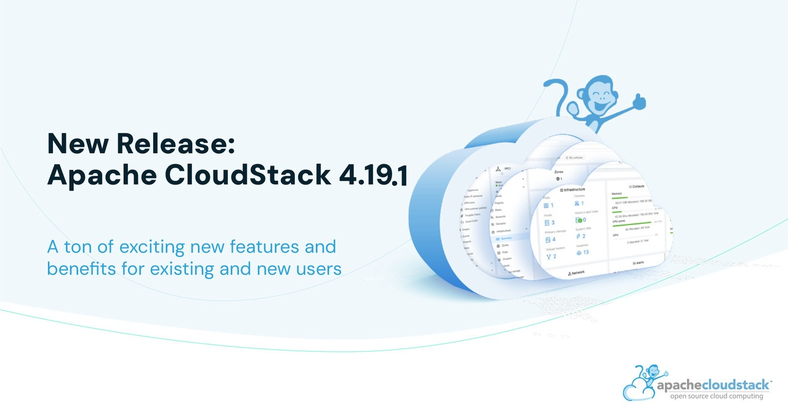

The Apache CloudStack project is pleased to announce the release of CloudStack
4.19.1.0.

The CloudStack 4.19.1.0 release is a maintenance release as part of its
4.19.x LTS branch and contains more than 300 fixes and improvements
since the CloudStack 4.19.0.0 release. Some of the highlights include:

<!-- truncate -->

* Improvements for VMware migration to KVM
* Support to manage/unmanage DATA volume of a primary storage on KVM
* Support for NFS mount options for a primary storage on KVM
* Support to change storage pool scope from Cluster to Zone and vice versa
* Support for RHEL/OL/Rocky/Alma Linux in the same cluster
* Import from remote KVM enhancements
* Storage plugins, PowerFlex, StorPool, Linstor related fixes and
improvements
* Some CKS, Veeam (B&R) related fixes and improvements
* Several UI fixes and improvements

CloudStack LTS branches are supported for 18 months and will receive
updates for the first 12 months and only security updates in the last
6 months.

Apache CloudStack is an integrated Infrastructure-as-a-Service (IaaS)
software platform that allows users to build feature-rich public and
private cloud environments. CloudStack includes an intuitive user interface
and rich API for managing the compute, networking, software, and storage
resources. The project became an Apache top-level project in March, 2013.

More information about Apache CloudStack can be found at:
https://cloudstack.apache.org/

## Documentation

What's new in  CloudStack 4.19.1.0:
https://docs.cloudstack.apache.org/en/4.19.1.0/releasenotes/about.html

The 4.19.1.0 release notes include a full list of issues fixed, as well
as upgrade instructions from previous versions of Apache CloudStack, and
can be found at:
https://docs.cloudstack.apache.org/en/4.19.1.0/releasenotes/

The official installation, administration, and API documentation for
each of the releases are available on our documentation page:
https://docs.cloudstack.apache.org/

## Downloads

The official source code for the 4.19.1.0 release can be downloaded from our
downloads page:

https://cloudstack.apache.org/downloads.html

In addition to the official source code release, individual contributors
have also made convenience binaries available on the Apache CloudStack
download page, and can be found at:

- https://download.cloudstack.org/el/7/
- https://download.cloudstack.org/el/8/
- https://download.cloudstack.org/el/9/
- https://download.cloudstack.org/suse/15
- https://download.cloudstack.org/ubuntu/dists/
- https://www.shapeblue.com/packages/
