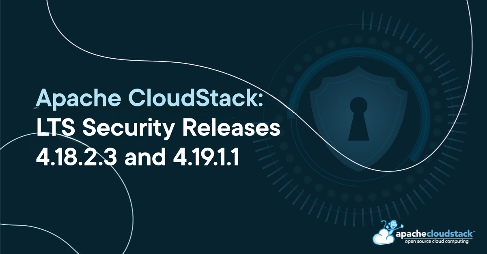

Apache CloudStack project announces the release of LTS security releases
[4.18.2.3](https://github.com/apache/cloudstack/releases/tag/4.18.2.3) and
[4.19.1.1](https://github.com/apache/cloudstack/releases/tag/4.19.1.1) that
address CVE-2024-42062 and CVE-2024-42222, both of severity rating 'critical',
explained below.

<!-- truncate -->

## [CVE-2024-42062](https://www.cve.org/CVERecord?id=CVE-2024-42062): User Key Exposure to Domain Admins

CloudStack account-users by default use username and password based
authentication for API and UI access. Account-users can generate and
register randomised API and secret keys and use them for the purpose
of API-based automation and integrations. Due to access permission
validation issue that affects Apache CloudStack versions 4.10.0 upto
4.19.1.0, domain admin accounts were found to be able to query all
registered account-users API and secret keys in an environment
including that of a root admin. An attacker who has domain admin
access, can exploit this to gain root admin and other-account
privileges and perform malicious operations that can result in
compromise of resources integrity and confidentiality, data loss,
denial of service and availability of CloudStack managed
infrastructure.

## [CVE-2024-42222](https://www.cve.org/CVERecord?id=CVE-2024-42222): Unauthorised Network List Access

In Apache CloudStack 4.19.1.0, a regression in the network listing API
allows unauthorised list access of network details for domain admin
and normal user accounts. This vulnerability compromises tenant
isolation, potentially leading to unauthorised access to network
details, configurations and data.

## Credits

The CVEs are credited to the following reporters:

- CVE-2024-42062:
  - Fabricio Duarte

- CVE-2024-42222:
  - Christian Gross of Netcloud AG
  - Midhun Jose

## Affected versions:

- CVE-2024-42062 affects the following versions:
  - Apache CloudStack 4.10.0 through 4.18.2.2
  - Apache CloudStack 4.19.0.0 through 4.19.1.0

- CVE-2024-42222 affect the following version:
  - Apache CloudStack 4.19.1.0

## Resolution

Users are recommended to upgrade to version 4.18.2.3, 4.19.1.1 or later, which
addresses these issues. Additionally, users on a version older than 4.19.1.0 are
advised to skip 4.19.1.0 and upgrade to 4.19.1.1 instead. To maintain the
security of their environment, users are advised to regenerate all existing user
keys.

## Downloads and Documentation

The official source code for the 4.18.2.3 and 4.19.1.1 releases can be
downloaded from the project downloads page:

https://cloudstack.apache.org/downloads

The 4.18.2.3 and 4.19.1.1 release notes can be found at:
- https://docs.cloudstack.apache.org/en/4.18.2.3/releasenotes/about.html
- https://docs.cloudstack.apache.org/en/4.19.1.1/releasenotes/about.html

In addition to the official source code release, individual contributors
have also made release packages available on the Apache CloudStack
download page, and available at:

- https://download.cloudstack.org/el/7/
- https://download.cloudstack.org/el/8/
- https://download.cloudstack.org/el/9/
- https://download.cloudstack.org/suse/15/
- https://download.cloudstack.org/ubuntu/dists/
- https://www.shapeblue.com/cloudstack-packages/
