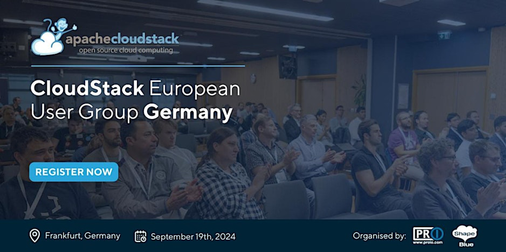

We are excited to announce the agenda for the upcoming CloudStack European User
Group, taking place in Frankfurt on September 19th, 2024. Hosted by
[proIO](https://www.proio.com), a leading German Private Cloud and Managed
Hosting Provider, this event promises to be a day filled with insightful
presentations, networking opportunities, and the latest updates from the
CloudStack community.

<a class="button button--primary button--lg" href="https://www.eventbrite.co.uk/e/cloudstack-european-user-group-germany-tickets-879369205967" target="_blank">Register</a> 

<!-- truncate -->

## Event Agenda

**10:30 – Registration & Morning Coffee**

**11:00 – Welcome: CloudStack EU User Group Updates, [Swen Brüseke](https://www.linkedin.com/in/swen-brüseke-391912193/), [proIO](https://www.proio.com)**

**11:15 - 12:00 - What’s New and What’s Upcoming in Apache CloudStack, [Giles Sirett](https://www.linkedin.com/in/gilessirett/), [ShapeBlue](https://www.shapeblue.com)**

This talk provides a detailed overview of the latest advancements and upcoming
features in Apache CloudStack. Giles will explore the 4.19 release, highlighting
significant updates such as VNF Appliances Support, KVM Import, and VMware to
KVM migration.

Looking ahead to version 4.20, the presentation will outline anticipated
features and offer a quick sneak peek into the project roadmap.

**12:10 - 12:55 - VM-HA with CloudStack and Linstor, Rene Peinthor, [LINBIT](https://linbit.com)**

Linstor's CloudStack integration uses DRBD's quorum implementation to determine
whether a VM currently has problems accessing its disk storage and might need to
be restarted on another host. This talk briefly overviews the implementation and
includes a live demo of CloudStack’s VM-HA combined with Linstor.

Rene will see what happens on DRBD level if a host node fails and when
CloudStack will start doing HA recovery procedures. Rene will also go into
CloudStack settings that can be used to tune VM HA timeouts.

**13:00 - 14:15 - Lunch Break**

**14:15 - 14:45 - Transitioning from VMware to Apache CloudStack: A Path to Profitability and Competitiveness, [Marco Sinhorelli](https://www.linkedin.com/in/msinhore/), [ShapeBlue](https://www.shapeblue.com)**

In this session, Marco will explore the potential of migrating from VMware to
Apache CloudStack with KVM. VMware vSphere is a robust cloud infrastructure and
management solution that combines vSphere and vRealize Suite, providing
automation and operations capabilities for traditional and modern infrastructure
and apps. However, the transition to Apache CloudStack can offer enhanced
profitability and competitiveness.

Marco will delve into the benefits of Apache CloudStack, including its
cost-effectiveness and open-source nature, and discuss how a gradual migration
from VMware vCloud can reduce ownership costs, increase profitability, and
enhance competitiveness. Marco will also cover the practical steps and
considerations in planning and executing this transition effectively.

**14:55 - 15:25 - Internet Facing VMs and the DDoS Problem, [Wido den Hollander](https://www.linkedin.com/in/widodh/), [Your.Online](https://your.online)**

When connected to the internet it is probably just a matter of time before one of your VMs is under a DDoS attack. Wido will cover how CloudStack handle this and what can you do about it.

**15:35 - 16:05 - How We Use CloudStack to Provide Managed Hosting, [Swen Brüseke](https://www.linkedin.com/in/swen-brüseke-391912193/), [proIO](https://www.proio.com)**

Swen will delve into how proIO leverages CloudStack to deliver robust and efficient managed hosting solutions. This session will explore the architecture and deployment strategies that enable us to provide reliable and scalable hosting services to our clients.

**16:15 - 16:45 - Development of an Оbject Storage Plugin for CloudStack, [Christian Reichert](https://www.linkedin.com/in/christian-reichert-35569b37/?originalSubdomain=de), [sc synergy GmbH](https://scsynergy.com/)**

The session will cover Mohammad’s organisation’s deployment of CloudStack and
Ceph and will cover their use case of CloudStack for both enterprise and Service
provider's networks. The session will also demonstrate their approach to a
cost-effective, open-source first cloud infrastructure deployment.

