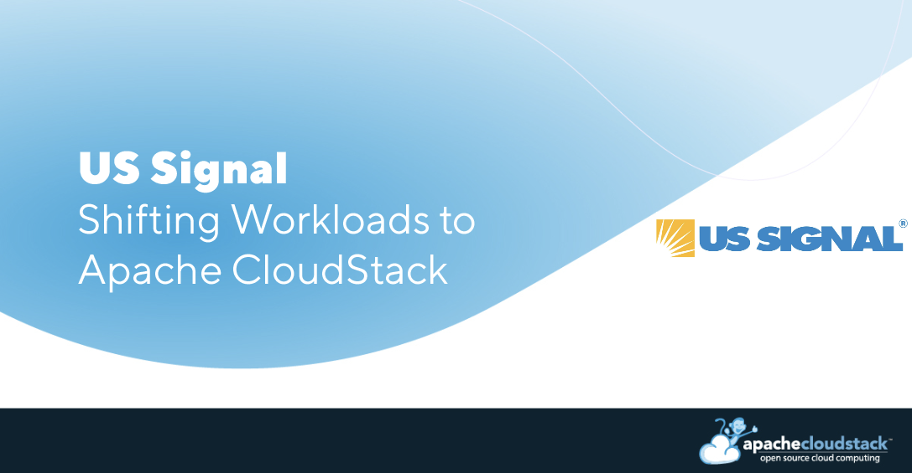

## About US Signal

A leading digital infrastructure provider of cloud, core connectivity, and data center services

US Signal is a leading digital infrastructure provider offering cloud,
core connectivity, and data center services. With a portfolio
including colocation, IT infrastructure, endpoint monitoring, data
management, disaster recovery, and security services, US Signal’s data
center solutions can meet even the most unique and complex technical
requirements.

<!-- truncate -->

Founded in 2000, US Signal has grown into one of the largest privately
held data center services providers. Its natural growth strategy has
allowed US Signal to evolve its solution portfolio based on customer
demand, emerging technologies, and changing business
requirements. With two core competencies—internet connectivity and
data center services—and 10 data centers, US Signal supports a wide
range of customers and hosts some of the largest healthcare
organizations and manufacturing companies in the Midwest.

## Ensuring Reliability and Predictability Based on Open Source 

Following the challenges arising from Broadcom's acquisition of
VMware, US Signal sought an additional IaaS solution to offer their
customers. John White, Chief Operating Officer at US Signal,
emphasizes the importance of companies controlling their own destinies
and having full opportunities for cloud consumption.

“We are a Premier VMware partner, among the largest in the U.S., and
it was going really well for us. However, over the last few years, as
VMware grew, they focused on just about anything but the service
provider community. This created some challenges for us and our
customers and left VMware vulnerable to disruption,” White said.

## The Choice of Apache CloudStack

While some customers continue to use VMware for specific use cases, US
Signal wanted to offer an alternative IaaS solution that would ensure
predictability, avoid dependency on a single vendor, and lower
licensing costs.

“At the end of 2023, we quickly put together an R&D team focused on
finding alternative cloud solutions,” explained White. “Our Cloud Team
started working with various technologies, and CloudStack was one of
them. We thought it would probably take us a few years to figure out
an alternative, but as we began designing and building, we discovered
that CloudStack was working pretty well. We were able to get pretty
good consistency, performance, and availability,” White observed.

“We knew we wanted to do something open, and CloudStack seemed to be
the right fit for us,” continued White. We wanted the solution to be
self-service and able to run multiple hypervisors. While we plan to
use KVM, we wanted to have the ability to run Xen if needed. An
additional requirement was options for easy migration between VMware
and the new platform.”

__US Signal’s criteria:__

    • Self-service solution
    • Online portal available
    • Multi-hypervisor support
    • Performance and availability
    • Easy migration from VMware
    • Simple networking management
    • Firewalls and load balancing easy management
    • Same support, performance, and uptime SLAs to match their VMware environment
    • Distributed solution between multiple data centers
    • Integrations with existing tools and technologies
    • OpenAPI

US Signal chose Apache CloudStack not only for its outstanding
technical capabilities but also for its supportive open-source
community. This choice enables the company to control its own destiny
without being dependent on a single vendor.

“We appreciate that Apache CloudStack is supported by an open
community. We are going to be contributing, others are contributing,
we are all driving towards a common goal. This collaboration provides
long-term support and growth that will meet future technology
demands,” White added.

## Future Roadmap with CloudStack

US Signal is committed to providing outstanding, customer-focused
services. They hope to leverage Apache CloudStack to enable AI
workloads, support edge computing (customer premises), and meet
compliance standards such as PCI DSS, HIPAA, and HITRUST.

“We are proud of what we have been able to achieve with CloudStack in
a very short timeframe. We're really excited for our launch and
strongly recommend CloudStack as an alternative IaaS solution to
VMware or even the hyperscalers,”White concluded.

## US Signal, a Frontrunner in Cloud Services

US Signal’s dedication to customer-focused solutions and
forward-thinking approach positions them as a leader in the cloud
services industry. Their adoption of Apache CloudStack demonstrates
their commitment to providing reliable, predictable, and
cost-effective solutions while supporting AI workloads and future
technological advancements.

Learn how US Signal can help your organization transform its digital infrastructure and meet evolving technology and business needs. Visit https://ussignal.com to get started.

<a class="button button--primary" href="https://cloudstack.apache.org/" target="_blank">BUTTON</a>
