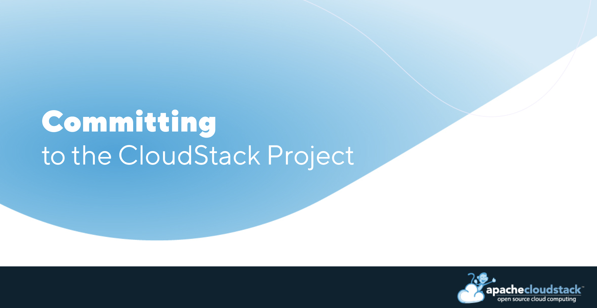

At the forefront of cloud computing stands the Apache CloudStack
project, a robust open-source platform that enables organisations to
build and manage scalable cloud environments with flexibility and
efficiency.

As open-source projects are not vendor-driven, they rely entirely on
contributions from their respective community. This community-driven
approach helps distribute the workload, accelerate innovation, and
ensure that the software evolves to meet the needs of the global user
base.

For those passionate about shaping the future of cloud computing,
contributing to the CloudStack project provides a valuable opportunity
to make a significant impact.

## Why Contribute to the CloudStack Project?

For the CloudStack project, contributions can come in a variety of
forms, such as code development, bug fixes, marketing, event
organisation, being a speaker at events/meetups, documentation,
contributing case studies, and the list goes on. Below, we outline the
various benefits of contributing to the project and share insights
from community members.

### Open-Source Community Collaboration

Joining the CloudStack project means becoming part of a vibrant
community of developers, architects, and enthusiasts who collaborate
openly to advance cloud technology. Open-source projects thrive on
diverse perspectives and contributions, making it an ideal environment
for learning and growth.

PMC member of the CloudStack project, Rohit Yadav shared "As a
committer or a PMC member, you gain industry and community recognition
while collaborating on a global scale. You contribute to the
development of features and improvements released with the project,
securing your organisation’s interests and influencing the future of
CloudStack. Your efforts drive its adoption and benefit a vast
community that you become an integral part of."

### Impactful Contributions

As a committer to the CloudStack project, individuals have the
opportunity to make substantial contributions to critical components
of cloud infrastructure. Whether it's enhancing scalability, improving
security measures, or innovating new features, every contribution
directly impacts the usability and reliability of cloud solutions
worldwide.

PMC member Daan (dahn) Hoogland shared his thoughts - "Users of a piece of
software have an opportunity unique to open-source with a product like
Apache CloudStack. They can see features and even direct the design
before it hits production. They can alter the direction of the
project, but for this they need to commit themselves to doing so. With
only a few hours per week of effort you can guard and influence your
main cloud orchestration tool to be as you need it."

PMC Member, Swen Brüseke expanded on Daan’s point - “Joining the
CloudStack project means being part of a global community dedicated to
advancing cloud technology. As a committer or PMC member, you have the
opportunity to influence the direction of a widely used open-source
project, connect with industry experts, and play a key role in its
development. Your contributions can make a significant impact on the
future of cloud computing.”

### Professional Experience

Working on an open-source project like Apache CloudStack provides
invaluable hands-on experience that enhances professional
growth. Contributors get the chance to collaborate with industry
leaders and peers, thus giving them invaluable experience aiding their
personal career trajectory.

### Building a Reputation

Becoming a committer to a respected open-source project such as Apache
CloudStack can elevate one's professional profile within the tech
community. It demonstrates expertise, dedication, and a commitment to
driving innovation, potentially opening doors to new career
opportunities and collaborations.

4.19 Release Manager and PMC Member Abhishek Kumar expanded on this
point - “Committing to an open-source project like CloudStack lets you
contribute to the future of cloud infrastructure while honing your
skills in a collaborative, innovative environment. It’s a chance to
influence the project's direction, mentor new contributors, and gain
recognition within the broader open-source community.”

Committing to the CloudStack project is more than a professional
endeavour; it is a commitment to shaping the future of cloud
computing. Through collaboration, innovation, and dedication,
contributors not only enhance their own skills and professional
development but also contribute to a global effort to make cloud
technology more accessible, secure, and efficient for everyone. As the
demand for scalable cloud solutions continues to grow, the
contributions made today through projects like CloudStack will
undoubtedly shape the landscape of tomorrow's digital infrastructure.

