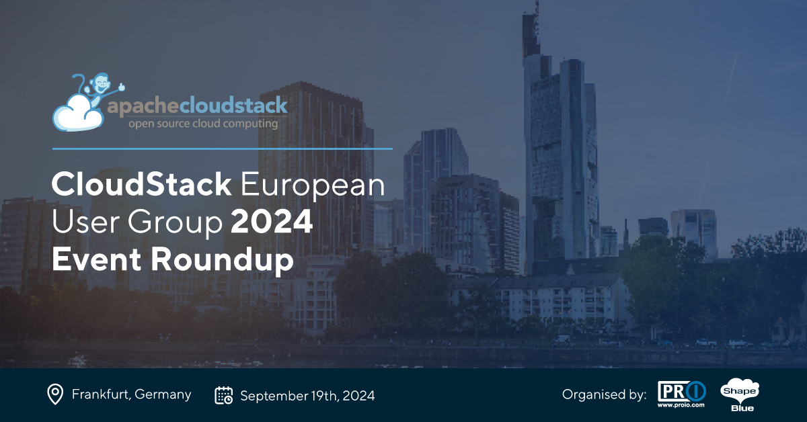
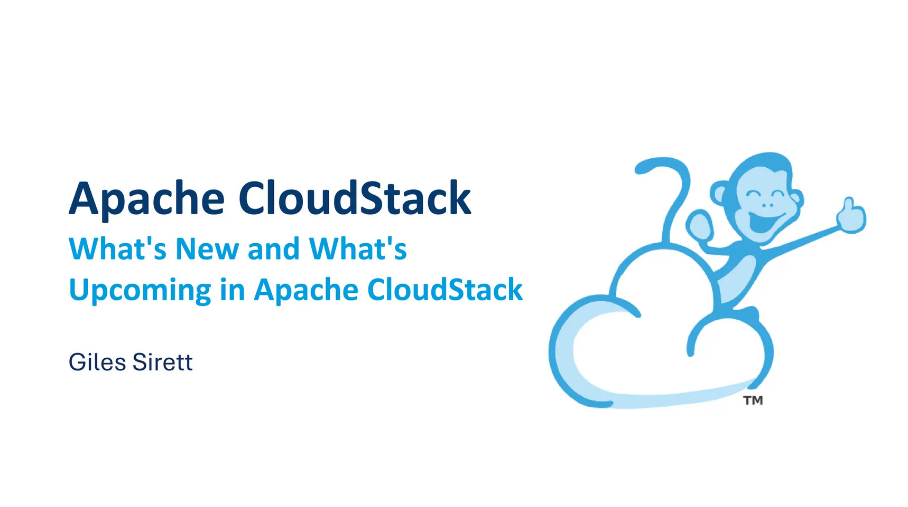
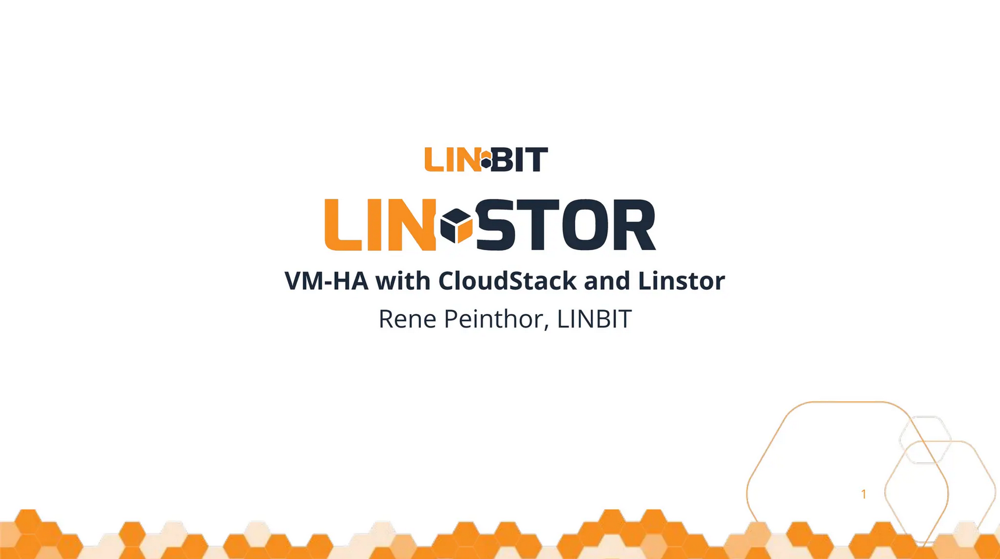
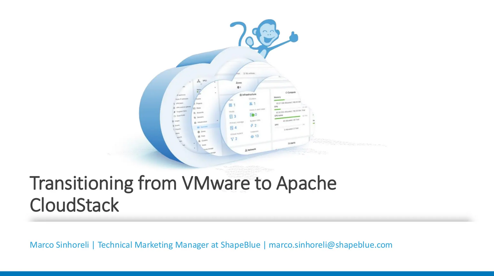
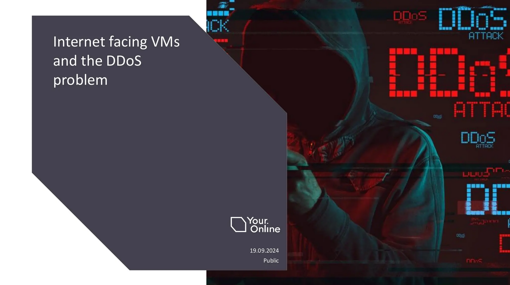
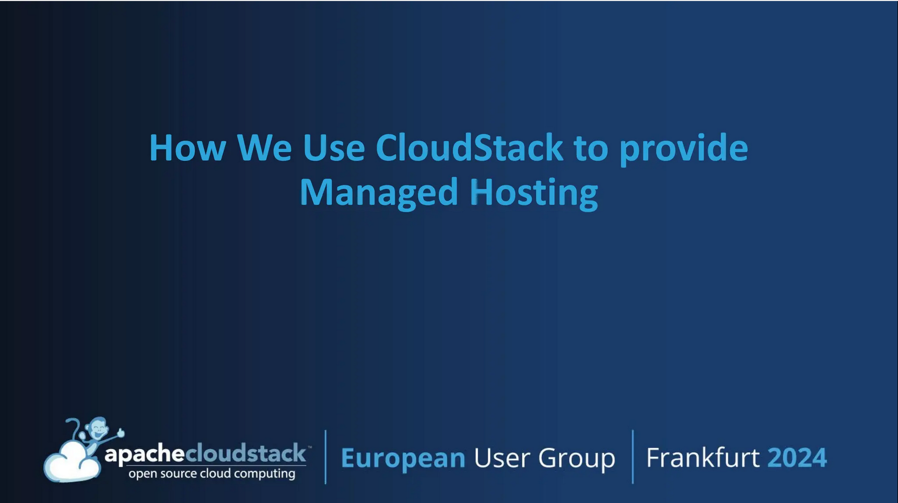
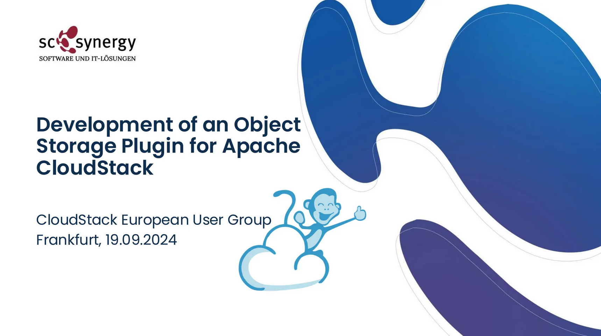

This year’s CloudStack European User Group was another successful
event for the community. The event drew a strong audience,
highlighting the growth of the CloudStack community in the region.

<!-- truncate -->

Discussions centred around CloudStack’s capabilities as a compelling
alternative to VMware, highlighting the many benefits organisations
can gain by avoiding vendor lock-in. The CloudStack community would
like to extend its gratitude to event host and sponsor,
[proIO](https://www.proio.com/), as well as to the additional event
sponsors, [ShapeBlue](https://www.shapeblue.com/) and
[LINBIT](https://linbit.com/).

Their invaluable support helped make the event a reality.

<a class="button button--primary" href="https://www.youtube.com/playlist?list=PLnIKk7GjgFlbXgKta_5Wu8rlDIHsqz407" target="_blank">Watch Session Recordings</a>

Below you can find the sessions slides, abstracts, as well as
speaker’s social links in case you would like to connect and have any
questions about their session!

**Access each session's slides by clicking onto the presentation graphic.**

## What’s New and What’s Upcoming in Apache CloudStack, [Giles Sirett](https://www.linkedin.com/in/gilessirett/), [ShapeBlue](https://www.shapeblue.com/)

Giles’s talk provided a detailed overview of the latest advancements and upcoming features in Apache CloudStack. Giles explored the 4.19 release, highlighting significant updates such as VNF Appliances Support, KVM Import, and VMware to KVM migration.

Looking ahead to version 4.20, the session outlined anticipated features and offer a quick sneak peek into the project roadmap.

## VM-HA with CloudStack and Linstor, Rene Peinthor, [LINBIT](https://linbit.com)

Linstor's CloudStack integration uses DRBD's quorum implementation to determine whether a VM currently has problems accessing its disk storage and might need to be restarted on another host. This talk overviewed the implementation and included a live demo of CloudStack’s VM-HA combined with Linstor.

Rene shared what happens on DRBD level if a host node fails and when CloudStack will start doing HA recovery procedures. Rene also went into CloudStack settings that can be used to tune VM HA timeouts.

## Transitioning from VMware to Apache CloudStack: A Path to Profitability and Competitiveness, [Marco Sinhorelli](https://www.linkedin.com/in/msinhore/), [ShapeBlue](https://www.shapeblue.com/)

In this session, Marco explored the potential of migrating from VMware to Apache CloudStack with KVM. VMware vSphere is a robust cloud infrastructure and management solution that combines vSphere and vRealize Suite, providing automation and operations capabilities for traditional and modern infrastructure and apps. However, the transition to Apache CloudStack can offer enhanced profitability and competitiveness. Marco delved into the benefits of Apache CloudStack, including its cost-effectiveness and open-source nature, and discussed how a gradual migration from VMware vCloud can reduce ownership costs, increase profitability, and enhance competitiveness. Marco also covered the practical steps and considerations in planning and executing this transition effectively.

## Internet Facing VMs and the DDoS Problem, [Wido den Hollander](https://www.linkedin.com/in/widodh/), [Your.Online](https://your.online/)

When connected to the internet, it is probably just a matter of time before one of your VMs is under a DDoS attack. In this session, Wido covered how CloudStack handles this and what can you do about it.

## How We Use CloudStack to Provide Managed Hosting, [Swen Brüseke](https://www.linkedin.com/in/swen-br%C3%BCseke-391912193), [proIO](https://www.proio.com)

Swen shared how proIO leverages CloudStack to deliver robust and efficient managed hosting solutions. He also explored the architecture and deployment strategies that enable proIO to provide reliable and scalable hosting services to their clients.

## Development of an Оbject Storage Plugin for CloudStack, [Christian Reichert](https://www.linkedin.com/in/christian-reichert-35569b37), [sc synergy GmbH](https://scsynergy.com/)

The session abstract for this talk is currently unavailable.

