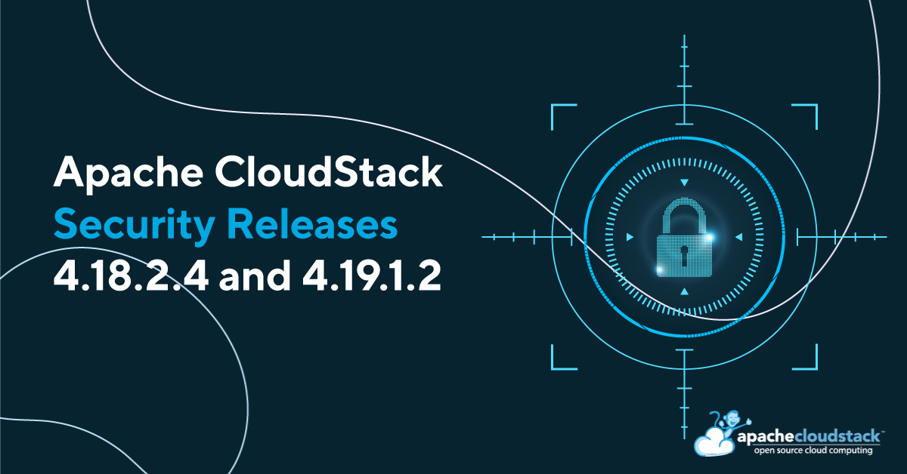

[](/blog/security-release-advisory-4.18.2.4-4.19.1.2)

The Apache CloudStack project announces the release of LTS security releases [4.18.2.4](https://github.com/apache/cloudstack/releases/tag/4.18.2.4) and [4.19.1.2](https://github.com/apache/cloudstack/releases/tag/4.19.1.2) that address the following security issues:

- CVE-2024-45219 (severity 'Important')
- CVE-2024-45461 (severity 'Moderate')
- CVE-2024-45462 (severity 'Moderate')
- CVE-2024-45693 (severity 'Important')

## [CVE-2024-45219](https://www.cve.org/CVERecord?id=CVE-2024-45219): Uploaded and registered templates and volumes can be used to abuse KVM-based infrastructure

Account users in Apache CloudStack by default are allowed to upload and register templates for deploying instances and volumes for attaching them as data disks to their existing instances. Due to missing validation checks for KVM-compatible templates or volumes in CloudStack 4.0.0 through 4.18.2.3 and 4.19.0.0 through 4.19.1.1, an attacker that can upload or register templates and volumes, can use them to deploy malicious instances or attach uploaded volumes to their existing instances on KVM-based environments and exploit this to gain access to the host filesystems that could result in the compromise of resource integrity and confidentiality, data loss, denial of service, and availability of KVM-based infrastructure managed by CloudStack.

Users are recommended to upgrade to Apache CloudStack 4.18.2.4 or 4.19.1.2, or later, which addresses this issue. 

Additionally, all user-uploaded or registered KVM-compatible templates and volumes can be scanned and checked that they are flat files that should not be using any additional or unnecessary features. For example, operators can run this on their secondary storage(s) and inspect output. An empty output for the disk being validated means it has no references to the host filesystems; on the other hand, if the output for the disk being validated is not empty, it might indicate a compromised disk.

```
for file in $(find /path/to/storage/ -type f -regex [a-f0-9\-]*.*); do echo "Retrieving file [$file] info. If the output is not empty, that might indicate a compromised disk; check it carefully."; qemu-img info -U $file | grep file: ; printf "\n\n"; done
```

The command can also be run for the file-based primary storages; however, bear in mind that (i) volumes created from templates will have references for the templates at first and (ii) volumes can be consolidated while migrating, losing their references to the templates. Therefore, the command execution for the primary storages can show both false positives and false negatives.

For checking the whole template/volume features of each disk, operators can run the following command:

```
for file in $(find /path/to/storage/ -type f -regex [a-f0-9\-]*.*); do echo "Retrieving file [$file] info."; qemu-img info -U $file; printf "\n\n"; done
```


## [CVE-2024-45461](https://www.cve.org/CVERecord?id=CVE-2024-45461): Access checks not enforced in Quota

The CloudStack Quota feature allows cloud administrators to implement a quota or usage limit system for cloud resources, and is disabled by default. In environments where the feature is enabled, due to missing access check enforcements, non-administrative CloudStack user accounts are able to access and modify quota-related configurations and data. This issue affects Apache CloudStack from 4.7.0 through 4.18.2.3; and from 4.19.0.0 through 4.19.1.1, where the Quota feature is enabled.

Users are recommended to upgrade to Apache CloudStack 4.18.2.4 or 4.19.1.2, or later, which addresses this issue. Alternatively, users that do not use the Quota feature are advised to disabled the plugin by setting the global setting "quota.enable.service" to "false".

## [CVE-2024-45462](https://www.cve.org/CVERecord?id=CVE-2024-45462): Incomplete session invalidation on web interface logout

The logout operation in the CloudStack web interface does not expire the user session completely which is valid until expiry by time or restart of the backend service. An attacker that has access to a user's browser can use an unexpired session to gain access to resources owned by the logged out user account. This issue affects Apache CloudStack from 4.15.1.0 through 4.18.2.3; and from 4.19.0.0 through 4.19.1.1.

Users are recommended to upgrade to Apache CloudStack 4.18.2.4 or 4.19.1.2, or later, which addresses this issue.

## [CVE-2024-45693](https://www.cve.org/CVERecord?id=CVE-2024-45693): Request origin validation bypass makes account takeover possible

Users logged into the Apache CloudStack's web interface can be tricked to submit malicious CSRF requests due to missing validation of the origin of the requests. This can allow an attacker to gain privileges and access to resources of the authenticated users and may lead to account takeover, disruption, exposure of sensitive data and compromise integrity of the resources owned by the user account that are managed by the platform.

This issue affects Apache CloudStack from 4.15.1.0 through 4.18.2.3 and 4.19.0.0 through 4.19.1.1

Users are recommended to upgrade to Apache CloudStack 4.18.2.4 or 4.19.1.2, or later, which addresses this issue.

## Credits

The CVEs are credited to the following reporters:

- CVE-2024-45219:
  - Daniel Augusto Veronezi Salvador (<gutoveronezi@apache.org>)

- CVE-2024-45461:
  - Fabrício Duarte (<fabricio.duarte.jr@gmail.com>)

- CVE-2024-45462:
  - Arthur Souza
  - Felipe Olivaes

- CVE-2024-45693:
  - Arthur Souza
  - Felipe Olivaes

## Affected versions:


- CVE-2024-45219:
  - Apache CloudStack 4.0.0 through 4.18.2.3
  - Apache CloudStack 4.0.0 through 4.19.1.1

- CVE-2024-45461:
  - Apache CloudStack 4.7.0 through 4.18.2.3
  - Apache CloudStack 4.7.0 through 4.19.1.1

- CVE-2024-45462:
  - Apache CloudStack 4.15.1.0 through 4.18.2.3
  - Apache CloudStack 4.15.1.0 through 4.19.1.1

- CVE-2024-45693:
  - Apache CloudStack 4.15.1.0 through 4.18.2.3
  - Apache CloudStack 4.15.1.0 through 4.19.1.1

## Resolution

Users are recommended to upgrade to version 4.18.2.4, 4.19.1.2 or later, which addresses these issues. Additionally, users on a version older than 4.19.1.0 are advised to skip 4.19.1.0 and upgrade to 4.19.1.2 instead.

## Downloads and Documentation

The official source code for the 4.18.2.4 and 4.19.1.2 releases can be downloaded from the project downloads page:

https://cloudstack.apache.org/downloads

The 4.18.2.4 and 4.19.1.2 release notes can be found at:
- https://docs.cloudstack.apache.org/en/4.18.2.4/releasenotes/about.html
- https://docs.cloudstack.apache.org/en/4.19.1.2/releasenotes/about.html

In addition to the official source code release, individual contributors have also made release packages available on the Apache CloudStack download page, and available at:

- https://download.cloudstack.org/el/7/
- https://download.cloudstack.org/el/8/
- https://download.cloudstack.org/el/9/
- https://download.cloudstack.org/suse/15/
- https://download.cloudstack.org/ubuntu/dists/
- https://www.shapeblue.com/cloudstack-packages/
