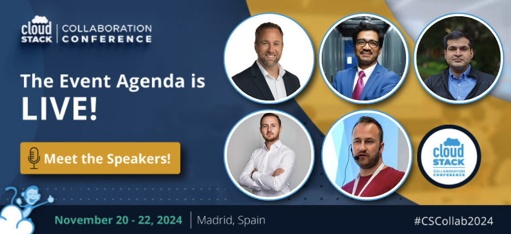

We are pleased the share that the official event agenda for this
year’s CloudStack Collaboration Conference is now live!

This year’s highly anticipated event is taking place in Madrid, Spain
on November 20-22nd. The first day at #CSCollab2024 will be a
hackathon day, with the following two days being fully dedicated to
sessions and workshops around Apache CloudStack. This blog will delve
into some of the highlighted sessions from the agenda and share
details of the evening events.

Registrations are still open for the conference for those still considering attending!

<a class="button button--primary" href="https://www.eventbrite.com/e/cloudstack-collaboration-conference-2024-tickets-879401903767?aff=oddtdtcreator" target="_blank">Register</a>

<!-- truncate -->

## Get Involved in the CloudStack Hackathon on the First Day

During the hackathon, participants will work on exciting projects
ranging from improving CloudStack features, developing new plugins, or
tackling specific cloud-related problems. Expert mentors and
CloudStack maintainers will be available to provide guidance and
support, ensuring everyone can contribute and learn. The day will
conclude with a showcase of the top solutions and technically
impressive projects.

## Elevate Your Skills at the CloudStack Collaboration Conference Workshops

Don’t miss the exclusive, hands-on workshops designed to deepen your
CloudStack expertise and boost your cloud management skills. Led by
industry experts and CloudStack pioneers, these workshops offer an
interactive environment where you can dive into real-world scenarios,
discover best practices, and explore advanced features. Whether you’re
a seasoned professional or new to CloudStack, these sessions are
tailored to provide valuable insights and practical knowledge that you
can immediately apply.

## A Glimpse into the Agenda

Below you can find some of the standout sessions from this year’s
event, including the keynote talks. Click the button below to see the
full event agenda!

<a class="button button--primary" href="https://www.cloudstackcollab.org/#schedule" target="_blank">Event Agenda</a>

###### Keynote: Navigating the Next Wave of Innovation, [John White](https://www.linkedin.com/in/iamjohn), COO, [US Signal](https://ussignal.com/)

In this session, John will explore the current state of the industry
and highlight the immense potential for transformation through
open-source technologies and will address:

* The Why: The fundamental reasons driving the shift towards open source and its disruptive potential.
* Future State: Projections and possibilities for what the technological landscape might look like with widespread open-source adoption.
* Limiting Factors: Challenges and obstacles that could impede this transformation including compute processing limitations, government regulations, power constraints, AI oversight, vendor disruptions, and public cloud failures.
* Gotchas: Unforeseen pitfalls and considerations businesses must be aware of.

###### Keynote: Building India's Sovereign Hyperscale Cloud with the CloudStack Ecosystem, [Sunil Gupta](https://www.linkedin.com/in/sunilgupta1701), Co-founder, Managing Director & CEO [at Yotta](https://yotta.com/)

In this session, Sunil will talk about the massive digital
transformation in India and how Yotta has partnered with the
Government to build multi-region hyperscale sovereign GovCloud
(perhaps largest outside US & EU) using Apache CloudStack and other
partner’s technology stack.

###### What is New in Apache CloudStack, [Rohit Yadav](https://www.linkedin.com/in/rohityadavcloud), VP of Engineering, [ShapeBlue](https://www.shapeblue.com/)

This will be an in-depth session on the latest advancements in Apache
CloudStack, with a special focus on the exciting new features and
improvements in the 4.20 release. As one of the leading open-source
cloud management platforms, CloudStack continues to evolve to meet the
needs of modern cloud infrastructures. This session will cover key
updates that enhance functionality, scalability, and user experience,
empowering cloud operators and developers alike. Rohit will explore
the cutting-edge enhancements introduced in version 4.20, including
new integrations, performance improvements, and security updates.

###### The Importance of a Proper Out-of-Band Network When Running CloudStack, [Wido den Hollander](https://www.linkedin.com/in/widodh), CTO, [Your.Online](https://your.online)

Often overlooked, but very important: a proper Out-of-Band (OOB)
network. When everything goes wrong you need proper access to your
CloudStack environment in order to diagnose and resolve any issues. In
this session, Wido will share how to design and implement a good OOB
network and have CloudStack benefit from it.

###### VMware/KVM to CloudStack/KVM Migration - tools and options within CloudStack, [Andrija Panić](https://www.linkedin.com/in/andrijapanic), Cloud Architect, [ShapeBlue](https://www.shapeblue.com)

In this talk, you will learn how CloudStack can help you
import/migrate VMware/KVM instances/volumes to CloudStack and what
options there are for operators to migrate those external workloads.

## Evening Events

##### Day 2: November 21st

The Get Together Party will be taking pace on November 21st at the
beautiful [Saona
Texeira](https://www.gruposaona.com/en/restaurante/saona-teixeira/)!
We invite all event attendees to join for an evening of drinks, great
conversations, and networking opportunities. This is a great
opportunity to connect with fellow community members, make new
friends, and strengthen professional relationships in a relaxed and
friendly atmosphere.

##### Day 3: November 22nd

The closing cocktail reception will be taking place at the event space
\- [Orense34](https://www.meetingplace.es/en/orense-34/), where we will
toast to a successful event and the exciting opportunities ahead in
cloud technology and Apache CloudStack!

### CloudStack Collaboration Conference 2024 - Made Possible with the Generous Support of Our Sponsors

