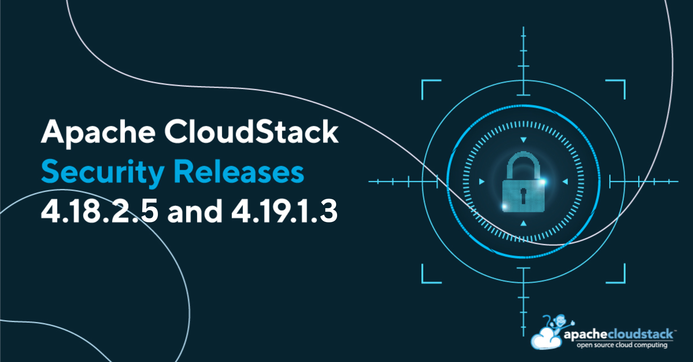

[](/blog/security-release-advisory-4.18.2.5-4.19.1.3)

The Apache CloudStack project announces the release of LTS security releases [4.18.2.5](https://github.com/apache/cloudstack/releases/tag/4.18.2.5) and [4.19.1.3](https://github.com/apache/cloudstack/releases/tag/4.19.1.3) that address the following security issues:

- CVE-2024-50386 (severity 'Important')

<!-- truncate -->

## [CVE-2024-50386](https://www.cve.org/CVERecord?id=CVE-2024-50386): Directly downloaded templates can be used to abuse KVM-based infrastructure

Account users in Apache CloudStack by default are allowed to register templates to be downloaded directly to the primary storage for deploying instances. Due to missing validation checks for KVM-compatible templates in CloudStack 4.0.0 through 4.18.2.4 and 4.19.0.0 through 4.19.1.2, an attacker that can register templates, can use them to deploy malicious instances on KVM-based environments and exploit this to gain access to the host filesystems that could result in the compromise of resource integrity and confidentiality, data loss, denial of service, and availability of KVM-based infrastructure managed by CloudStack.

Users are recommended to upgrade to Apache CloudStack 4.18.2.5 or 4.19.1.3, or later, which addresses this issue. 

Additionally, all user-registered KVM-compatible templates can be scanned and checked that they are flat files that should not be using any additional or unnecessary features. For example, operators can run the following command on their file-based primary storage(s) and inspect the output. An empty output for the disk being validated means it has no references to the host filesystems; on the other hand, if the output for the disk being validated is not empty, it might indicate a compromised disk. However, bear in mind that (i) volumes created from templates will have references for the templates at first and (ii) volumes can be consolidated while migrating, losing their references to the templates. Therefore, the command execution for the primary storages can show both false positives and false negatives.

```
for file in $(find /path/to/storage/ -type f -regex [a-f0-9\-]*.*); do echo "Retrieving file [$file] info. If the output is not empty, that might indicate a compromised disk; check it carefully."; qemu-img info -U $file | grep file: ; printf "\n\n"; done
```

For checking the whole template/volume features of each disk, operators can run the following command:

```
for file in $(find /path/to/storage/ -type f -regex [a-f0-9\-]*.*); do echo "Retrieving file [$file] info."; qemu-img info -U $file; printf "\n\n"; done
```

## Credits

The CVEs are credited to the following reporters:

- CVE-2024-50386:
  - Kiran Chavala <kiranchavala@apache.org> (reporter)

## Affected versions:

- CVE-2024-50386:
  - Apache CloudStack 4.0.0 through 4.18.2.4
  - Apache CloudStack 4.19.0.0 through 4.19.1.2

## Resolution

Users are recommended to upgrade to version 4.18.2.5, 4.19.1.3 or later, which addresses this issue. Additionally, users on a version older than 4.19.1.0 are advised to skip 4.19.1.0 and upgrade to 4.19.1.3 instead.

## Downloads and Documentation

The official source code for the 4.18.2.5 and 4.19.1.3 releases can be downloaded from the project downloads page:

https://cloudstack.apache.org/downloads

The 4.18.2.5 and 4.19.1.3 release notes can be found at:
- https://docs.cloudstack.apache.org/en/4.18.2.5/releasenotes/about.html
- https://docs.cloudstack.apache.org/en/4.19.1.3/releasenotes/about.html

In addition to the official source code release, individual contributors have also made release packages available on the Apache CloudStack download page, and available at:

- https://download.cloudstack.org/el/7/
- https://download.cloudstack.org/el/8/
- https://download.cloudstack.org/el/9/
- https://download.cloudstack.org/suse/15/
- https://download.cloudstack.org/ubuntu/dists/
- https://www.shapeblue.com/cloudstack-packages/
