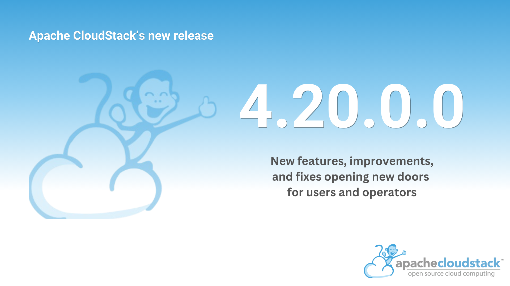

# Apache CloudStack LTS Release 4.20.0.0

The Apache CloudStack project is pleased to announce the release of
CloudStack 4.20.0.0.

Apache CloudStack 4.20 is the most recent release of the cloud
management platform. It comes as a product of extensive contributions
from the development community and is a LTS release, guaranteeing
ongoing maintenance and support for a period of 18 months

<!-- truncate -->

The 4.20 release contains 26 new features, 79 improvements and 59 bug
fixes since 4.19.

Some of the highlighted features include:

- Multi-Architecture Zones & ARM64 Support
- Shared File Systems
- VMware NSX Integration
- CloudStack Webhooks
- Granular Resource Limits
- Dynamic & Static Routing
- Simple NAS Backup and Recovery Provider
- CEPH RGW Object Storage Provider
- Security Group for Shared Networks in Advanced Zones
- Huge Quota Plugin API improvements
- Usage Management UI
- Quota Tariff UI
- Download Volume Snapshots

CloudStack LTS branches are supported for 18 months and will receive
updates for the first 12 months and only security updates in the last
6 months.

Apache CloudStack is an open-source software system designed to deploy
and manage large networks of virtual machines, as a highly available,
highly scalable Infrastructure as a Service (IaaS) cloud computing
platform. CloudStack includes an intuitive user interface and rich API
for managing the compute, networking, software, and storage resources.
The project became an Apache top-level project in March, 2013 and is
currently deployed in thousands of organizations globally.

More information about Apache CloudStack can be found at:  
https://cloudstack.apache.org/

# Documentation

What's new in CloudStack 4.20.0.0:  
https://docs.cloudstack.apache.org/en/4.20.0.0/releasenotes/about.html

The 4.20.0.0 release notes include a full list of issues fixed, as well
as upgrade instructions from previous versions of Apache CloudStack, and
can be found at:  
https://docs.cloudstack.apache.org/en/4.20.0.0/releasenotes/

The official installation, administration, and API documentation for
each of the releases are available on our documentation page:  
https://docs.cloudstack.apache.org/

# Downloads

The official source code for the 4.20.0.0 release can be downloaded from
our downloads page:  
https://cloudstack.apache.org/downloads.html

In addition to the official source code release, individual contributors
have also made convenience binaries available on the Apache CloudStack
download page, and can be found at:  
https://download.cloudstack.org/el/7/  
https://download.cloudstack.org/el/8/  
https://download.cloudstack.org/ubuntu/dists/  
https://download.cloudstack.org/suse/15/  
https://www.shapeblue.com/packages/  

#  A Word from the Community

<em>
"The 4.20 release brings a balanced set of new features, fixes, and upgrades for Apache CloudStack. Including:
 <ul>
  <li>Dynamic and static routing for networks;</li>
  <li>New NSX integration;</li>
  <li>Shared file systems, and many others.</li>
</ul>

Furthermore, already existing features were revamped, such as the Quota plugin, which was restructured to enable a billing pipeline to be implemented into ACS. We also had big changes on the building blocks of the project, such as:
 <ul>
  <li>Logging library update from log4j 1.29 to log4j 2.19;</li>
  <li>The JRE used with the project;</li>
  <li>upgrades in the system VM template.</li>
</ul>
"
</em>

\- [João Jandre Paraquetti](https://www.linkedin.com/in/joão-jandre-136a32159), CloudStack Committer, 4.20 Release Manager

 

<em>“Apache CloudStack 4.20.0 is an exciting version. We got several new integrations, such as Ceph RGW as an Object Storage provider and VMware NSX, and features, like Webhooks and Shared File System. We also got improvements for existing features, for instance, the Quota plugin API and UI improvements and the upgrade for Log4j 2. Furthermore, there are many fixes addressed in this release. In summary, 4.20.0 will open new doors for operators and users.”</em>

\- [Daniel Augusto Veronezi Salvador](https://www.linkedin.com/in/gutoveronezi/), Cloudstack VP

