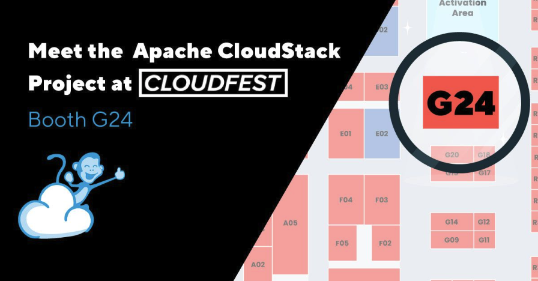

From March 17-20th, the world’s leading internet infrastructure event
– [CloudFest](https://www.cloudfest.com) – will be taking place at
Europa-Park in Rust, Germany!  The Apache CloudStack project will be
exhibiting at the conference for a third consecutive year, showcasing
the benefit of complete vendor independency and flexibility of using
open-source virtualization management solutions! The event presents a
fantastic opportunity for cloud builders to discover Apache
CloudStack’s robust capabilities and its value to the wider cloud
computing industry. As the premier gathering for internet
infrastructure professionals, CloudFest offers an ideal platform to
connect with industry leaders, share insights, and highlight how
Apache CloudStack is driving innovation in cloud computing.

<!-- truncate -->

## Get a Free Ticket!

Click the button below to redeem a free pass, worth €499 EUR!

<a class="button button--primary" href="https://registration.cloudfest.com/registration" target="_blank">Register for Free</a>

## Visit the CloudStack Booth!

Visitors to the Apache CloudStack booth (G24) at CloudFest will have
the opportunity to explore live demos with CloudStack expert,
providing insights into its capabilities and features. The booth will
also serve as a space for discussions on topical subjects, such as
migration strategies from proprietary technologies to Apache
CloudStack. Whether you’re interested in new features or want to delve
deeper into existing ones, the booth offers a chance to engage with
knowledgeable community members and gain a deeper understanding of how
CloudStack supports modern cloud infrastructure needs.

## Why Apache CloudStack?

For companies entering the public cloud market, one of the main
challenges is selecting the right software to ensure efficient
deployment for their customers. This process can be time-intensive
and, if the wrong decisions are made, may lead to reduced returns on
investment when delivering both public and private cloud solutions.

Apache CloudStack offers a comprehensive solution for cloud builders
and managed service providers. As a fully open-source platform, it is
designed for ease of use, straightforward implementation, seamless
management, and scalability. Supported by a vibrant open-source
community and frequent release cycles, CloudStack helps businesses
address critical challenges, including cost management, avoiding
vendor lock-in, and effectively handling large-scale infrastructure
across geographically distributed datacentres.
