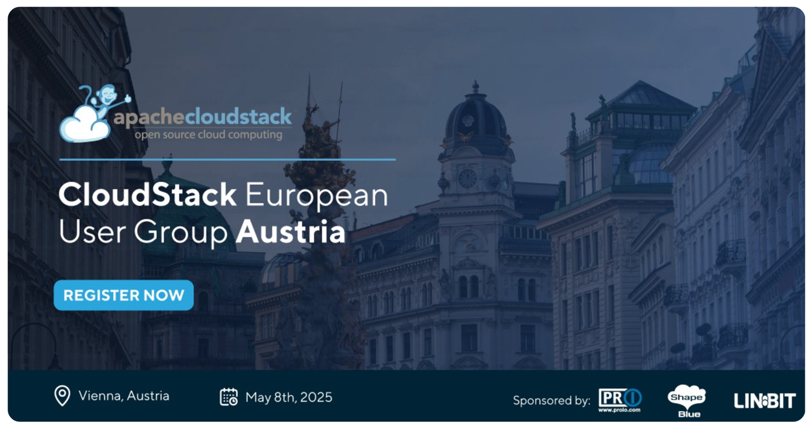

We’re thrilled to announce that the CloudStack European User Group
(CSEUG) 2025 is happening on May 8th in Vienna, Austria! This User
Group meeting will bring together the European CloudStack community
for a full day of networking, knowledge sharing, and discussions about
our open-source cloud technology. This year’s CSEUG is sponsored by
[ShapeBlue](https://www.shapeblue.com/),
[proIO](https://www.proio.com/) and [LINBIT](https://linbit.com/), who
will also be the local event host.

<!-- truncate -->

<a class="button button--primary" href="https://www.eventbrite.com/e/cloudstack-european-user-group-2025-vienna-austria-tickets-1217321664869?aff=oddtdtcreator" target="_blank">Register Now</a>

## Why Attend CSEUG 2025

Whether you’re an existing user of Apache CloudStack or have just
started researching it, this is the perfect opportunity to connect and
learn from fellow community members from the European CloudStack
ecosystem. The event will host a full day of sessions, all focused-on
Apache CloudStack. From new features to compelling case studies, the
event promises to be yet another CSEUG to remember.

## Who is the Event for?

CSEUG is intended for developers, operators, and users to collaborate
on advancing the Apache CloudStack project, exploring its features,
and discussing its real-world applications.

The event proudly welcomes attendees from across the globe, although
you can expect the majority of attendees and speakers to be from the
European CloudStack community. The primary audience includes
enterprises, cloud service providers, telecommunications companies,
and managed service providers (MSPs).

## Agenda

**10:00 - 10:45 - Apache CloudStack 101 - Introduction, What’s New and What’s Coming**,
Giles Sirett, ShapeBlue

**10:55 - 11:25 - Storage Setup for LINSTOR/DRBD/CloudStack**,
Rene Peinthor, LINBIT

**11:35 - 12:05 - I’d Like to Resell Your CloudStack Services, but...**,
Brian Turnbow, CDLAN

**12:15 - 12:45 - Fully Open-Source Private Clouds: Freedom, Security, and Control**,
Swen Brüseke, proIO

**12:45 - 13:45 - Lunch break**

**13:45 - 14:15 - CloudStack + KVM: Your Local Cloud Lab**,
Francisco Arencibia, Jotelulu

**14:25 - 14:55 - Proposed Feature: Monitoring and Managing Cloud Usage Costs in Apache CloudStack**,
Grégoire Lamodiere, Joffrey Luangsaysana, DIMSI

**15:05 - 15:35 - Stretching CloudStack Over Multiple Datacenters**,
Wido den Hollander, Your.Online

**15:45 - 16:15 - Pushing the Limits: CloudStack at 25K Hosts**,
Boris Stoyanov, ShapeBlue

## Meet [LINBIT - Our Host](https://linbit.com/)

LINBIT is the company behind the open-source storage software DRBD and
LINSTOR. Since 2001, the company has been recognized in the public
sphere primarily for its distributed replicated storage system for the
Linux platform DRBD, which was officially integrated into the Linux
Kernel in 2010 by Linus Torvalds. LINBIT’s roots are deeply embedded
in the open-source community, and its software and solutions are
utilized by established organizations and businesses worldwide.

## The Event Venue is Confirmed!

**This year’s Spring Edition of CSEUG** will be held near **Vienna’s historic Old Town**, at [Quartier Belvedere Central 3](https://shapeblue.us1.list-manage.com/track/click?u=5dc04ec275e7bd0b6af196418&id=c21a8d9a71&e=3c67b97b3c). Conveniently located just **20 minutes from Vienna International Airport** by car or public transport, this venue offers an easily accessible and welcoming space for our community members traveling to the event.
