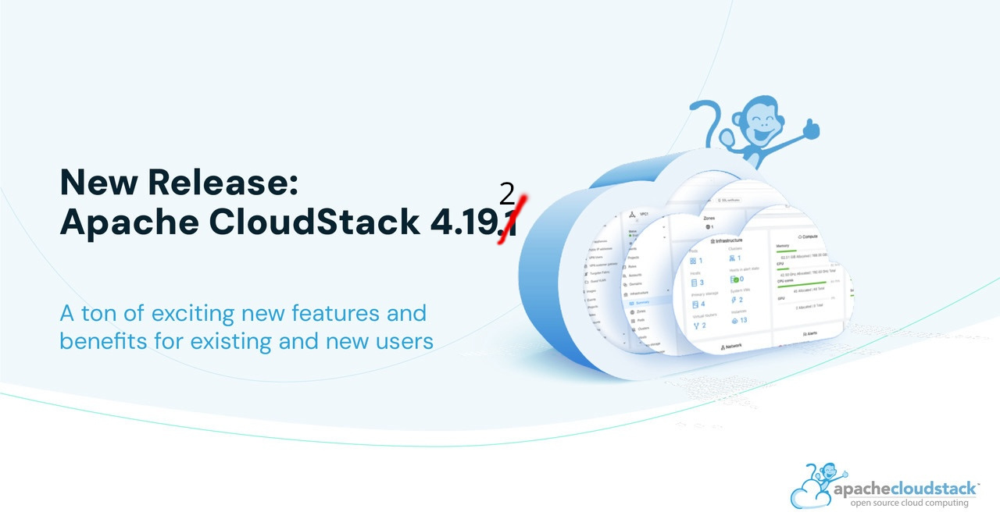

The Apache CloudStack project is pleased to announce the release of CloudStack
4.19.2.0.

<!-- truncate -->

The CloudStack 4.19.2.0 release is a maintenance release as part of its
4.19.x LTS branch. It contains over 170 fixes in rounds the tally of fixes since 4.19.0 up to 480
Some of the highlights include:

* Improvements for the 3rd party storage solutions like linstor and storpool
* Numerous fixes for UI and API behavious
* Project access controll fixes
* Network improvements for the various kinds of networks
* Vmware import improvents

CloudStack LTS branches are supported for 18 months and will receive
updates for the first 12 months and only security updates in the last
6 months.

Apache CloudStack is an integrated Infrastructure-as-a-Service (IaaS)
software platform that allows users to build feature-rich public and
private cloud environments. CloudStack includes an intuitive user interface
and rich API for managing the compute, networking, software, and storage
resources. The project became an Apache top-level project in March 2013.

More information about Apache CloudStack can be found at:
https://cloudstack.apache.org/

## Documentation

What's new in  CloudStack 4.19.2.0:
https://docs.cloudstack.apache.org/en/4.19.2.0/releasenotes/about.html

The 4.19.2.0 release notes include a full list of issues fixed, as well
as upgrade instructions from previous versions of Apache CloudStack, and
can be found at:
https://docs.cloudstack.apache.org/en/4.19.2.0/releasenotes/

The official installation, administration, and API documentation for
each of the releases are available on our documentation page:
https://docs.cloudstack.apache.org/

## Downloads

The official source code for the 4.19.2.0 release can be downloaded from our
downloads page:

https://cloudstack.apache.org/downloads.html

In addition to the official source code release, individual contributors
have also made convenience binaries available on the Apache CloudStack
download page, and can be found at:

- https://download.cloudstack.org/el/7/
- https://download.cloudstack.org/el/8/
- https://download.cloudstack.org/el/9/
- https://download.cloudstack.org/suse/15
- https://download.cloudstack.org/ubuntu/dists/
- https://www.shapeblue.com/packages/
