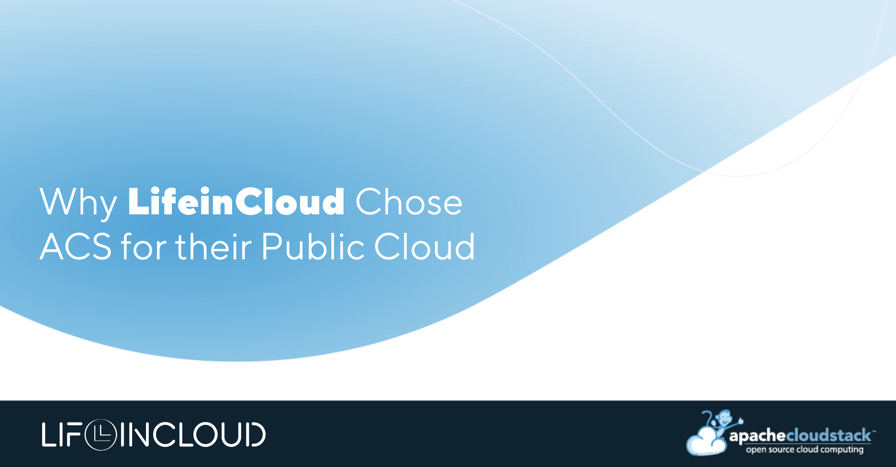

## The Story of LifeinCloud

[LifeinCloud](https://lifeincloud.com/) is a privately-owned, European public
cloud provider on a mission to make powerful cloud solutions more accessible to
developers and businesses worldwide.

They started in 2009 as a managed services provider, later expanding into
private cloud solutions. As demand grew, they faced a similar challenge to many
in our community:

<!-- truncate -->

*"Each client environment was essentially a separate island. We were duplicating
efforts across different environments - separate hardware, separate maintenance
windows, separate upgrade cycles. This wasn't just inefficient; it was
unsustainable as we looked to scale."*

-[Bogdan Rohan](https://www.linkedin.com/in/bogdanrohan/), LifeinCloud Founder & CEO

Their solution? Building a multi-region public cloud platform powered by Apache
CloudStack. The results transformed their operations: 40% reduction in overhead,
85%+ infrastructure utilization, and onboarding time cut from weeks to hours.

But the interesting part is how they got there.

## The choice: CloudStack vs OpenStack

During their technical evaluation, LifeinCloud's team discovered significant
architectural differences between the two platforms. Their CTO, [George
Lisandru](https://www.linkedin.com/in/george-lisandru-6840a9294/?originalSubdomain=ro),
explains why OpenStack's architecture proved challenging for what they were
trying to achieve:

*"OpenStack's architecture follows the Unix philosophy - many small components
each doing one thing well. In theory, this provides maximum flexibility. In
practice, it means you need separate services for compute (Nova), networking
(Neutron), identity (Keystone), image management (Glance) and storage (Cinder).
Each component needs its own high-availability setup, monitoring and
maintenance. It's as powerful as it is complex."*

Their testing revealed striking differences in resource requirements for managing 100 VMs:
- OpenStack needed 5+ control nodes and nearly 100GB of RAM just to manage itself
- CloudStack ran the same workload with a single management server (two for HA) and just 16GB of RAM
- Ceph integration with CloudStack "just worked," while OpenStack required additional components and careful configuration

George also singled out CloudStack's API-first approach as a major advantage:

*"It's remarkably stable and well-documented. The API hasn't broken compatibility
in years, making it reliable for long-term automation. This is crucial for our
customers building infrastructure-as-code pipelines."*

## Implementation Challenges

While basic deployment was straightforward, the team encountered several
technical hurdles, as George notes:

"The documentation for advanced HA configurations could be better. We ended up
working directly with ShapeBlue and the CloudStack community to resolve some
edge cases."

Other challenges included:
- Extensive Ceph optimization for their workload patterns
- Network configuration refinement for maximum throughput
- Management server database tuning for multi-datacenter operations

## Real-World Performance

After optimization, LifeinCloud reports that their deployment is now delivering
consistent performance:

**Compute Layer:**

- [VM Provisioning](https://lifeincloud.com/products/cloud-servers/): 45 seconds average (down from 3+ minutes)
- Live Migration: Sub-second downtime for running VMs
- CPU Overhead: Less than 2% for KVM virtualization

**Storage Layer (Ceph with NVMe):**

- Random 4K Read: 120,000 IOPS per storage node
- Sequential Read: 3.2 GB/s sustained throughput
- Latency: Sub-5ms for cached reads

## Storage Architecture

When asked about why Ceph won, LifeinCloud’s CTO explains: "Ceph, while more
resource-intensive, met our reliability requirements and offered better scaling
characteristics."

Their current Ceph implementation provides:

- Triple replication for data redundancy
- Dedicated networks for replication traffic
- Optimized placement groups for better performance
- Integration with [NVMe SSD storage](https://lifeincloud.com/products/block-storage/) for high-performance workloads

## Network Architecture

Their network design emphasizes redundancy and isolation through:

- Dual physical switches for hardware redundancy
- Network bonding on all hosts
- Automatic failover capabilities
- VLAN-based network separation
- [Granular firewall](https://lifeincloud.com/products/cloud-firewall/) controls
- Support for custom network topologies

## Security Architecture

The provider says security was built as a fundamental component into every layer of their stack:

**Network Security:**

- CloudStack's VLAN capabilities maintain complete customer traffic separation
- Per-VLAN firewall rules allow customers to implement precise security controls
- No cross-tenant network visibility

**[Access Control](https://lifeincloud.com/features/identity-access-management/):**

- Granular Role-Based Access Control (RBAC) system
- Precise permission management
- Comprehensive admin action logging for compliance requirements

*"The centralized management approach is key here,"* notes George. *"When
something needs investigation, we're not playing detective across five different
dashboards trying to piece together what happened."*

## Technical Roadmap

The LifeinCloud platform currently operates across multiple datacenters:

- Frankfurt: Chosen for proximity to DE-CIX, Europe's largest Internet peering exchange
- Bucharest: Features some of the fastest broadband internet globally
- London: Europe’s largest data center market and a global business hub
- Miami: Planned for end of 2025, connecting European customers to the Americas

Having just released their
[Kubernetes](https://lifeincloud.com/products/kubernetes/), [high-frequency
compute](https://lifeincloud.com/products/high-frequency-compute/), and [S3-compatible
object storage](https://lifeincloud.com/products/object-storage/) offerings,
their upcoming technical initiatives include GPU support with direct device
passthrough.

## The Final Verdict

After running CloudStack in production, LifeinCloud achieved the scalability
they needed without the complexity they feared. Their infrastructure handled
growth from one region to multiple availability zones while maintaining
performance and reliability. Their CTO adds:
*"So far, we're happy with how ACS performed in this expansion: one platform,
multiple regions, no silos. We can scale globally while keeping data exactly
where it needs to be."*
