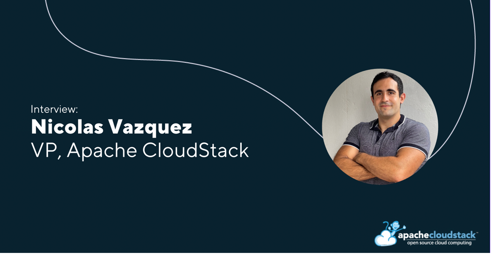

# Meet the New VP of CloudStack: Nicolas Vazquez

The CloudStack project is pleased to announce our newest VP, [Nicolas Vazquez](https://www.linkedin.com/in/nvazquezuy/). This interview explores Nicolas’ experience with Apache CloudStack, key projects, recent developments, advice on how to contribute to the CloudStack ecosystem, and more!

##### Introduce yourself in a few words

My name is Nicolas Vazquez, I am a Software Engineer from Uruguay. I have been involved on the CloudStack project for the last 10 years, during which I became a Committer and then a PMC member. In the last months I have been contributing to features like VMware to KVM migration, the support for Virtual Appliances on VMware, the Multi-Architecture Zones.

<!-- truncate -->

I have been working as a Senior Software Engineer at [ShapeBlue](https://www.shapeblue.com/) for the last 8 years, which is a major code contributor the project.

[→ Explore the current project members](https://cloudstack.apache.org/who/)

##### How did you first get involved in cloud computing and the Apache CloudStack project?

I was initially assigned to work to a customer project - providing fixes and improvements for their CloudStack-based private cloud. This was the first time I was working on cloud computing (and CloudStack), and I had a big learning curve before delivering my first fixes, but fortunately it was made possible with the help from my current mentor. Eventually, and while still learning, I was able to deliver more fixes and improvements.

##### Can you share your experience in the community and how you contribute to the CloudStack ecosystem?

My experience with the community has been great since the first day. I still remember my first code contribution was not tidy, but I was pleased to see community members patiently reviewing and suggesting ways to improve it. I improved my next code contributions but still found it great that people took time to review and test my fixes. Today I continue by providing code contributions for new features & improvements, bug fixes, helping review other people’s contributions, and being involved in mailing lists discussions. During the last few years, I have been the release manager for versions 4.16.0 and 4.17.0 and participated as a [GSOC mentor](https://cloudstack.apache.org/blog/gsoc-2023/) for two years. I’ve also presented features I have worked on, in several [CloudStack Collaboration Conferences](https://www.cloudstackcollab.org/).

##### What are some key projects and developments you have worked on and are currently working on?

I have worked on the development of many exciting features for CloudStack, some of which being: the VMware to KVM migration, the support for Virtual Appliances on VMware, the Multi-Architecture Zones. For cloud builders, features like VMware to KVM migration, support for Virtual Appliances on VMware, and Multi-Architecture Zones provide greater flexibility, lower costs, and faster deployment. They enable a shift away from proprietary platforms, simplify application delivery, and allow support for diverse workloads across different CPU architectures. Together, these capabilities help cloud builders create more open, efficient, and adaptable cloud environments.

Most recently I have also worked (and still working) on some SDN integrations for CloudStack: the NSX 4 Integration (which has been included on version 4.20.0) and I currently working on the Netris Integration.

[→ Watch Nicolas’s session on NSX 4 Integration from #CSCollab2024](https://www.youtube.com/watch?v=PGDGo7yTM90)

##### How do you think the CloudStack project will continue to grow over the next five years?

CloudStack gives a solid, production-ready platform to run IaaS at scale without having to stitch together a bunch of tools. It’s hypervisor agnostic, which means we can support both KVM and VMware environments, and its built-in features. The API is clean and predictable, which makes automation straightforward, and the UI is user-friendly.

What really stands out is the stability and maturity of the platform. We can deploy complex environments without worrying about unexpected behaviour or vendor lock-in, and the active open-source community means improvements are steady and transparent. For companies building private or public clouds, it’s a very practical choice.  I think over the next years we will see many exciting new features as the adoption grows. CloudStack is already a reliable solution and has multiple integrations for storage and networking providers. I believe many more integrations will be introduced. I also believe the CloudStack community will grow in numbers, as we are already seeing many more people get involved by reporting issues, as well as proposing and providing fixes.

##### What do you think is missing in terms of contribution to the CloudStack project from the community?

In my opinion, there are a few items which are being improved in terms of contribution to the project. For new developer contributors, there is a lot to learn as the codebase is very large, but luckily there is a great starting guide to help new developers on their start with CloudStack: https://github.com/shapeblue/hackerbook. Also, many companies have been presenting their Use Case and how CloudStack fits their needs.

[→ Explore CloudStack Use Cases & Integrations](https://cloudstack.apache.org/blog/tags/case-studies)

However, I think the project is still missing more involvement on release candidate testing and keeping the documentation up to date. An increase on the release candidates testing would help us catch issues earlier and provide more robust releases. I would encourage everyone interested to contribute on these fronts, to make our product even better!

##### What would you say as a conclusion to companies’ evaluating open-source technology?

The cloud industry is evolving beyond scale — it’s now about control, flexibility, and long-term sustainability. Apache CloudStack addresses this shift by giving builders a stable, production-grade platform that doesn't compromise on openness. Its deep integration of core IaaS functions — compute, networking, storage — allows us to operate complex cloud environments efficiently, while avoiding the pitfalls of vendor lock-in. In a world where infrastructure decisions shape business agility, open-source solutions like CloudStack are not an alternative — they’re the foundation!