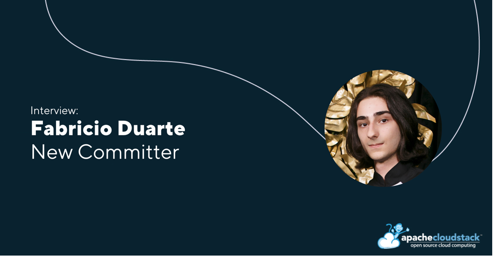

Fabricio Duarte is one of the newest committers of the Apache
CloudStack community. In this interview, Fabricio delves into his
professional background, his contributions to the CloudStack project,
advice on how to get involved in the project, and more! Click the
button below to see the current project member list.

<!-- truncate -->

<a class="button button--primary" href="https://cloudstack.apache.org/who" target="_blank">Project members</a>

##### Introduce yourself in a few words and what your current job role is

Hey all, I'm Fabricio. I'm an undergraduate student from Brazil
pursuing my bachelor’s in computer science and working as a developer
at [SC Clouds](https://scclouds.com.br/). I enjoy reading
(particularly content in foreign languages; in fact, my involvement
with open-source began with language learning related software),
playing video-games and learning new stuff.

##### What are some of your key contributions to the Apache CloudStack project?

I have worked on:
- investigating and patching security issues: CVE-2024-42062, CVE-2024-45461, https://github.com/apache/cloudstack/pull/9461;
- fixing regressions: 
https://github.com/apache/cloudstack/pull/9894, https://github.com/apache/cloudstack/pull/10244, https://github.com/apache/cloudstack/pull/10546;
- fixing bugs: 
https://github.com/apache/cloudstack/pull/7832, https://github.com/apache/cloudstack/pull/9888;
- normalizing behaviors:
https://github.com/apache/cloudstack/pull/8243, https://github.com/apache/cloudstack/pull/9636, https://github.com/apache/cloudstack/pull/10008;
- and on various other improvements, such as: 
https://github.com/apache/cloudstack/pull/10363 and https://github.com/apache/cloudstack/pull/10454.

##### What would your advice be to people interested in the CloudStack project, but not sure how to get involved?

As a starting point, learn what CloudStack is used for, how to deploy
a simple testing environment, and how to use its basic
functionalities. The deployment process can feel quite overwhelming
for people that are not familiar with the underlying technology, but
there's lots of great guides on how to deploy minimal environments for
testing. You don't need to understand everything on your first time
(although it is good to look up what the software and commands you are
using do). You will gradually understand things as you get more used
to them and read more.

Then, if you see that the project interests you and want to contribute
(and learn more about CloudStack in the process), there are many
things you can do: ask questions, give feedback, report bugs, test
changes, submit patches, review code. All these things can be done by
people with all expertise levels, even code related stuff! There are
issues simple enough that, if you have a programming basis and already
managed to deploy CloudStack, you can probably work on a patch.

CloudStack also tends to participate in Google Summer of Code (and
will participate this year!), which provides a great opportunity for
newcomers to get involved while learning new technologies and
improving their skills. A mentor will individually guide participants
on getting started with the software and on developing an interesting
feature or enhancement.

##### What do you think are some of the standout features introduced in the last two years?

Some standout features introduced in the last two years include, but are not limited to:

- All the new quota functionality
- Autoscaling VM groups
- Dynamic & static routing
- Flexible tags for host and storage pools
- KVM instance import
- Multi-architecture zones
- Object storage framework
- Secondary storage selectors
- VMware to KVM migration
- Webhooks

##### What are some features that have not been developed yet and are not in the current roadmap that you would like to see?

I have spent quite some time poking around Usage, and one thing that I
sometimes see are inconsistencies between the cloud and cloud_usage
databases, which results in removed resources generating usage records
or existing resources not generating usage records. This usually
happens because operators manually changed entries on the cloud
database, but forgot to update cloud_usage. Something that I wish to
see someday is an environment inconsistency detection feature that
would automatically detect things like these and notify operators
(there are the Usage sanity checks, but they are Usage-specific and
very limited). This feature would also be able to detect
inconsistencies in other modules, such as templates that exist on
secondary storage but are not registered and vice-versa. The
normalization would not be performed automatically so that we do not
accidentally ignore an underlying problem, but we could suggest
operators some actions to take (maybe even provide an API to easily
execute these actions).
