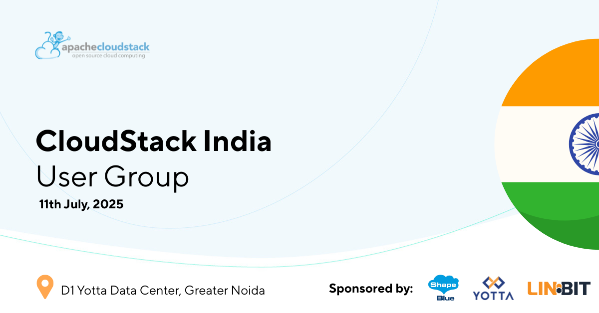

We’re excited to share that the CloudStack India User Group (CSIUG) will be held
on 11th July 2025 at the [D1 Yotta Data Center](https://tinyurl.com/yjff2yza) in
Greater Noida.

This event will bring together CloudStack users, developers, and operators from
across India for a day of technical sessions, community collaboration, and
in-depth discussions on building and running open-source cloud infrastructure.
Expect real-world case studies, project updates, and valuable insights from
across the CloudStack ecosystem.

The 2025 CSIUG is supported by [ShapeBlue](https://www.shapeblue.com/), [Yotta](https://yotta.com/) and [LINBIT](https://linbit.com/).

<a class="button button--primary button--lg" href="https://www.eventbrite.com/e/cloudstack-india-user-group-2025-tickets-1374146161159?aff=oddtdtcreator" target="_blank">REGISTER</a>

<!-- truncate -->

## Event Agenda

09.00 - 09.45 - Registration & Networking

09.45-10.00 - Meetup Kickoff & Welcome – Rohit Yadav, CSIUG Chairman

10.00 -10.25 - The Yotta x CloudStack Advantage: a Scalable, India-First Cloud - Tailored for Sovereignty, Flexibility, Affordability and Innovation – Sunil Gupta, Yotta

10.30 - 11.15 - Apache CloudStack 201: Let's Design & Build an IaaS Cloud – Jithin Raju, ShapeBlue

11.30 - 11.55 - Empowering Cloud Providers with Apache CloudStack and Stackbill: From Infrastructure to Business Success - Ravichandran Palanisamy, StackBill

12.00 - 12.25 - Ampere offers energy-efficient future for AI and Cloud - Vinod Kumar, Ampere Computing

12.30 - 12.55 - Building and Operating a Private Cloud with CloudStack and LINBIT CloudStack HCI Appliance - Nischal Prabhu, LINBIT

13.00 - 13.50 - Lunch & Networking

13.50pm - 14.50 – Datacentre Tour

14.50 - 15.00 - Meetup Photo-Op & Break

15.00 - 15.25 - CloudStack GPU Integration - Rohit Yadav, ShapeBlue

15.30 -15.55 - Simplifying End-to-End Apache CloudStack Deployment with a Web-Based Automation Portal - Vivek Kumar, Yotta

16.00 -16.25 - Extensions Framework (XaaS) - Enabling Orchestrate Anything - Harikrishna Patnala & Abhishek Kumar, ShapeBlue

16.30 - 17.30 - Meetup Closing & Networking

## Who Should Attend?

The CloudStack India User Group is for developers, cloud operators, engineers,
and technology leaders in India who are working with or curious about — Apache
CloudStack. Whether you’re deploying, managing, or building on CloudStack, this
event offers a platform to explore its capabilities, hear real-world
implementation stories, and engage with the open-source community driving the
project forward.

CSIUG brings together a diverse audience from across India’s growing cloud
ecosystem — including enterprises, cloud service providers, telecoms, and
managed service providers — all contributing to and benefiting from open-source
cloud infrastructure. You’ll also have the opportunity to connect directly with
core contributors, maintainers, and project committers in the region.

## Bonus - DC Tour!

Courtesy of Yotta, this CSIUG meetup event also includes a Data Center tour of
their [D1 Data Center](https://www.youtube.com/watch?v=fGSkazxblmE) in Greater
Noida, which is also the event venue.

## A Note from the Chair

"The CloudStack India User Group (CSIUG) meetup brings together real users and
developers to share practical insights, integrations, and success stories. With
tech talks, live demos, and face-to-face networking, it’s a great space for
anyone using or considering Apache CloudStack, to learn and connect with others.

If you're building or running IaaS cloud infrastructure in India, CSIUG is where
you want to be."

-<a href="https://www.linkedin.com/in/rohityadavcloud/">Rohit Yadav</a>, CSIUG Chairman & CloudStack PMC Member

