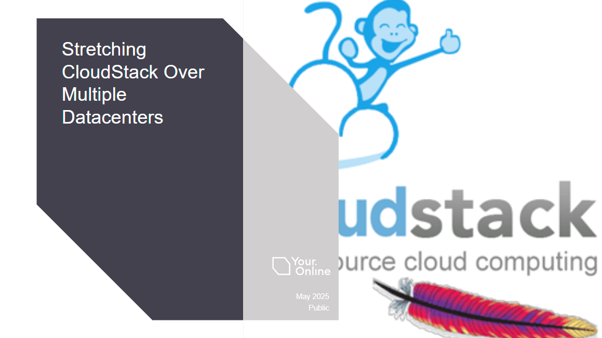

The Apache CloudStack European User Group (CSEUG) convened on May 8th
in Vienna, Austria, marking its return with a technically focused
event that brought together a dynamic cross-section of users,
contributors, developers, and operators from across Europe. Hosted at
Quartier Belvedere Central, the event delivered a full day of in-depth
technical sessions, collaborative community interactions, and
practical insights into real-world deployments and advancements within
the Apache CloudStack ecosystem.

<!-- truncate -->

Organised annually by the CloudStack EU Community and with the support
of longtime contributors and sponsors including ShapeBlue, ProIO, and
LINBIT, the event continues to grow, reflecting the maturity and
vitality of the Apache CloudStack community.

## A Full Day of Technical Deep Dives and Community Learning

The agenda for this year’s event included presentations covering core
concepts, advanced configuration techniques, case studies on
production deployments, and proposals for future development. The
program was structured to accommodate both new users interested in
open-source cloud orchestration and experienced practitioners working
with large-scale Apache CloudStack environments.

  <a class="button button--primary" href="https://www.youtube.com/playlist?list=PLnIKk7GjgFlaMg8GePeADgfC-XLmUD8-l" target="_blank">Watch Session Recordings</a>

Below you can find the sessions slides, abstracts, as well as
speaker’s social links in case you would like to connect and have any
questions about their session!

**Access each session's slides by clicking onto the presentation graphic.**

## Apache CloudStack 101 – What’s New and What’s Coming, [Giles Sirett](https://www.linkedin.com/in/gilessirett/), [ShapeBlue](https://www.shapeblue.com/)

Giles Sirett, CEO of ShapeBlue kicked off the day with an accessible
yet thorough overview of Apache CloudStack’s core capabilities. He
walked attendees through the project’s architecture, support for
multiple hypervisors (KVM, VMware, XCP-ng), and how CloudStack
integrates into existing IT environments. The session also highlighted
new features from recent releases and shared exciting developments on
the roadmap, including enhancements in UI/UX, support for
containerized workloads, and improvements in scalability and
automation.

## Storage Setup for LINSTOR/DRBD/CloudStack, [Rene Peinthor](https://github.com/rp-), [LINBIT](https://linbit.com/)

Rene Peinthor, Software Engineer at LINBIT, presented a comparative
analysis of various storage setups including LVM-Thin, ZFS, and
striped volumes, explaining the trade-offs between performance,
failure domains, and operational complexity. Attendees gained
actionable insights into designing optimized storage backends using
LINSTOR with CloudStack, and learned best practices for balancing high
availability with efficient resource utilization.

## I’d Like to Resell Your CloudStack Services, But..., [Brian Turnbow](https://www.linkedin.com/in/brianturnbow/), [CDLAN](https://www.cdlan.it/en/)

Brian Turnbow, DCT at CDLAN, shared a candid case study on onboarding
a white-label reseller into CDLAN’s CloudStack-powered platform. The
talk addressed the operational and technical challenges faced when
customers require custom IP ranges, brand identity, billing
integration, and even their own network capacity. This session
resonated with providers looking to expand their customer base while
maintaining operational control and compliance.

## Fully Open-Source Private Clouds: Freedom, Security, and Control, [Swen Brüseke](https://www.linkedin.com/in/swen-br%C3%BCseke-391912193/), [ProIO](https://www.proio.com/)

In a compelling argument for digital sovereignty, SwenBrüseke, CEO at
ProIO, presented ProIO’s fully open-source approach to building secure
and performant private clouds. By combining Apache CloudStack with
LINBIT’s storage stack, and maintaining transparency through
professional support, ProIO demonstrates how organizations can reduce
dependency on proprietary solutions while ensuring reliability,
flexibility, and security. He also offered a comparative evaluation of
CloudStack vs. other solutions like Proxmox, highlighting CloudStack’s
strengths in automation, scalability, and multi-tenancy.

## CloudStack + KVM: Your Local Cloud Lab, [Francisco Arencibia](https://www.linkedin.com/in/franciscoarencibia/), [Jotelulu](https://jotelulu.com/en-gb/)

Francisco Arencibia, Senior DevOps Engineer at Jotelulu, provided a
highly practical guide for setting up a CloudStack-based private cloud
lab using KVM, ideal for testing and development. Attendees learned
how to automate the entire setup using Ansible, making it simple to
deploy and tear down environments. This session served as a great
entry point for developers and sysadmins looking to experiment with
CloudStack or prototype cloud-native applications.

## Proposed Feature: Monitoring and Managing Cloud Usage Costs in Apache CloudStack, [Grégoire Lamodiere](https://linkedin.com/in/grégoire-lamodière-04171210) & [Joffrey Luangsaysana](https://www.linkedin.com/in/jluang/), [DIMSI](https://dimsi.fr)

Grégoire Lamodiere, CEO and Joffrey Luangsaysana, Cloud Expert at
DIMSI introduced a proposed native feature aimed at tracking and
visualizing cloud resource usage and cost within CloudStack. Gregoire
and Joffrey emphasized the need for better visibility for both
administrators and end users—especially in multi-tenant or MSP
environments. The session invited feedback from the community,
igniting discussion around metrics collection, usage-based billing,
and potential integrations with third-party tools. The proposal
underscores the community’s commitment to evolving CloudStack in
response to real-world needs.

## Stretching CloudStack Over Multiple Datacenters, [Wido den Hollander](https://www.linkedin.com/in/widodh/), [Your.Online](https://your.online/)

Scaling CloudStack beyond a single datacenter brings new architectural
considerations. Wido den Hollander, CTO at Your.Online, explored
techniques for spanning CloudStack zones across multiple physical
locations, including challenges in networking, storage, and
orchestration. Drawing from operational experience, he outlined
patterns for inter-datacenter VM migration and high availability while
preserving CloudStack's logical zone constructs.

## Pushing the Limits: CloudStack at 25K Hosts, [Boris Stoyanov](https://www.linkedin.com/in/bstoyanov/), [ShapeBlue](https://www.shapeblue.com/)

The closing session was a standout, as Boris Stoyanov, QA Manager at
ShapeBlue walked the audience through a large-scale load testing
initiative involving 25,000 hosts in a lab environment. This technical
deep dive included performance benchmarks, system bottlenecks, and the
specific code changes implemented to support this level of
scalability. The findings will inform future development efforts to
further strengthen CloudStack’s ability to support massive,
distributed infrastructure.

## Thank You for Making It a Success

The Apache CloudStack community would like to extend a sincere thank
you to ShapeBlue, ProIO, and LINBIT for their continued sponsorship
and support. These events wouldn’t be possible without the volunteers,
contributors, and passionate users who give their time and energy to
make each gathering meaningful.

We’re already looking forward to the upcoming CloudStack India User
Group 2025, taking place on 11th July at the Yotta Data Centre Park
(D1) in Greater Noida, Uttar Pradesh. Shortly after, we’ll be
gathering again for the next CloudStack European User Group meeting in
London on 18th September. And finally, the highlight of the year—the
CloudStack Collaboration Conference—will be held in Milan, Italy from
19th to 21st November. As the most significant CloudStack event
globally, the conference brings together professionals from around the
world to connect, share knowledge, and shape the future of open-source
cloud infrastructure. Until then, stay involved, stay curious, and
keep building!
