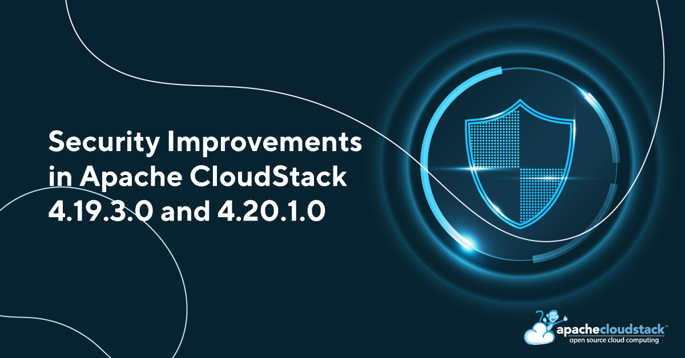

[](/blog/lts-release-advisory-4.19.3.0-4.20.1.0)

 The Apache CloudStack project announces the LTS release of [4.19.3.0](https://github.com/apache/cloudstack/releases/tag/4.19.3.0) and [4.20.1.0](https://github.com/apache/cloudstack/releases/tag/4.20.1.0) that address the following security issues:

 - CVE-2025-26521 (severity 'Critical')
 - CVE-2025-30675 (severity 'Low')
 - CVE-2025-47713 (severity 'Critical')
 - CVE-2025-47849 (severity 'Moderate')
 - CVE-2025-22829 (severity 'Low')

<!-- truncate -->

## [CVE-2025-26521](https://www.cve.org/CVERecord?id=CVE-2025-26521): CKS cluster in project exposes user API keys

When an Apache CloudStack user-account creates a CKS-based Kubernetes cluster in a project, the API key and the secret key of the 'kubeadmin' user of the caller account are used to create the secret config in the CKS-based Kubernetes cluster. A member of the project who can access the CKS-based Kubernetes cluster, can also access the API key and secret key of the 'kubeadmin' user of the CKS cluster's creator's account. An attacker who's a member of the project can exploit this to impersonate and perform privileged actions that can result in complete compromise of the confidentiality, integrity, and availability of resources owned by the creator's account.

CKS users are recommended to upgrade to version 4.19.3.0 or 4.20.1.0, which fixes this issue.

### Updating Existing Kubernetes Clusters in Projects

A **service account** should be created for each project to provide limited access specifically for Kubernetes cluster providers and autoscaling. Follow the steps below to create a new service account, update the secret inside the cluster, and regenerate existing API and service keys:

#### 1. Create a New Service Account

Create a new account using the role "Project Kubernetes Service Role" with the following details:

| Field          | Value                                            |
|----------------|--------------------------------------------------|
| Account Name   | kubeadmin-<FIRST_EIGHT_CHARACTERS_OF_PROJECT_ID> |
| First Name     | Kubernetes                                       |
| Last Name      | Service User                                     |
| Account Type   | 0 (Normal User)                                  |
| Role ID        | <ID_OF_SERVICE_ROLE>                             |

#### 2. Add the Service Account to the Project

Add this account to the **project** where the Kubernetes cluster(s) are hosted.

#### 3. Generate API and Secret Keys

Generate **API Key** and **Secret Key** for the default user of this account.

#### 4. Update the CloudStack Secret in the Kubernetes Cluster

Create a temporary file `/tmp/cloud-config` with the following data:

```
api-url = <API_URL>       # For example: <MS_URL>/client/api
api-key = <SERVICE_USER_API_KEY>
secret-key = <SERVICE_USER_SECRET_KEY>
project-id = <PROJECT_ID>
```

Delete the existing secret using kubectl and Kubernetes cluster config:

```
   ./kubectl --kubeconfig kube.conf -n kube-system delete secret cloudstack-secret
```

Create a new secret using kubectl and Kubernetes cluster config:

```
    ./kubectl --kubeconfig kube.conf -n kube-system create secret generic cloudstack-secret --from-file=/tmp/cloud-config
```

Remove the temporary file:

```
    rm /tmp/cloud-config
```

#### 5. Regenerate API and Secret Keys

Regenerate the API and secret keys for the **original user account** that was used to create the Kubernetes cluster.


## [CVE-2025-30675](https://www.cve.org/CVERecord?id=CVE-2025-30675): Unauthorised template/ISO list access to the domain/resource admins

In Apache CloudStack, a flaw in access control affects the listTemplates and listIsos APIs. A malicious Domain Admin or Resource Admin can exploit this issue by intentionally specifying the 'domainid' parameter along with the 'filter=self' or 'filter=selfexecutable' values. This allows the attacker to gain unauthorized visibility into templates and ISOs under the ROOT domain.
A malicious admin can enumerate and extract metadata of templates and ISOs that belong to unrelated domains, violating isolation boundaries and potentially exposing sensitive or internal configuration details. This vulnerability has been fixed by ensuring the domain resolution strictly adheres to the caller's scope rather than defaulting to the ROOT domain.

Affected users are recommended to upgrade to Apache CloudStack 4.19.3.0 or 4.20.1.0.

## [CVE-2025-47713](https://www.cve.org/CVERecord?id=CVE-2025-47713): Domain Admin can reset Admin password in Root Domain

A privilege escalation vulnerability exists in Apache CloudStack versions 4.10.0.0 through 4.20.0.0 where a malicious Domain Admin user in the ROOT domain can reset the password of user-accounts of Admin role type. This operation is not appropriately restricted and allows the attacker to assume control over higher-privileged user-accounts. A malicious Domain Admin attacker can impersonate an Admin user-account and gain access to sensitive APIs and resources that could result in the compromise of resource integrity and confidentiality, data loss, denial of service, and availability of infrastructure managed by CloudStack.

Users are recommended to upgrade to Apache CloudStack 4.19.3.0 or 4.20.1.0, which fixes the issue with the following:

- Strict validation on Role Type hierarchy: the caller's user-account role must be equal to or higher than the target user-account's role.
- API privilege comparison: the caller must possess all privileges of the user they are operating on.
- Two new domain-level settings (restricted to the default Admin):
  - `role.types.allowed.for.operations.on.accounts.of.same.role.type`: Defines which role types are allowed to act on users of the same role type.  
    Default: `"Admin, DomainAdmin, ResourceAdmin"`.
  - `allow.operations.on.users.in.same.account`: Allows/disallows user operations within the same account.  
    Default: `true`.


## [CVE-2025-47849](https://www.cve.org/CVERecord?id=CVE-2025-47849): Insecure access of user's API/Secret Keys in the same domain

A privilege escalation vulnerability exists in Apache CloudStack versions 4.10.0.0 through 4.20.0.0 where a malicious Domain Admin user in the ROOT domain can get the API key and secret key of user-accounts of Admin role type in the same domain. This operation is not appropriately restricted and allows the attacker to assume control over higher-privileged user-accounts. A malicious Domain Admin attacker can impersonate an Admin user-account and gain access to sensitive APIs and resources that could result in the compromise of resource integrity and confidentiality, data loss, denial of service, and availability of infrastructure managed by CloudStack.

Users are recommended to upgrade to Apache CloudStack 4.19.3.0 or 4.20.1.0, which fixes the issue with the following:

- Strict validation on Role Type hierarchy: the caller's user-account role must be equal to or higher than the target user-account's role.
- API privilege comparison: the caller must possess all privileges of the user they are operating on.
- Two new domain-level settings (restricted to the default Admin):
  - `role.types.allowed.for.operations.on.accounts.of.same.role.type`: Defines which role types are allowed to act on users of the same role type.  
    Default: `"Admin, DomainAdmin, ResourceAdmin"`.
  - `allow.operations.on.users.in.same.account`: Allows/disallows user operations within the same account.  
    Default: `true`.


## [CVE-2025-22829](https://www.cve.org/CVERecord?id=CVE-2025-22829): Unauthorised access to dedicated resources in Quota plugin

The CloudStack Quota plugin has an improper privilege management logic in version 4.20.0.0. Anyone with authenticated user-account access in CloudStack 4.20.0.0 environments, where this plugin is enabled and have access to specific APIs can enable or disable reception of quota-related emails for any account in the environment and list their configurations.

Quota plugin users using CloudStack 4.20.0.0 are recommended to upgrade to CloudStack version 4.20.1.0, which fixes this issue.


## Credits

The CVEs are credited to the following reporters:

- CVE-2025-26521:
  - Wei Zhou (weizhou@apache.org)

- CVE-2025-30675:
  - Bernardo De Marco Gonçalves <bernardomg2004@gmail.com>

- CVE-2025-47713:
  - Scott Schmitz <sschmitz@ussignal.com>

- CVE-2025-47849:
  - Kevin <kli74@apple.com>
  - Scott Schmitz <sschmitz@ussignal.com>

- CVE-2025-22829:
  - Fabricio Duarte <fabricio.duarte.jr@gmail.com>  

## Affected versions:


- CVE-2025-26521:
  - Apache CloudStack 4.17.0.0 through 4.19.2.0
  - Apache CloudStack 4.17.0.0 through 4.20.1.0

- CVE-2025-30675:
  - Apache CloudStack 4.0.0 through 4.19.2.0
  - Apache CloudStack 4.0.0 through 4.20.0.0

- CVE-2025-47713:
  - Apache CloudStack 4.10.0.0 through 4.19.2.0
  - Apache CloudStack 4.10.0.0 through 4.20.0.0

- CVE-2025-47849:
  - Apache CloudStack 4.10.0.0 through 4.19.2.0
  - Apache CloudStack 4.10.0.0 through 4.20.0.0

- CVE-2025-22829:
  - Apache CloudStack 4.20.0.0

## Resolution

Users are recommended to upgrade to version 4.19.3.0, 4.20.1.0 or later, which addresses these issues. Additionally, users on a version older than 4.20.0.0 are advised to skip 4.20.0.0 and upgrade to 4.20.1.0 instead.

## Downloads and Documentation

The official source code for the 4.19.3.0 and 4.20.1.0 releases can be downloaded from the project [downloads page](/downloads).

The 4.19.3.0 and 4.20.1.0 release notes can be found at:

- https://docs.cloudstack.apache.org/en/4.19.3.0/releasenotes/about.html
- https://docs.cloudstack.apache.org/en/4.20.1.0/releasenotes/about.html

In addition to the official source code release, individual contributors have also made release packages available on the Apache CloudStack download page, and available at:

- https://download.cloudstack.org/el/7/
- https://download.cloudstack.org/el/8/
- https://download.cloudstack.org/el/9/
- https://download.cloudstack.org/suse/15/
- https://download.cloudstack.org/ubuntu/dists/
- https://www.shapeblue.com/cloudstack-packages/
