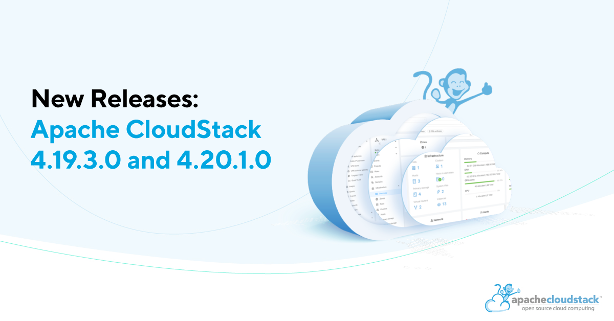

The Apache CloudStack project is pleased to announce the release of CloudStack 4.19.3.0 and 4.20.1.0.

The CloudStack releases 4.19.3.0 and 4.20.1.0 are maintenance releases as part of their 4.19.x and 4.20.x LTS branches respectively. CloudStack release 4.19.3.0 contains more than 120 fixes and improvements since CloudStack 4.19.2.0 and CloudStack 4.20.1.0 contains more than 150 fixes and improvements since CloudStack 4.20.0.0 release.

Highlights of 4.19.3.0 include:
<!-- truncate -->

* Fixes broken console access after upgrade to 4.19.2.0 on VMware
* Improve listing of VMware Datacenter VMs for migration to KVM
* Infinite scroll UI component to retrieve more items on reaching end of list
* Prevention of duplication HA jobs and alerts
* Fix SAML2 plugin limitations and SAML multi-account selector in the UI
* Improvements to Linstor

Highlights of 4.20.1.0 include:
<!-- truncate -->

CloudStack 4.20.1.0 includes all the fixes from the 4.19.3.0 release.
* Improvements to multi-architecture support in CloudStack
* vTPM support for KVM and VMware
* Support for XenServer 8.4 / XCP-ng 8.3
* Added support for VMware 80u2 and 80u3
* Updated System VM template to Debian 12.11
* NAS B&R improvements
* Experimental Support of EL10 as Management Server and KVM host

CloudStack LTS branches are supported for 18 months and will receive updates for the first 12 months and only security updates in the last 6 months.

Apache CloudStack is an integrated Infrastructure-as-a-Service (IaaS) software platform that allows users to build feature-rich public and private cloud environments. CloudStack includes an intuitive user interface and rich API for managing the compute, networking, software, and storage resources. The project became an Apache top-level project in March, 2013.

More information about Apache CloudStack can be found at:
https://cloudstack.apache.org/

## Documentation

What's new in  CloudStack 4.19.3.0:
https://docs.cloudstack.apache.org/en/4.19.3.0/releasenotes/about.html

What's new in  CloudStack 4.20.1.0:
https://docs.cloudstack.apache.org/en/4.20.1.0/releasenotes/about.html

The 4.19.3.0 release notes include a full list of issues fixed, as well as upgrade instructions from previous versions of Apache CloudStack, and can be found at:
https://docs.cloudstack.apache.org/en/4.19.3.0/releasenotes/

The 4.20.1.0 release notes include a full list of issues fixed, as well as upgrade instructions from previous versions of Apache CloudStack, and can be found at:
https://docs.cloudstack.apache.org/en/4.20.1.0/releasenotes/

The official installation, administration, and API documentation for each of the releases are available on our documentation page:
https://docs.cloudstack.apache.org/

## Downloads

The official source code for the 4.19.3.0 and 4.20.1.0 releases can be downloaded from our downloads page:https://cloudstack.apache.org/downloads

In addition to the official source code release, individual contributors have also made convenience binaries available on the Apache CloudStack download page, and can be found at:

https://download.cloudstack.org/el/7/
https://download.cloudstack.org/el/8/
https://download.cloudstack.org/el/9/
https://download.cloudstack.org/suse/15
https://download.cloudstack.org/ubuntu/dists/
https://www.shapeblue.com/packages/