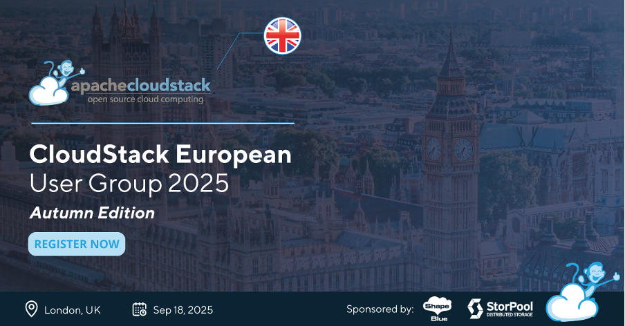

We’re pleased to announce the Autumn 2025 edition of the CloudStack European User Group (CSEUG), taking place on September 18th at [Events @ No.6](https://tinyurl.com/mr26j2s5) in the City of London.

This event will bring together members of the European CloudStack community for a full day of technical discussions, knowledge exchange, and networking. Attendees can expect insights into real-world CloudStack use cases, community developments, and best practices in open-source cloud infrastructure.

This edition of CSEUG is supported by [ShapeBlue](https://www.shapeblue.com/) and [StorPool Storage](https://storpool.com/).

<!-- truncate -->

<a class="button button--primary" href="https://www.eventbrite.com/e/autumn-edition-cloudstack-european-user-group-2025-tickets-1366848914899?aff=oddtdtcreator" target="_blank">Register Now</a>

## Call for Presentations

The Call for presentations is open! We're looking for session proposals that highlight technical insights, real-world user stories, best practices, new features, and innovative approaches to open-source cloud technology.

<b>
Submit your session proposal using the button below for an opportunity to share your insights with the global CloudStack community. Please note that the CFP closes on August 1st.
</b>

<a class="button button--primary" href="https://tinyurl.com/4pks9ky4" target="_blank">Submit a Session</a>

## Who is the User Group for?

This event is designed for developers, operators, and users who are involved with or interested in the evolution of the Apache CloudStack project. It offers an opportunity to explore the platform’s capabilities, share real-world experiences, and contribute to the ongoing development of its open-source ecosystem. Attendees will also have the chance to connect with members of the CloudStack community, including project contributors, maintainers, and committers.

The CloudStack European User Group (CSEUG) welcomes participants from around the world. The core audience includes enterprises, cloud service providers, telecommunications companies, and managed service providers.

## A Word from Previous Participants

Gain insights from community members Swen Brüseke and Ivet Petrova as they reflect on their experiences with the CloudStack European User Group. Their perspectives highlight the event’s impact on collaboration, knowledge sharing, and the broader CloudStack community.

“The CloudStack European User Group is an invaluable space for knowledge-sharing, collaboration, and community-driven innovation. Speaking at these events has allowed me to share insights, learn from others, and contribute to the growth of the CloudStack ecosystem”.

- [Swen Brüseke](https://www.linkedin.com/in/swen-br%C3%BCseke-391912193/), CEO at [proIO](https://www.proio.com/) & CloudStack Committer

“The CloudStack EU User Groups are the most focused community gatherings in Europe for anyone passionate about open-source cloud infrastructure. These events bring together skilled technologists and strategic decision-makers for in-depth discussions on open-source innovation, vendor independence, and building sustainable cloud platforms. A must-attend for cloud professionals who want to shape the future of open-source and virtualization!”.

- [Ivet Petrova](https://www.linkedin.com/in/ivpetrova/), Marketing Director at [ShapeBlue](https://www.shapeblue.com/) & CloudStack PMC Member
