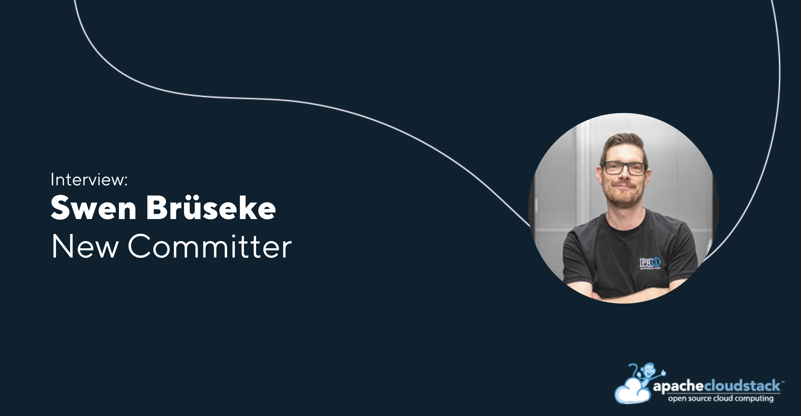

[Swen Brüseke](https://www.linkedin.com/in/swen-br%C3%BCseke-391912193/) has recently been appointed as a Committer to the Apache CloudStack project. In this interview, Swen shares insights into his professional journey, his views on open-source development, recent projects he’s contributed to, and his perspective on the future of the CloudStack community.

<!-- truncate -->

Click the button below to view the full list of current project members.

  <a class="button button--primary" href="https://cloudstack.apache.org/who" target="_blank">Project members</a>

##### Introduce yourself in a few words and what your job role/company is

I’m Swen Brüseke, Founder & CEO of [proIO GmbH](https://www.proio.com/), a company based in Germany specializing in Private Clouds, Managed Hosting and Remote Hands. We deliver secure, customized cloud infrastructures for companies across Europe, with a strong focus on open-source, transparency, reliability, and data sovereignty. Personally, I have a strong background in IT infrastructure and cloud architectures – always with a passion for building practical, scalable solutions that fit real business needs, not just buzzwords.

##### What do you think are the benefits of utilizing open-source projects, like CloudStack?

From my experience, open-source projects like Apache CloudStack offer three major benefits:
1.	Transparency:
You know exactly what’s happening under the hood. There are no hidden mechanisms or vendor lock-ins – which is crucial for customers who care about data sovereignty and operational control.
2.	Flexibility and Independence:
You are not tied to a specific vendor’s roadmap. We can adapt CloudStack to fit the specific needs of our customers – whether it's integrating with existing on-prem infrastructure or enabling custom networking configurations.
3.	Community-driven Innovation:
Innovation is not dictated by one company’s profit interest. Instead, new features arise from real-world needs contributed by users around the globe. And if there is an interest from companies, then those projects can be supported, giving development an additional boost while still remaining transparent and beneficial to the community.

##### How do you collaborate with the community distributed around the world?

The CloudStack community is one of the healthiest and most professional open-source communities I've ever worked with.

- Communication is very transparent: [Mailing lists](https://cloudstack.apache.org/mailing-lists/), [GitHub discussions](https://github.com/apache/cloudstack/discussions), [Events](https://cloudstack.apache.org/events/) – everyone is approachable and discussions are technically deep but respectful.
- Contribution goes beyond code: We regularly participate in discussions, report bugs, contribute to testing, and support knowledge-sharing activities.
- Global Collaboration: Despite being spread around the globe, the community feels very connected. Conferences, meetups, and hackathons keep the collaboration real and personal.

Personally, I value that the CloudStack community embraces both:

- Solid engineering standards.
- A real-world focus on what cloud users actually need.

Working with them doesn't feel like a corporate obligation – it feels like building something meaningful together.

##### What are some key projects and developments you have worked on and are currently working on?

At proIO, we are heavily focused on building cloud solutions that combine operational control, security, and flexibility with open-source — and CloudStack plays a central role in achieving that.

Some of the key areas we have been working on include:

- Building highly secure Private Cloud environments for customers who need full data sovereignty and compliance with regulations like GDPR and, increasingly, NIS2. CloudStack’s flexibility allows us to tailor solutions exactly to these requirements.
- Designing mixed cloud architectures, where some hosts are on-premises and others are located in a remote datacenter, enables seamless communication across private environments. Sensitive workloads stay securely on-prem, while less critical services operate from the datacenter. This approach gives clients tight control over key assets while leveraging external resources for scalability and efficiency.
- Driving automation and operational efficiency, using tools like Terraform, Ansible, and Kubernetes alongside and with CloudStack. This enables faster provisioning, standardized deployments, and easier scaling, even across complex environments.

##### How do you think the CloudStack project will continue to grow over the next five years?

I strongly believe CloudStack will continue growing in three major dimensions:

1. Enterprise Adoption:
   As regulatory pressure increases (e.g., GDPR, NIS2, EU Data Act), companies will look for cloud solutions that guarantee transparency and sovereignty. CloudStack is perfectly positioned here.
2. Integration Focus:
   Cloud architectures are becoming increasingly heterogeneous. CloudStack’s ability to integrate with other tools (Kubernetes, Terraform, observability platforms) will drive more adoption across DevOps and hybrid environments.
3. Operational Simplicity:
   Making cloud management easier and more intuitive for operators will be key. I expect CloudStack will invest further in improving UX, automation, and "out-of-the-box" setups for fast deployment.

The open-source model ensures that CloudStack adapts based on real-world needs, not marketing trends – and that’s why I’m confident it will keep gaining traction where reliability, security, and operational transparency matter most.
