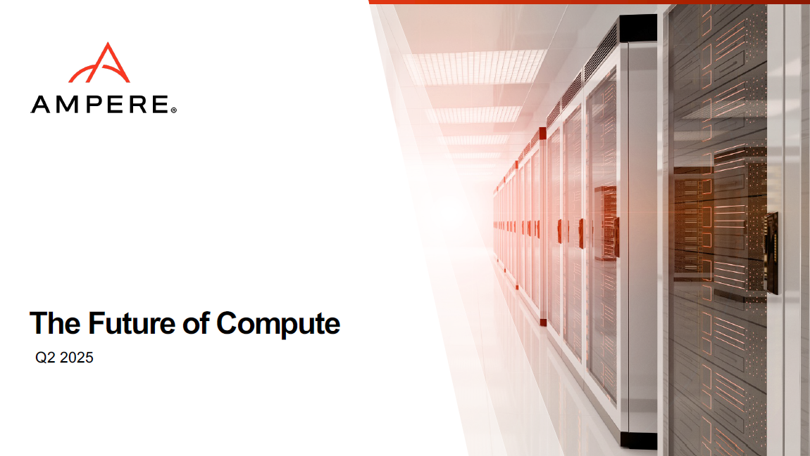

The 2025 edition of the CloudStack India User Group (CSIUG) brought
together passionate users, contributors, and innovators from across
the region to explore the evolving landscape of Apache
CloudStack. Hosted in person at the D1 Yotta Data Center in Greater
Noida and supported by ShapeBlue, Yotta and LINBIT, the event was
packed with technical talks, deployment insights, and collaborative
energy.

<!-- truncate -->

CloudStack India User Group 2025 – Event Roundup

The 2025 edition of the CloudStack India User Group (CSIUG) brought
together passionate users, contributors, and innovators from across
the region to explore the evolving landscape of Apache
CloudStack. Hosted in person at the D1 Yotta Data Center in Greater
Noida and supported by ShapeBlue, Yotta and LINBIT, the event was
packed with technical talks, deployment insights, and collaborative
energy.

  <a class="button button--primary" href="https://www.youtube.com/playlist?list=PLnIKk7GjgFlaO1t3mtHeJ_g_MKBQKnfkR" target="_blank">Watch Session Recordings</a>

 

Below you can find the sessions slides, abstracts, as well as
speaker’s social links in case you would like to connect and have any
questions about their session!

**Access each session's slides by clicking onto the presentation
graphic.**

##### Meetup Kickoff & Welcome - [Rohit Yadav](https://www.linkedin.com/in/rohityadavcloud/), CSIUG Chairman and CTO at [ShapeBlue](https://shapeblue.com)

The day began with a warm welcome and a reflection on how far the
CloudStack community in India has come — and where it’s headed next.

##### The Yotta x CloudStack Advantage: a Scalable, India-First Cloud - Tailored for Sovereignty, Flexibility, Affordability and Innovation – [Sunil Gupta](https://www.linkedin.com/in/sunilgupta1701/), CEO at [Yotta](https://yotta.com)

Sunil highlighted the critical role of sovereign clouds in India and
how CloudStack enables Yotta to deliver scalable, secure, and
compliant cloud services tailored to the Indian market.

##### Apache CloudStack 201: Let's Design & Build an IaaS Cloud - [Jithin Raju](https://www.linkedin.com/in/rajujith/), Cloud Architect at [ShapeBlue](https://shapeblue.com)

A standout session that walked attendees through a live demonstration
of building an IaaS cloud from scratch. Jithin provided a clear
blueprint for designing and deploying real-world CloudStack
environments — a perfect bridge for those moving from basics to
production deployments.

##### Empowering Cloud Providers with Apache CloudStack and Stackbill - [Ravichandran Palanisamy](https://www.linkedin.com/in/ravichandran-p-99948054/), Global Head of Business Development at [StackBill](https://stackbill.com)

This talk focused on transforming infrastructure into a business
platform, showcasing how StackBill layers on top of CloudStack to
enable turnkey cloud delivery with improved tenant experience and
provider ROI.

##### Ampere Offers Energy-Efficient Future for AI and Cloud - [Vinod Kumar](https://www.linkedin.com/in/vinod-se), Sales Director at [Ampere Computing](https://amperecomputing.com)

Vinod shared how Ampere’s processors — in partnership with ShapeBlue —
are helping reduce power usage and carbon footprint while delivering
performance for AI and cloud workloads.

##### Building and Operating a Private Cloud with CloudStack and LINBIT CloudStack HCI Appliance - [Nischal Prabhu](https://www.linkedin.com/in/nischal-p-531568b/), Cloud Engineer at [LINBIT](https://www.linkedin.com/company/linbit/) # (https://linbit.com)

An in-depth look at how LINBIT’s HCI Appliance simplifies private
cloud operations, leveraging CloudStack’s orchestration with resilient
storage through DRBD and LINSTOR.

##### CloudStack GPU Integration -  [Rohit Yadav](https://www.linkedin.com/in/rohityadavcloud/), CTO at [ShapeBlue](https://shapeblue.com)

Rohit unveiled the latest GPU capabilities in CloudStack, covering passthrough, virtual GPU support, and intelligent scheduling — vital for AI/ML and HPC workloads.

##### Simplifying End-to-End Apache CloudStack Deployment with a Web-Based Automation Portal - [Vivek Kumar](https://www.linkedin.com/in/vivek-kumar-6663275a/), Lead DevОps Engineer at [Yotta](https://yotta.com)

A technical deep dive into how Yotta has automated complex CloudStack
deployments using a custom-built web UI that drives Ansible playbooks
interactively.

[![] "Simplifying End-to-End Apache CloudStack Deployment with a Web-Based Automation Portal - slides"](VivekYotta.png https://www.slideshare.net/slideshow/simplifying-end-to-end-apache-cloudstack-deployment-with-a-web-based-automation-portal/281704660)

##### Extensions Framework (XaaS) - Enabling Orchestrate Anything - [Harikrishna Patnala](https://www.linkedin.com/in/harikrishnapatnala/) - Lead Software Engineer & [Abhishek Kumar](https://www.linkedin.com/in/shwstppr/) - Software Engineer at ShapeBlue

This session demonstrated the flexibility of the new Extensions
Framework, allowing operators to integrate custom services,
orchestrators, and even third-party hypervisors like Proxmox directly
into CloudStack’s lifecycle. A game-changer for extensibility and
vendor-neutral operations.

##### Community Spirit

The CSIUG 2025 event once again demonstrated the power of the
CloudStack community in India — not just as users, but as
contributors, innovators, and leaders. With strong momentum in areas
like GPU support, automation, and real-world production use cases, the
future of Apache CloudStack looks brighter than ever.

We thank all the speakers, participants, and contributors who made the
day a success!

###### Next Stop: London, September 18th

The next Apache CloudStack User Group event is just around the corner!
Join us in London on September 18th for another day of technical
sessions, live demos, and networking with the global CloudStack
community. Whether you're an experienced operator or new to the
project, the London User Group is a great opportunity to connect,
learn, and contribute.

Secure your spot now – submit a [session](https://docs.google.com/forms/d/1CxROnophMr0NQqZ_3I02V-bwP9E4o1bTVcOy4JdlKtk/viewform?edit_requested=true)!
