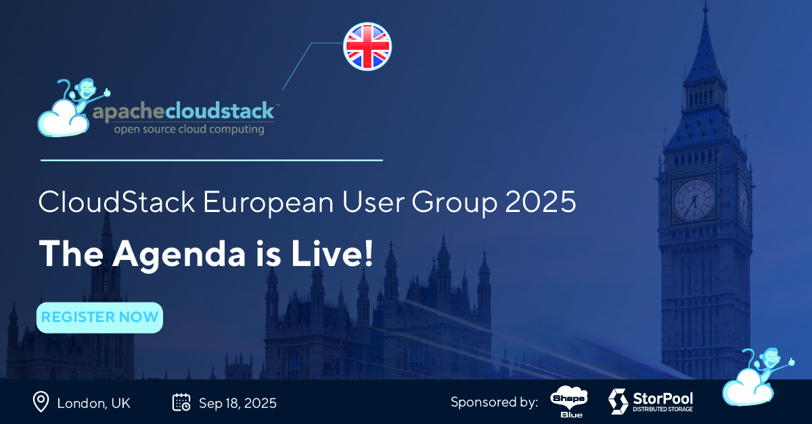

We're revealing the full agenda for [the upcoming CloudStack European User Group in London](https://www.eventbrite.com/e/autumn-edition-cloudstack-european-user-group-2025-tickets-1366848914899?aff=oddtdtcreator), a must-attend event for anyone working with or interested in open-source cloud infrastructure. This year's agenda brings together leading experts from across the CloudStack ecosystem to share real-world use cases, technical deep dives, and community discussions.
From building Tier 1 infrastructure and exploring the future of orchestration, to enabling scientific research and rethinking performance metrics—there’s something for everyone. Whether you're a developer, architect, or decision-maker, this event is your opportunity to connect, learn, and shape the future of Apache CloudStack.

<!-- truncate -->

###### 10:00 - 10:30    Registration and Morning Coffee

###### 10:30 - 11:15    Welcome, Community, News and CloudStack 101 – [Steve Roles](https://www.linkedin.com/in/steveroles/), COO, [ShapeBlue](https://www.linkedin.com/company/shapeblue/)

Steve will talk about this group and the community, and will also provide an introductory overview of CloudStack, covering its core features, architecture, and practical use cases. Attendees will gain insights into how CloudStack simplifies cloud orchestration, supports multiple hypervisors, and integrates seamlessly with existing IT infrastructure. He will also present the CloudStack news, talking through recent releases and new features.

###### 11:25 - 11:55    Apache Cloudstack: Powering research in Apiculture, Aquaponics, and advanced networking, [Mike Hinsley](https://www.linkedin.com/in/michael-hinsley-b29b5234/), [Objectway](https://objectway.com/)

Exploring how Apache CloudStack serves as a versatile infrastructure foundation for innovative research in apiculture, aquaponics, and advanced networking. The practical implementations including IoT sensor networks for bee colony monitoring, automated aquaponics control systems, and complex network testbeds using EVE-NG Pro with SONiC virtual switches. How open-source cloud infrastructure can power cutting-edge agricultural research while providing the scalability, flexibility, and cost-effectiveness essential for modern research environments.

###### 12:05 - 12:35    Design and Build a Tier 1 Infrastructure for Your CloudStack Cloud – [Nikolay Tenev](https://www.linkedin.com/in/ntenev/), Solutions Architect, [StorPool](https://www.linkedin.com/company/storpool/)

With more cloud options available to your customers, you need an edge to stay ahead. In today’s service economy, the biggest differentiating factors are the services you offer, and the reliability of those services. To provide the best services, you need the best infrastructure. In this session we’ll discuss how to build infrastructure that will make it easy to offer – and meet – service level agreements (SLAs) for:
* Uptime – 5 nines uptime plus eliminating the need for maintenance windows
* Performance – as measured in IOPS, throughput, and latency
* Scalability – scale up or scale out quickly as needed
* Disaster Recovery – offer a premium service tier
* Cost Savings – Linux KVM with CloudStack is a far more cost-effective alternative to ESXi with VMware Cloud Director

We’ll show how you can offer all of this while simplifying your operations, automating your daily workflows, and reducing staff bottlenecks.

###### 12:45 - 13:15    Double the Savings on Repatriation with an Ampere Combination – [Pete Logan](https://www.linkedin.com/in/petelogan/), Principal FAE – EMEA, [Ampere]( https://www.linkedin.com/company/amperecomp/)

It’s established now that moving workloads off hyperscalers will reduce TCO, but you can offer more when dropping that onto Ampere CPU based systems through better efficiency and high utilisation. Pete Logan from Ampere describes how, using the joint architecture with CloudStack & Shape Blue. Bonus: you can port your Graviton and other Arm workloads directly too!

###### 13:15 - 14:15    Lunch

######  14:15 - 14:40    Latency is all that matters, not bandwidth – [Wido den Hollander]( https://www.linkedin.com/in/widodh/), CTO, [Your. Online](https://www.linkedin.com/company/youronline/)

Everyone talks about increasing bandwidth, faster download and upload speeds, NVMe PCIe 5.0 devices pushing gigabytes per se
cond. But what if bandwidth isn’t the real bottleneck? Latency is far more important. I’ll explore why latency matters more than raw speed and why it matters in CloudStack.

###### 14:50 - 15:35    CloudStack Extensions Framework (XaaS) - Enabling Orchestrate Anything + Demo - Lucian Burlacu, Cloud Architect, [ShapeBlue](https://www.linkedin.com/company/shapeblue/)

This session will demonstrate the flexibility of the new Extensions Framework, allowing cloud builders to integrate custom services, orchestrators, and even third-party hypervisors directly into CloudStack’s lifecycle. A game-changer for extensibility and vendor-neutral operations.

###### 15:45 - 16:20    CloudStack Community Forum: Embracing Open-Source for True Independence – [Ivet Petrova]( https://www.linkedin.com/in/ivpetrova/) – Facilitator

An open discussion, where we will highlight the power of open-source collaboration. As cloud builders seek freedom from vendor lock-in and greater control over their infrastructure, CloudStack offers a mature, production-ready platform backed by a vibrant global community. This will be an open discussion, where everybody can ask for advice, shared experience and good practices.

<a class="button button--primary" href="https://www.eventbrite.com/e/autumn-edition-cloudstack-european-user-group-2025-tickets-1366848914899?aff=oddtdtcreator" target="_blank">Register Now</a>

