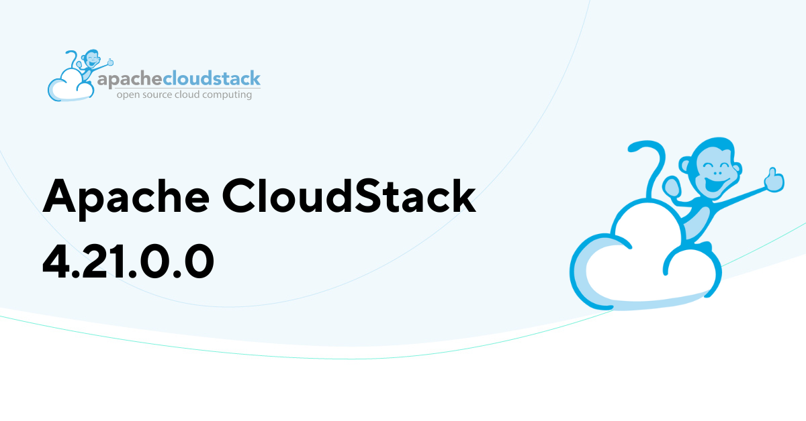

The Apache CloudStack project is pleased to announce the release of CloudStack 4.21.0.0, which is a Regular release.

The CloudStack 4.21 release is the most recent release of the cloud management platform. It comes as a product of extensive contributions from the project development community.

The 4.21 release contains 15 new features, around 40 improvements and more than 150 bug fixes since 4.20. Some of the highlights include:

<!-- truncate -->

· CloudStack Extensions Framework and Orchestrate Anything extension, with built-in extensions for Proxmox and Hyper-V

· GPU Integration with KVM in CloudStack (Technical Preview)

· Netris Network Plugin Integration

· Cloudian HyperStore Object Store Plugin Integration

· CloudStack Kubernetes Service (CKS) Enhancements

· Create Instance from Backup

· Instance Lease (Automatic Stop/Deletion)

· Backup and Object Storage Limits

· Virtual Trusted Platform Module (vTPM) Support

· Support for KVM on s390x (IBM Z and LinuxONE) architecture

· Management Server Maintenance Mode

· Incremental Volume Snapshots for KVM

· File-Based Disk-Only Instance Snapshots with KVM

· Reconciliation of VM and Volume Copy/Migrate operations for KVM agent

· Storage Access Groups

· Volume Allocation Algorithm Support

· VMware to KVM migration improvements

· Storage plugins - Ceph, PowerFlex, StorPool, Linstor related fixes and improvements

· Several UI fixes and improvements, including Deploy Instance Form, Announcement Banner, etc

CloudStack Regular releases are supported only up to the next regular or LTS release and can upgrade to the next releases when they are available.

Apache CloudStack is an open-source software system designed to deploy and manage large networks of virtual machines, as a highly available, highly scalable Infrastructure as a Service (IaaS) cloud computing platform. CloudStack includes an intuitive user interface and rich API for managing the compute, networking software, and storage resources, that allows users to build feature-rich public and private cloud environments. The project became an Apache top-level project in March 2013 and is currently deployed in thousands of organizations globally.

More information about Apache CloudStack can be found at: https://cloudstack.apache.org/

##### Documentation

What's new in CloudStack 4.21.0.0: https://docs.cloudstack.apache.org/en/4.21.0.0/releasenotes/about.html

The 4.21.0.0 release notes include a full list of issues fixed, as well as upgrade instructions from previous versions of Apache CloudStack, and can be found at: https://docs.cloudstack.apache.org/en/4.21.0.0/releasenotes/

The official installation, administration, and API documentation for each of the releases are available on our documentation page: https://docs.cloudstack.apache.org/

##### Downloads

The official source code for the 4.21.0.0 release can be downloaded from our downloads page:

https://cloudstack.apache.org/downloads.html

In addition to the official source code release, individual contributors have also made convenience binaries available on the Apache CloudStack download page, and can be found at:

https://download.cloudstack.org/el/8/

https://download.cloudstack.org/el/9/

https://download.cloudstack.org/suse/15

https://download.cloudstack.org/ubuntu/dists/

https://www.shapeblue.com/packages/

##### A Word from the Community

<em>
“Apache CloudStack 4.21.0 is a Regular (non-LTS) release after long time, with the last one being 4.12.0 in April 2019. This release introduces exciting new features designed to help organizations build faster, more efficient clouds while simplifying their management. The 4.21.0 release is a joint effort of the whole community for the last six months and more – with contributors and committers from around the world collaborating on feature

development and code quality. Operators and users can now explore GPU workloads, integrate external systems through the new extensibility framework, and benefit from many other enhancements.

The Apache CloudStack community is observing an accelerated shift of Cloud Service Providers and Private Cloud builders towards open, transparent, and community-led cloud computing platforms. Our collective focus remains on ensuring the long-term sustainability and growth of the project.”
</em>

\- Suresh Kumar Anaparti, CloudStack Committer & PMC, 4.21 Release Manager

